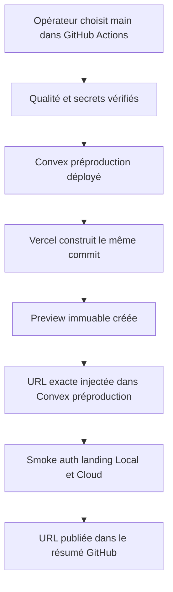
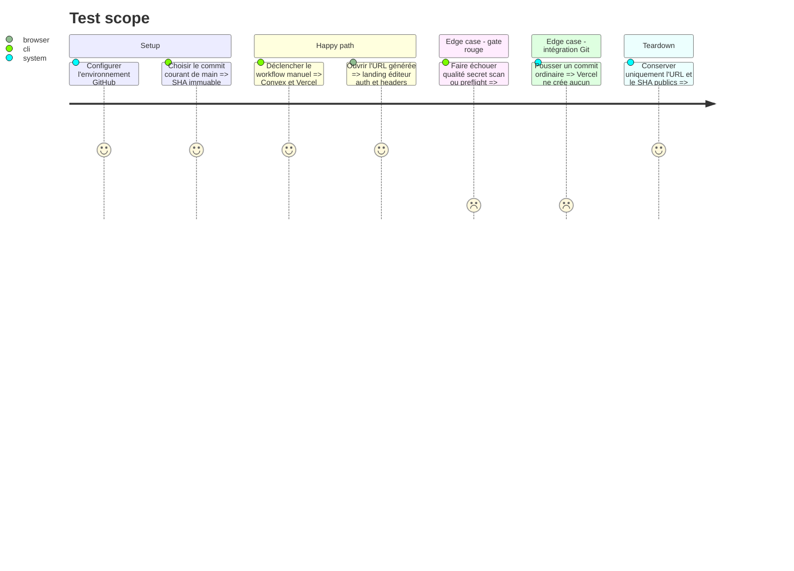

# Instruction: Publier une Preview Vercel contrôlée par GitHub Actions

## Architecture projection

> Tree of the final files. ✅ create · ✏️ modify · ❌ delete

```txt
.
├── .github/workflows/
│   └── ✅ deploy-preview.yml
├── ✏️ vercel.json
└── aidd_docs/tasks/2026_08/2026_08_16_cloud-prelaunch-validation/
    └── ✏️ verification.md
```

## User Journey



## Test Scope



## Tasks to do

### `1)` Verrouiller l’autorité de déploiement

> Empêcher Vercel Git et GitHub Actions de publier le même commit par deux chemins.

1. Ajouter `git.deploymentEnabled: false` à `vercel.json`; conserver les déploiements CLI autorisés.
2. Ne pas installer ni connecter l’intégration GitHub native au projet Vercel avant la v1.
3. Vérifier dans Vercel qu’aucun repository Git n’est autorisé à auto-déployer et qu’un push ordinaire ne crée pas de Preview.

### `2)` Créer l’environnement GitHub préproduction

> Isoler les identifiants de test de ceux déjà placés dans `production`.

1. Créer l’environnement `preproduction` sans reviewer obligatoire pour les essais manuels.
2. Ajouter `VERCEL_TOKEN` et la clé de déploiement Convex préproduction comme secrets; ajouter les IDs Vercel et l’URL publique Convex comme variables.
3. Ne jamais réutiliser la clé Convex production dans cet environnement et ne jamais écrire les valeurs dans un artifact.

### `3)` Ajouter le workflow Preview manuel

> Déployer un SHA de `main` de façon reproductible, sans `--prod` et sans domaine.

1. Déclencher uniquement par `workflow_dispatch`, lire le commit sélectionné et refuser toute ref qui n’appartient pas à `main`.
2. Réutiliser setup pnpm, cache, installation figée, qualité, tests et Gitleaks déjà employés par la release.
3. Déployer le backend sur Convex préproduction, puis exécuter `vercel pull --environment=preview`, `vercel build` et `vercel deploy --prebuilt` sans `--prod`.
4. Récupérer l’URL publique générée sans imprimer token ni sorties contenant des secrets.
5. Poser cette URL exacte dans `SITE_URL`, `CORS_ALLOWED_ORIGINS` et `CHECKOUT_SUCCESS_URL` de Convex préproduction, puis relancer le preflight.
6. Exécuter les sondes HTTP et headers existantes, ajouter au résumé GitHub le SHA, l’URL et les résultats non sensibles, sans upload d’artifact.

## Test acceptance criteria

| Task | Acceptance criteria |
| --- | --- |
| 1 | Un push ou une PR ne déclenche aucun déploiement Vercel natif; seul un workflow explicitement déclenché peut créer une Preview ou une production. |
| 2 | L’environnement `preproduction` utilise la clé Convex de préproduction et expose seulement les noms de secrets ainsi que des variables publiques. |
| 3 | Un run manuel vert déploie le même SHA sur Convex et Vercel, produit une URL Preview fonctionnelle, aligne les trois URLs backend et s’arrête avant déploiement si un gate échoue. |
