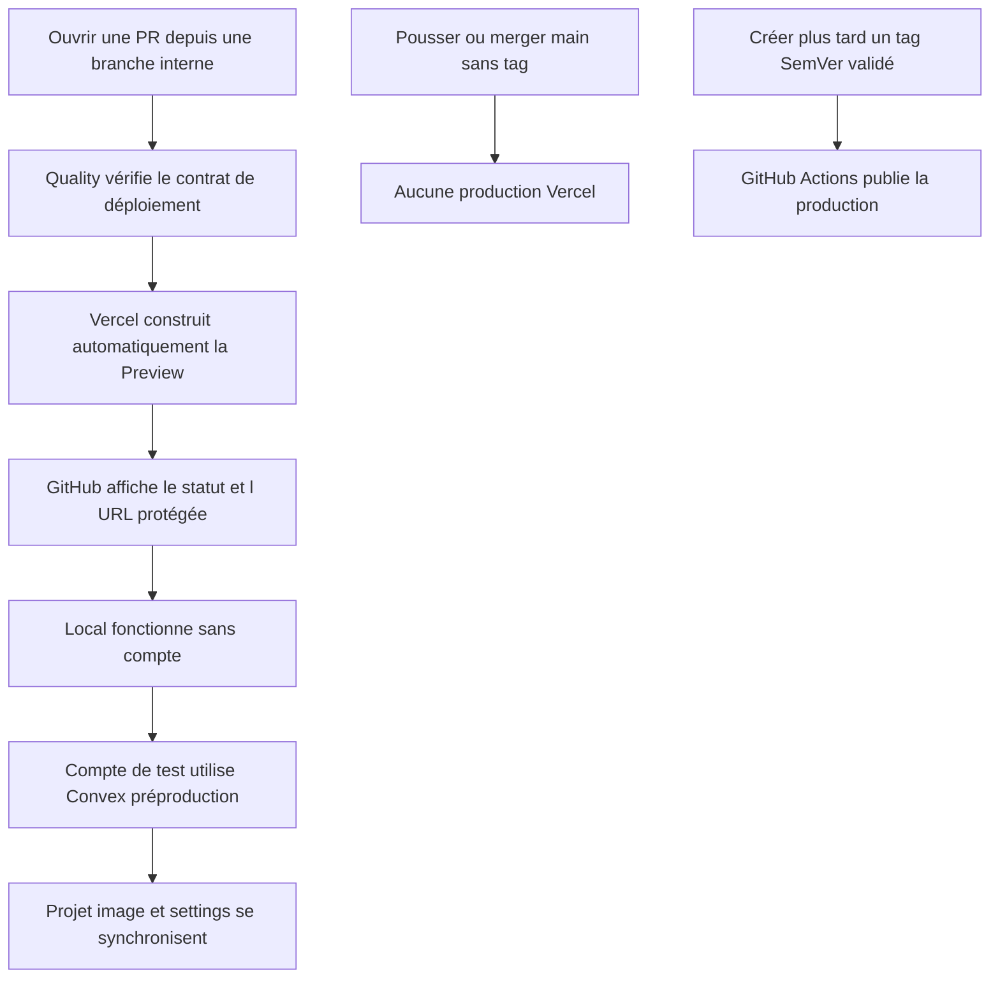
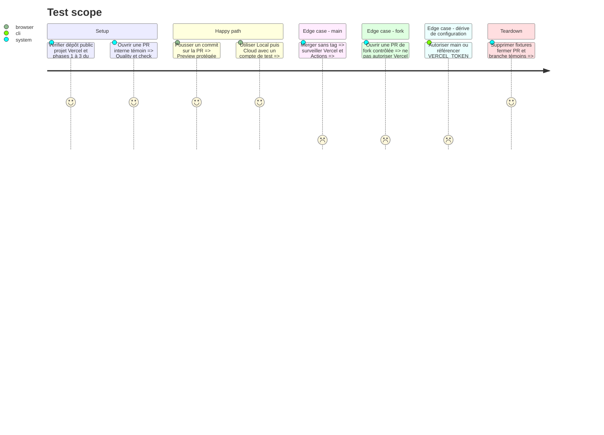

# Instruction: Exécuter le sous-plan Previews Vercel par pull request

## Architecture projection

> Tree of the final files. ✅ create · ✏️ modify · ❌ delete

```txt
.
├── ✏️ vercel.json
├── ✏️ package.json
├── ✏️ RELEASING.md
├── scripts/
│   └── ✅ deployment-config-audit.mjs
├── apps/backend/convex/
│   ├── ✅ origins.ts
│   ├── ✅ origins.test.ts
│   ├── ✏️ auth.ts
│   ├── ✏️ auth.test.ts
│   ├── ✏️ http.ts
│   ├── ✏️ assets.test.ts
│   ├── ✏️ convex.config.ts
│   └── ✏️ _generated/server.d.ts
└── aidd_docs/
    ├── memory/
    │   ├── ✏️ testing.md
    │   └── ✏️ vcs.md
    └── tasks/2026_08/
        ├── 2026_08_11_migration-convex/
        │   └── ✏️ environnements.md
        ├── 2026_08_16_vercel-pr-previews/
        │   ├── ✏️ plan.md
        │   ├── ✏️ phase-1.md
        │   ├── ✏️ phase-2.md
        │   ├── ✏️ phase-3.md
        │   └── ✏️ phase-4.md
        └── 2026_08_16_cloud-prelaunch-validation/
            └── ✏️ verification.md
```

## User Journey



## Test Scope



## Tasks to do

### `1)` Exécuter les trois phases techniques du sous-plan

> Faire du plan Vercel dédié l’unique spécification de l’intégration Git et de sa frontière d’origine.

1. Implémenter les phases 1 à 3 de `2026_08_16_vercel-pr-previews` dans leur ordre.
2. Désactiver seulement `main` dans `git.deploymentEnabled`; laisser les branches internes produire leurs Previews natives.
3. Installer l’application GitHub officielle Vercel au seul dépôt ScreenForge et ne créer aucun workflow Preview, jeton supplémentaire ou `pull_request_target`.
4. Faire partager à CORS et aux retours d’auth la règle d’origine Preview étroite mesurée sur le namespace réel du projet.
5. Garder Production sans configuration Preview et `.github/workflows/deploy-production.yml` limité aux tags SemVer.

### `2)` Séparer données et autorités

> Donner à une Preview juste assez d’information pour parler à préproduction, jamais pour administrer un fournisseur.

1. Mettre uniquement `VITE_CONVEX_URL` et les autres valeurs frontend déjà prouvées publiques dans l’environnement Vercel Preview.
2. Garder clés Convex, Polar, Resend, OAuth et Vercel hors du bundle, des workflows PR, des logs et des artifacts.
3. Utiliser un compte Cloud de test et des fixtures synthétiques sur les PR; réserver le compte propriétaire aux validations provider contrôlées.
4. Garder le checkout Polar Sandbox sur l’origine canonique configurée en phase 3; vérifier seulement son entitlement depuis les Previews éphémères.

### `3)` Exécuter la preuve du sous-plan dans la matrice Cloud

> Fermer le parcours Preview sans créer une seconde source de vérité.

1. Exécuter la phase 4 du sous-plan Vercel sur une PR interne témoin et une PR de fork contrôlée.
2. Reporter commandes, SHA, statuts, compteurs et findings expurgés dans `verification.md` du présent plan.
3. Vérifier une PR Release Please et une PR Dependabot avant de rendre le check Vercel obligatoire; le laisser informatif si Hobby ne couvre pas leurs auteurs.
4. Corriger chaque finding à la source, rejouer test ciblé puis gate complet et ne passer le sous-plan à `implemented` puis `reviewed` qu’avec toutes les preuves vertes.

## Test acceptance criteria

| Task | Acceptance criteria |
| --- | --- |
| 1 | Chaque PR interne éligible reçoit une Preview Vercel protégée; `main`, les forks non autorisés et les branches de production ne déclenchent aucun déploiement hors du contrat. |
| 2 | La Preview ne contient que des valeurs frontend publiques, utilise un compte de test contre Convex préproduction et ne peut lire aucun secret ou jeton de déploiement. |
| 3 | Local puis Cloud fonctionnent sur la PR témoin, la production reste inchangée sans tag et une seule matrice `verification.md` porte les preuves et findings expurgés. |
