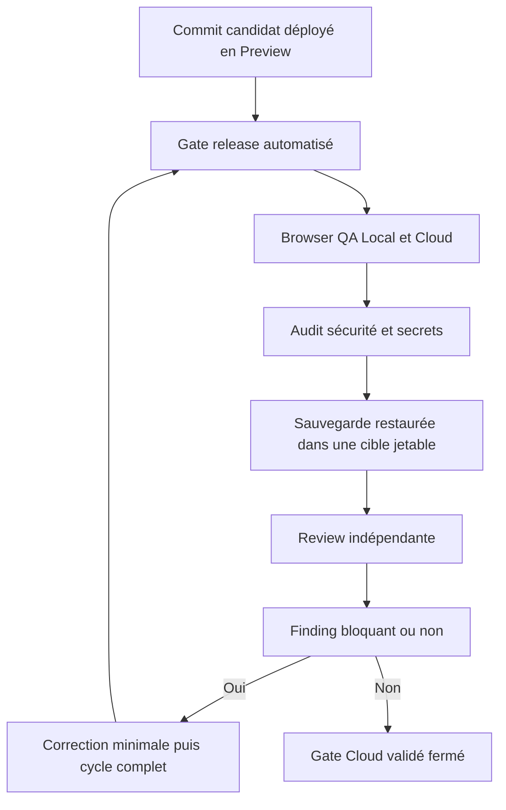
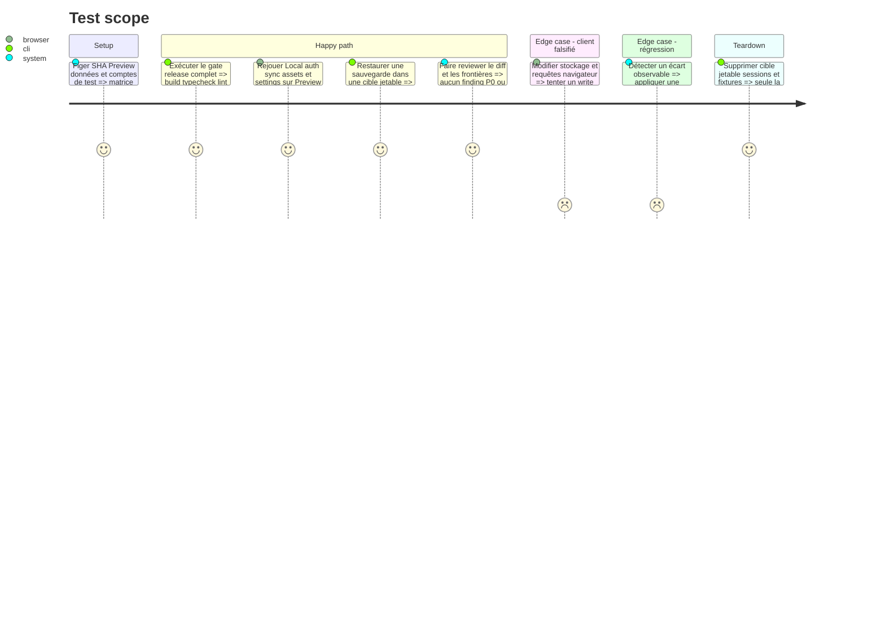

# Instruction: Asserter, reviewer et fermer le gate Cloud validé

## Architecture projection

> Tree of the final files. ✅ create · ✏️ modify · ❌ delete

```txt
.
└── aidd_docs/tasks/2026_08/2026_08_16_cloud-prelaunch-validation/
    ├── ✏️ plan.md
    ├── ✏️ phase-1.md
    ├── ✏️ phase-2.md
    ├── ✏️ phase-3.md
    ├── ✏️ phase-4.md
    ├── ✏️ phase-5.md
    └── ✏️ verification.md
```

## User Journey



## Test Scope



## Tasks to do

### `1)` Exécuter les assertions automatisées

> Vérifier le candidat complet plutôt que quelques fichiers isolés.

1. Exécuter format, lint, typecheck, tests unitaires, build, tests E2E de release, audit de publication et Gitleaks sur fichiers et historique.
2. Vérifier l’export critique à 1320×2868, PNG opaque et ZIP valide depuis le clone Local puis depuis la Preview.
3. Comparer le SHA du frontend, du backend, de la Preview et de la preuve.

### `2)` Faire la browser QA de la Preview

> Rejouer les parcours humains sur le vrai réseau provider.

1. Tester landing Local gratuit et Cloud payant, éditeur Local sans session, navigation clavier, thèmes et absence d’erreur console.
2. Tester lien magique Resend, compte propriétaire, sync projet, image et settings entre deux profils.
3. Vérifier sur la Preview l’entitlement issu du checkout Polar Sandbox canonique de phase 3, sa révocation puis la restauration de la dérogation propriétaire.
4. Falsifier entitlement et données locales, rejouer les writes directs et confirmer les refus Convex.

### `3)` Prouver sauvegarde, restauration et exploitation

> Vérifier qu’un service Cloud vendu peut être récupéré et surveillé.

1. Créer une sauvegarde Convex préproduction après fixtures connues et noter son horodatage sans URL signée.
2. Restaurer la sauvegarde dans un déploiement jetable séparé, comparer les comptes, projets, assets, settings et entitlements, puis supprimer cette cible.
3. Vérifier limites d’usage, rétention, erreurs récentes, absence de données sensibles dans les logs et procédure de révocation des secrets.

### `4)` Reviewer et itérer jusqu’au vert

> Fermer uniquement sur preuves, pas sur intuition.

1. Faire une review indépendante du diff final, des workflows, du preflight, des permissions et des frontières Cloud.
2. Classer chaque finding par sévérité; bloquer la phase pour tout P0, P1, secret, write contournable ou perte de données.
3. Corriger à la source avec le plus petit diff, ajouter le test qui reproduit l’écart et rejouer tâches 1 à 3.
4. Passer les phases 1 à 5 et le plan à leur état AIDD suivant seulement lorsque la matrice est verte et ne contient aucune donnée sensible.

## Test acceptance criteria

| Task | Acceptance criteria |
| --- | --- |
| 1 | Tous les gates automatisés sont verts sur le même SHA et l’export critique respecte exactement les contraintes App Store. |
| 2 | Les parcours Local, auth, propriétaire et sync fonctionnent sur la Preview; l’entitlement Polar validé sur l’origine canonique y gouverne les writes et toute falsification client reste sans effet. |
| 3 | Une sauvegarde se restaure dans une cible séparée avec données cohérentes, puis la cible et les fixtures sont supprimées sans secret dans la preuve. |
| 4 | Aucun finding P0/P1, secret, contournement Cloud ou perte de données ne reste ouvert; toute correction a son test et le cycle complet est repassé au vert. |
