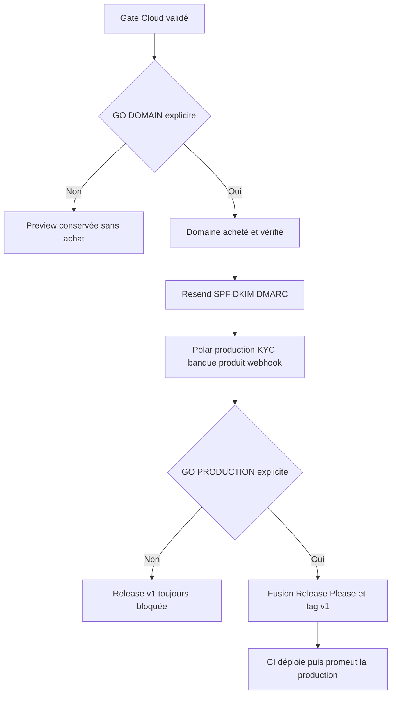
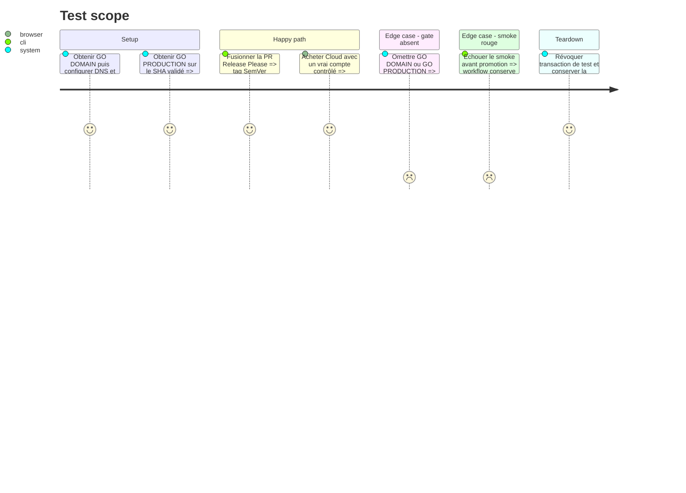

# Instruction: Garder domaine, production et v1 derrière leurs gates

## Architecture projection

> Tree of the final files. ✅ create · ✏️ modify · ❌ delete

```txt
.
├── .github/workflows/
│   └── ✏️ deploy-production.yml
└── aidd_docs/tasks/2026_08/2026_08_16_cloud-prelaunch-validation/
    ├── ✏️ plan.md
    ├── ✏️ phase-6.md
    └── ✏️ verification.md
```

## User Journey



## Test Scope



## Tasks to do

### `1)` Attendre et exécuter le gate domaine

> Ne dépenser ni configurer la production tant que le produit Cloud de test n’est pas validé.

1. Ne rien acheter et laisser cette tâche pending jusqu’au texte explicite `GO DOMAIN`.
2. Après accord, acheter le domaine retenu, connecter Vercel et configurer les redirections canoniques.
3. Vérifier le domaine Resend avec SPF et DKIM, publier DMARC, puis tester envoi, alignement et retours.
4. Remplacer dans Convex production les URLs par l’origine HTTPS finale et exécuter le preflight production.

### `2)` Préparer Polar et le compte propriétaire en production

> Séparer entièrement la validation financière de Sandbox.

1. Terminer KYC et compte bancaire Polar uniquement après le gate domaine.
2. Créer l’unique produit Cloud production, son token et son webhook signé, puis stocker les secrets dans Convex production.
3. Se connecter une fois au domaine final et accorder la dérogation Cloud au compte propriétaire via mutation interne.
4. Vérifier qu’aucun identifiant Sandbox ni droit de test n’a traversé vers la production.

### `3)` Déclencher la v1 uniquement après GO PRODUCTION

> Faire du tag SemVer l’unique événement de publication réelle.

1. Garder la PR Release Please en brouillon et `PRODUCTION_URL` absent tant que `GO PRODUCTION` n’est pas écrit.
2. Après accord, revalider le SHA de `main`, les changelogs, le preflight, la sauvegarde et tous les checks de phase 5.
3. Fusionner la PR Release Please pour créer le tag v1 et laisser le workflow tag déployer Convex puis Vercel sans domaine, sonder et promouvoir.
4. Exécuter smoke, auth, achat contrôlé, sync, export et rollback drill sur le domaine final; documenter uniquement des preuves publiques non sensibles.
5. Passer la phase 6 et le plan à leur état AIDD suivant lorsque production et récupération sont vertes.

## Test acceptance criteria

| Task | Acceptance criteria |
| --- | --- |
| 1 | Sans `GO DOMAIN`, aucun achat ni DNS n’est modifié; après accord, le domaine Vercel et Resend est vérifié et Convex n’accepte que l’origine HTTPS finale. |
| 2 | Polar production est distinct de Sandbox, les webhooks signés pilotent le produit Cloud unique et le propriétaire dispose de Cloud sans rôle admin. |
| 3 | Sans `GO PRODUCTION`, aucun tag ni paiement réel n’est créé; après accord, la v1 est publiée par le seul workflow tag, validée sur le domaine final et récupérable par rollback. |
