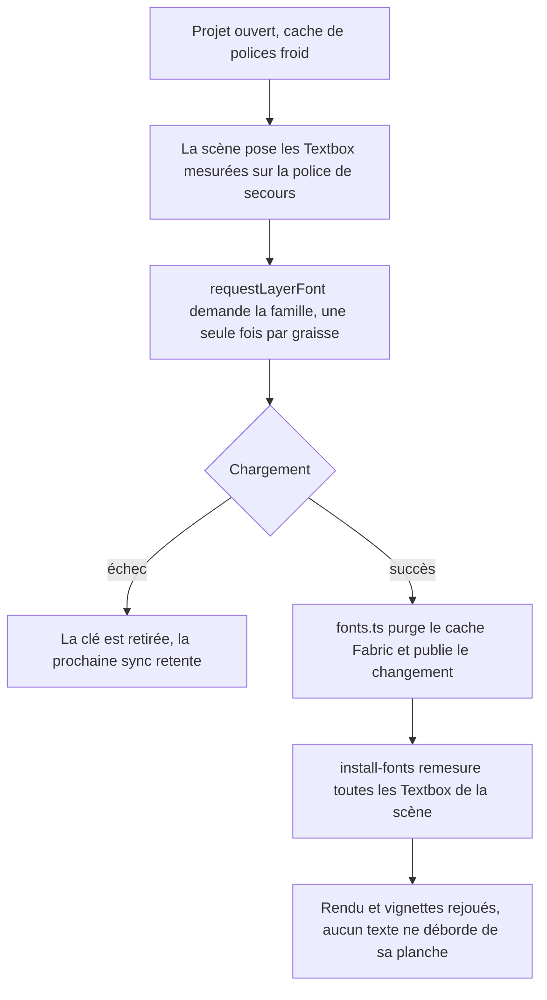
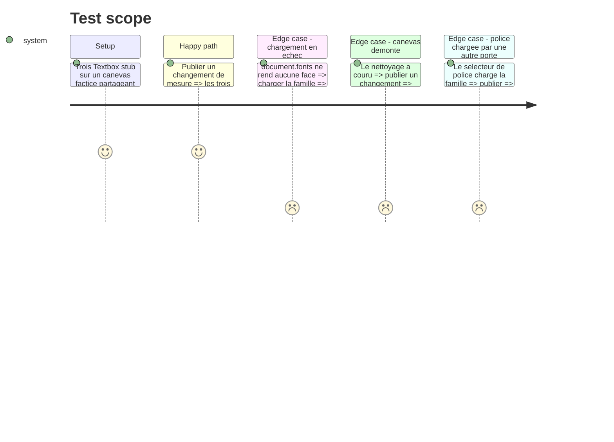

# Instruction: l’arrivée d’une police est un événement de scène

## Architecture projection

> Tree of the final files. ✅ create · ✏️ modify · ❌ delete

```txt
.
└── apps/web/src/
    ├── hooks/
    │   └── use-canvas.ts                          ✏️ installe l'abonnement avec le canevas, le coupe au démontage
    └── lib/
        ├── fonts.ts                               ✏️ publie le changement de mesure là où il purge déjà le cache
        ├── canvas/
        │   ├── canvas-sync.ts                     ✏️ `requestLayerFont` ne fait plus que demander ; `remeasureTextObjects` déménage
        │   ├── install-fonts.ts                   ✅ l'abonné — remesure la scène, redemande le rendu, régénère les vignettes
        │   └── __tests__/
        │       ├── canvas-sync.test.ts            ❌ son assertion est absorbée par install-fonts.test.ts
        │       └── install-fonts.test.ts          ✅ un événement remesure toutes les boîtes ; le démontage coupe
        └── __tests__/
            └── fonts.test.ts                      ✏️ une notification par famille chargée, aucune sur échec
```

## User Journey



## Test Scope



## Tasks to do

### `1)` Publier l’événement là où la mesure change

> `fonts.ts` possède déjà l’invalidation ; il doit posséder l’annonce.

1. Exporter `onFontMetricsChanged(listener: (family: string) => void): () => void` — un `Set` d’écouteurs, la fonction rendue désabonne.
2. Émettre immédiatement après `cache.clearFontCache(family)`, dans la branche succès de `loadFont`, et nulle part ailleurs.
3. Ne rien émettre quand le résultat est `fallback` : la mesure n’a pas changé, la police de secours était déjà en place.

### `2)` Réduire `requestLayerFont` à une demande

> Une fonction qui demande une police n’a pas à savoir ce qu’une police qui arrive fait à la scène.

1. Garder la garde `isFontLoaded`, la clé `fontLoadRequests` et sa suppression sur échec — c’est le seul rôle qui reste.
2. Supprimer du `.then()` la boucle de remesure, le `requestRenderAll` et la régénération des vignettes.
3. Déplacer `remeasureTextObjects` dans `install-fonts.ts` ; `canvas-sync.ts` n’importe plus `Textbox` que pour ce dont il se sert encore.

### `3)` Poser l’abonné

> Même forme que `install-thumbnails` / `install-viewport` : une installation, un nettoyage.

1. `installFonts({ currentCanvas, generateThumbnails }): { cleanup: () => void }` dans `apps/web/src/lib/canvas/install-fonts.ts`.
2. À la notification : lire le canevas courant, sortir s’il n’y en a plus, remesurer toutes les `Textbox`, `requestRenderAll`, puis régénérer les vignettes du projet courant.
3. `cleanup` désabonne — un abonnement au module survit au canevas, c’est une fuite et un rendu sur un canevas mort.

### `4)` Brancher au cycle de vie du canevas

> L’abonnement naît et meurt avec le canevas Fabric, pas avec un rendu React.

1. Dans `use-canvas.ts`, installer dans l’effet qui possède déjà le canevas, à côté de `installThumbnails`.
2. Appeler `cleanup` dans le retour du même effet, dans l’ordre des autres `install-*`.

### `5)` Les assertions

> Trois propriétés, aucune police réelle, aucun navigateur.

1. `fonts.test.ts` : réutiliser le `stubFonts` existant, ajouter un écouteur, charger une famille, assert une notification portant la famille ; puis un chargement en échec, assert zéro notification.
2. `install-fonts.test.ts` : canevas factice rendant trois stubs `Object.create(Textbox.prototype)` et un objet non-texte ; émettre, assert `initDimensions` appelé sur les **trois** et pas sur le quatrième, `requestRenderAll` et `generateThumbnails` une fois chacun.
3. Même fichier : après `cleanup`, émettre à nouveau, assert qu’aucun stub n’est retouché et que `currentCanvas` n’est plus lu.
4. Supprimer `canvas-sync.test.ts` : sa propriété est celle du point 2, une couche plus haut.

## Test acceptance criteria

| Task | Acceptance criteria                                                                                                                                    |
| ---- | ------------------------------------------------------------------------------------------------------------------------------------------------------ |
| 1    | Charger une police avec succès notifie une fois, en nommant la famille ; un chargement qui retombe sur la police de secours ne notifie pas.               |
| 2    | `canvas-sync.ts` ne contient plus ni remesure, ni `requestRenderAll`, ni régénération de vignettes ; un échec réseau retire toujours la clé et retente.   |
| 3    | Un seul changement de mesure remesure **toutes** les boîtes de la scène, quel que soit le calque qui avait demandé la police ; le démontage coupe tout.   |
| 4    | Ouvrir puis fermer l’éditeur ne laisse aucun écouteur derrière lui, et aucun rendu n’est demandé sur un canevas détruit.                                  |
| 5    | `pnpm test` passe ; les trois tests échouent si l’on remet un filtre par calque, si l’on émet sur un échec, ou si l’on oublie le désabonnement.           |
