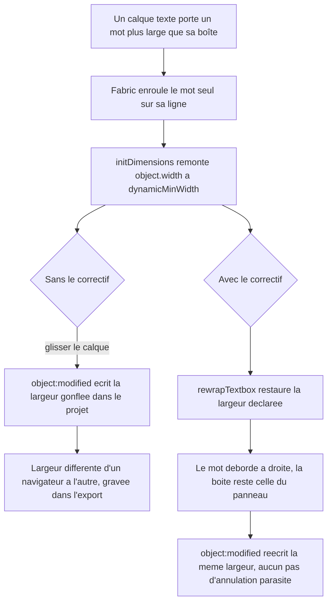
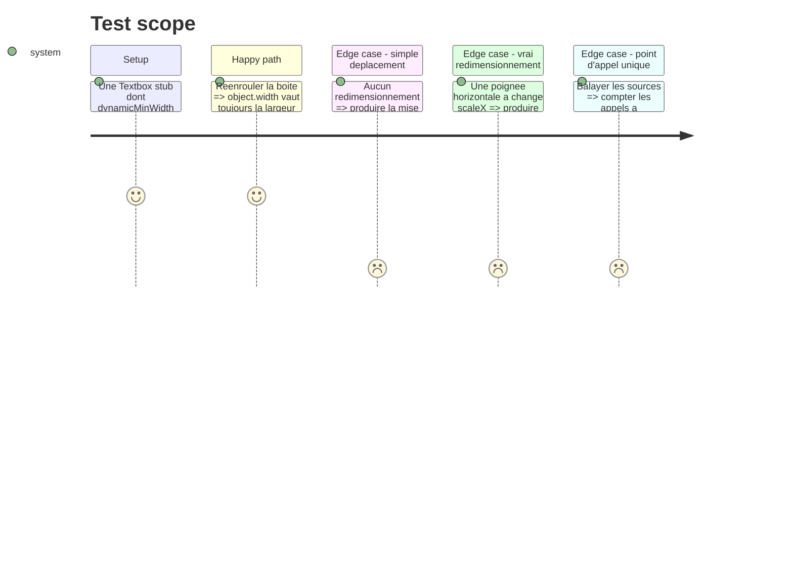

# Instruction: la largeur déclarée survit à ce que Fabric a mesuré

## Architecture projection

> Tree of the final files. ✅ create · ✏️ modify · ❌ delete

```txt
.
└── apps/web/src/lib/canvas/
    ├── canvas-utils.ts                        ✏️ `rewrapTextbox` — seul point qui appelle `initDimensions`
    ├── install-fonts.ts                       ✏️ la remesure passe par `rewrapTextbox`
    └── __tests__/
        ├── install-fonts.test.ts              ✏️ la remesure ne gonfle plus la boîte
        └── declared-width.test.ts             ✅ ce qui part vers le projet est la largeur du calque
```

## User Journey



## Test Scope



## Tasks to do

### `1)` Mémoriser la largeur déclarée sur l’objet

> La remesure n’a pas le calque sous la main ; elle doit pouvoir la relire sur l’objet.

1. Dans `applyLayerToFabricObject`, brancher `declaredWidth` dans `object.data` au moment où la géométrie est posée — c’est déjà la seule fonction qui écrit la géométrie.
2. Déclarer le champ sur le type `RenderedObject`, à côté de `uid` / `layerId`.

### `2)` Un seul point qui réenroule

> `initDimensions` gonfle `width` ; personne d’autre que le voisin immédiat ne doit avoir à le savoir.

1. `rewrapTextbox(object: Textbox & RenderedObject): void` dans `canvas-utils.ts` : `initDimensions()`, puis restaurer `data.declaredWidth` si `width` a bougé.
2. Documenter en tête la raison : Fabric enroule déjà au `Math.max(desiredWidth, largestWordWidth)` (`_wrapLine`), donc restaurer la largeur ne change pas la coupe — seulement la boîte annoncée et l’origine du rendu.
3. `applyLayerToFabricObject` et la remesure de `install-fonts.ts` passent par elle ; plus aucun `initDimensions()` ailleurs.

### `3)` Les assertions

> La preuve porte sur ce qui part vers le projet, pas sur ce que Fabric a mesuré.

1. `declared-width.test.ts` : stub de `Textbox` avec `dynamicMinWidth` supérieur à la largeur déclarée ; après `rewrapTextbox`, `object.width` vaut la largeur déclarée.
2. Même fichier : `fabricObjectToLayerUpdate` sur cet objet, `scaleX` à 1, rend exactement la largeur du calque — le déplacement n’écrit rien de neuf.
3. Contre-test : le même objet avec `scaleX` à 1.5 rend bien la largeur redimensionnée. Sans lui, le correctif pourrait devenir « ne jamais écrire la largeur d’un texte » et personne ne le verrait.
4. Garde de source : un balayage de `apps/web/src` compte les appels à `initDimensions(` et échoue au-delà d’un seul, sur le modèle des invariants déjà vérifiés au grep dans ce dépôt.
5. `install-fonts.test.ts` : après remesure, une boîte dont `dynamicMinWidth` dépasse garde sa largeur déclarée.

## Test acceptance criteria

| Task | Acceptance criteria                                                                                                                                                   |
| ---- | ----------------------------------------------------------------------------------------------------------------------------------------------------------------------- |
| 1    | Tout objet texte de la scène porte la largeur que le calque déclare, lisible sans consulter le projet.                                                                    |
| 2    | Un mot plus large que sa boîte déborde visiblement à droite ; la boîte annoncée par le panneau Transformation ne bouge pas, et la coupe des autres lignes est inchangée.   |
| 3    | Déplacer un calque texte n’altère jamais sa largeur dans le projet ; le redimensionner l’altère toujours ; un second appelant de `initDimensions` fait échouer la suite.   |
