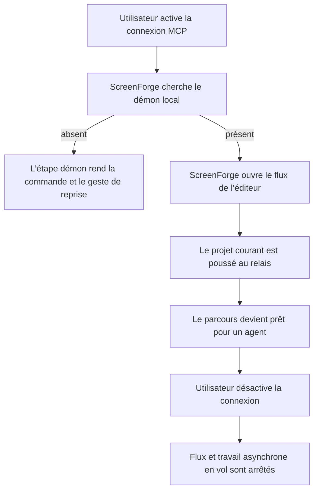
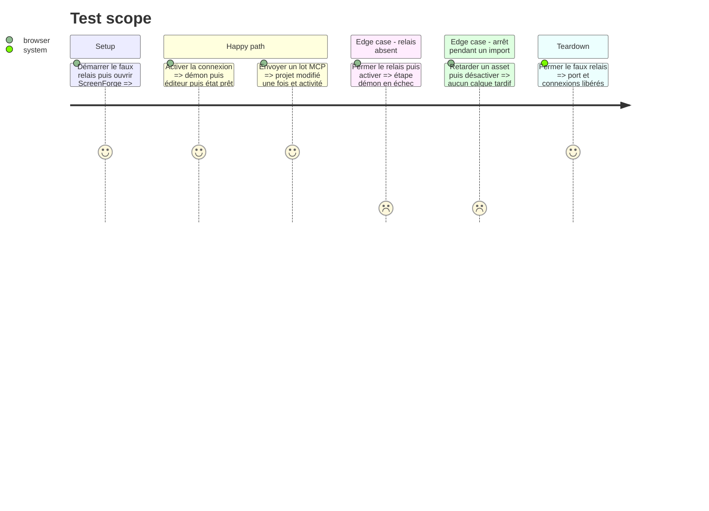

# Instruction: Un cycle MCP vrai jusque dans l’interface

## Architecture projection

> Tree of the final files. ✅ create · ✏️ modify · ❌ delete

```txt
.
├── apps/web/src/
│   ├── lib/mcp/client.ts                  ✏️ annuler les réponses en vol et publier des jalons fiables
│   └── stores/mcp.store.ts                ✏️ dériver les trois étapes depuis le cycle de connexion existant
├── apps/web/e2e/mcp-live.spec.ts          ✏️ verrouiller progression, reprise et désactivation pendant un appel
└── scripts/mcp-live-probe.mjs             ✏️ aligner la miniature factice sur `RelayRendered.findings`
```

## User Journey



## Test Scope



## Tasks to do

### `1)` Rendre les jalons observables

> Donner à l’UI des faits, pas une chronologie inventée.

1. Conserver `McpStatus` comme résumé destiné à la TopBar et ajouter dans le même store une étape de connexion `daemon`, `editor` ou `ready` ; aucune nouvelle couche de state.
2. Faire avancer cette étape uniquement sur les événements observés par `client.ts` : tentative de `/pair`, réponse valide, ouverture SSE puis premier `POST /state` réussi.
3. Ajouter un sélecteur pur qui projette l’étape et le statut sur `waiting`, `active`, `done` et `error`, avec la cause existante dans `message`.
4. Garder `appliedBatches` et `appliedCalls` comme preuve d’activité, sans les transformer en progression.

### `2)` Faire de « Désactivée » une promesse exacte

> Couper le travail local déjà reçu en même temps que le flux.

1. Faire capturer le `cycle` courant à `answer()` et refuser toute mutation ou réponse quand `teardown()` l’a invalidé.
2. Propager un signal d’abandon aux récupérations d’assets quand le chemin existant le permet ; conserver la garde de cycle avant le commit comme garantie finale.
3. Ajouter au scénario Playwright un asset volontairement retardé, puis désactiver avant sa résolution et vérifier projet, historique et absence de reconnexion.

### `3)` Rétablir la gate MCP

> Partir d’une probe verte avant de construire une nouvelle représentation du même cycle.

1. Ajouter `findings: []` à la réponse `render` de la fausse app dans `mcp-live-probe.mjs`.
2. Vérifier que la probe couvre toujours le vrai round-trip stdio, SSE, vignette et refus.

## Test acceptance criteria

| Task | Acceptance criteria |
| ---- | ------------------- |
| 1    | Une réponse `/pair` valide termine seulement le jalon démon ; l’ouverture SSE active le jalon éditeur et le premier état poussé termine le parcours. |
| 1    | Pour chaque combinaison de statut et d’étape, le sélecteur rend exactement un jalon actif ou en erreur et jamais un pourcentage temporel. |
| 1    | Un flux `live` avec état initial poussé rend les trois jalons terminés et les compteurs d’activité restent indépendants. |
| 2    | Désactiver pendant le téléchargement retardé d’un asset ne modifie ni le projet ni l’historique après le clic. |
| 2    | Après désactivation, le flux tombe et ne se rouvre pas sans nouveau geste utilisateur. |
| 3    | La probe MCP accepte la miniature factice avec `findings` et atteint la fin du parcours sans erreur. |
