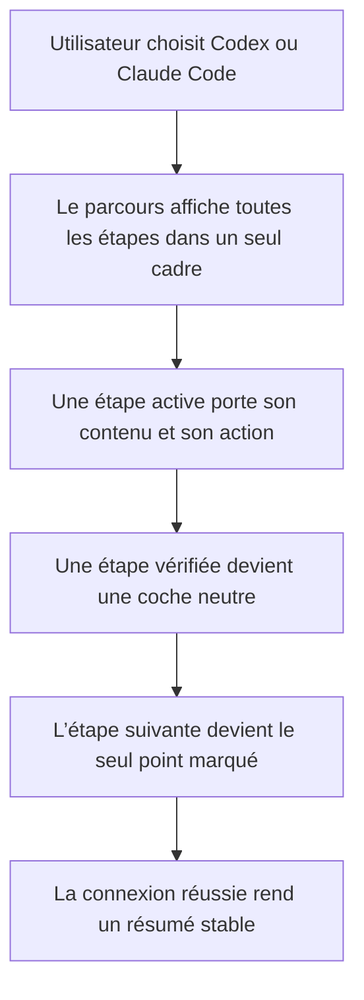
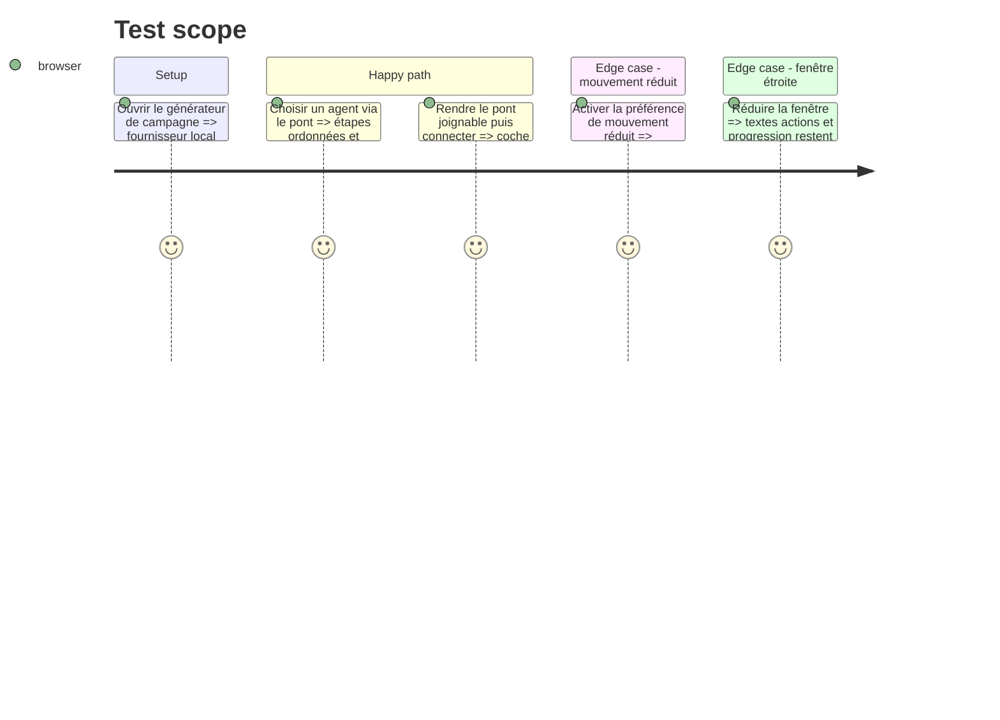

# Instruction: Une grammaire d’étapes partagée avec le pont d’assistant

## Architecture projection

> Tree of the final files. ✅ create · ✏️ modify · ❌ delete

```txt
.
└── apps/web/src/
    ├── components/ui/setup-flow.tsx                    ✅ primitive composée pour étapes et progression réelle
    ├── components/campaign-dialog/AssistantSetup.tsx   ✏️ remplacer `Step` local par la primitive partagée
    └── index.css                                        ✏️ ajouter seulement l’animation indéterminée si les tokens actuels ne suffisent pas
```

## User Journey



## Test Scope



## Wireframe

```txt
┌───────────────────────────────────────────────┐
│ (1) Choix du fournisseur                      │
├───────────────────────────────────────────────┤
│ ┌───────────────────────────────────────────┐ │
│ │ (2) ✓ Étape terminée                      │ │
│ │ (3) ◉ Étape active        [progression]   │ │
│ │       contenu et action                   │ │
│ │ (4) ○ Étape suivante                      │ │
│ ├───────────────────────────────────────────┤ │
│ │ (5) › Détails techniques                  │ │
│ └───────────────────────────────────────────┘ │
└───────────────────────────────────────────────┘
```

1. Choix : le fournisseur reste sélectionné dans le composant existant.
2. Terminée : résultat acquis, compact et non interactif.
3. Active : seul endroit qui porte explication, contrôle et progression.
4. Suivante : visible pour annoncer la suite sans offrir une action prématurée.
5. Détails : divulgation native pour la confidentialité et les informations secondaires.

## Tasks to do

### `1)` Extraire le parcours minimal

> Réutiliser le motif existant sans créer un framework de workflow.

1. Créer `SetupFlow`, `SetupStep` et `SetupProgress` comme petits composants composés dans un seul fichier UI.
2. Donner à `SetupStep` les seuls états nécessaires : `waiting`, `active`, `done`, `error` ; employer Lucide, les tokens sémantiques et `cn()`.
3. Rendre `SetupProgress` avec l’élément natif `<progress>` : `value/max` pour les jalons connus, sans `value` pour une attente indéterminée, et libellé accessible explicite.
4. Réserver le marqueur citron à l’étape active et au focus ; utiliser une coche neutre pour les étapes terminées et le destructif pour l’erreur.

### `2)` Migrer `AssistantSetup` sans changer son métier

> Prouver la primitive sur le parcours qui possède déjà les bons états.

1. Retirer le composant `Step` local et composer les mêmes contenus avec `SetupFlow`.
2. Conserver `ProviderChoice`, `CommandLine`, la détection du pont, les secrets et tous les libellés fonctionnels existants.
3. Placer `Données et confidentialité` dans la zone de détails repliable de la nouvelle carte, sans masquer l’information quand elle est ouverte.

### `3)` Respecter le plancher de qualité

> Garder le parcours dense, accessible et stable dans les deux thèmes.

1. Utiliser les hauteurs, rayons, surfaces et ombres déjà définis ; ne créer aucun hex ni z-index.
2. Annoncer l’étape active et les erreurs avec `aria-live` sans relire toute la liste à chaque changement.
3. Réduire l’animation à une coche et une transition d’opacité de 120–200 ms ; sous `prefers-reduced-motion`, conserver uniquement le changement visuel d’état.

## Test acceptance criteria

| Task | Acceptance criteria |
| ---- | ------------------- |
| 1    | Le composant rend une seule étape active, une progression native lisible par technologie d’assistance et aucun contrôle sur une étape en attente. |
| 1    | Le citron n’apparaît que sur l’étape active ou le focus ; une étape terminée reste neutre. |
| 2    | Les scénarios existants de choix Codex, Claude Code, pont absent, secret refusé et confidentialité passent sans modification de comportement. |
| 2    | Le parcours conserve commande copiable, relance de détection et oubli du secret. |
| 3    | À largeur étroite, aucune ligne, action ou progression ne sort de la boîte. |
| 3    | En mouvement réduit, chaque changement d’état reste perceptible sans animation spatiale. |
