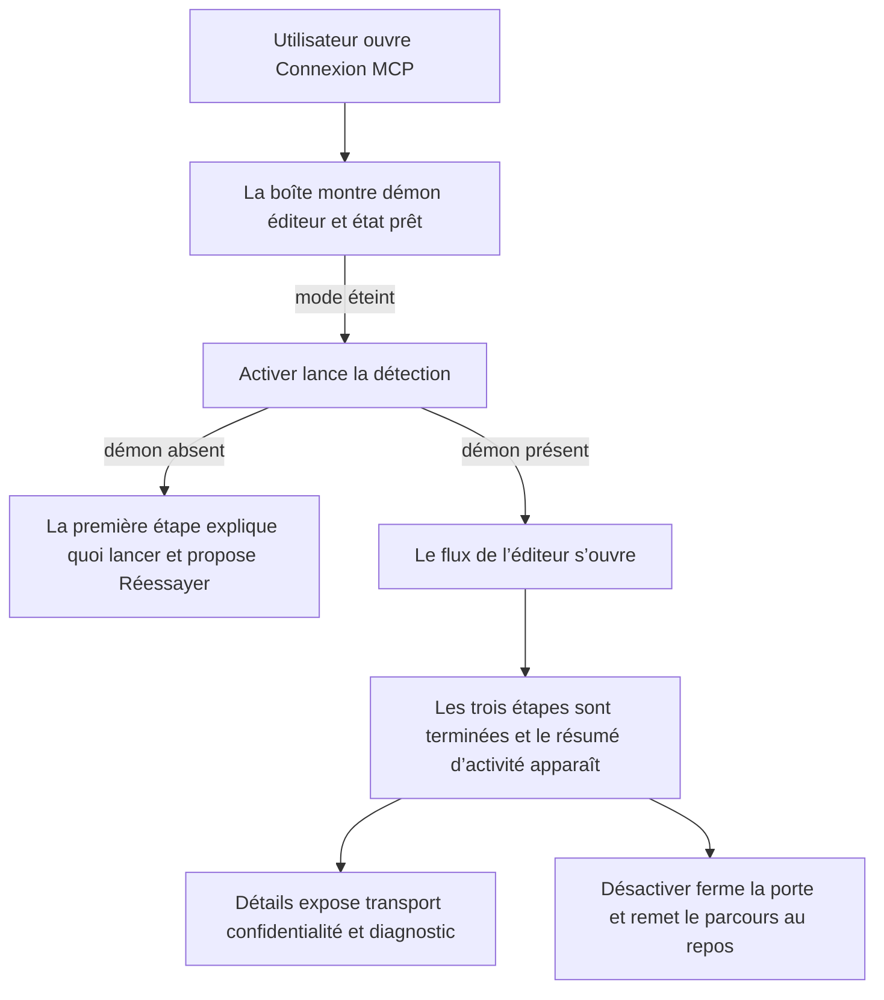
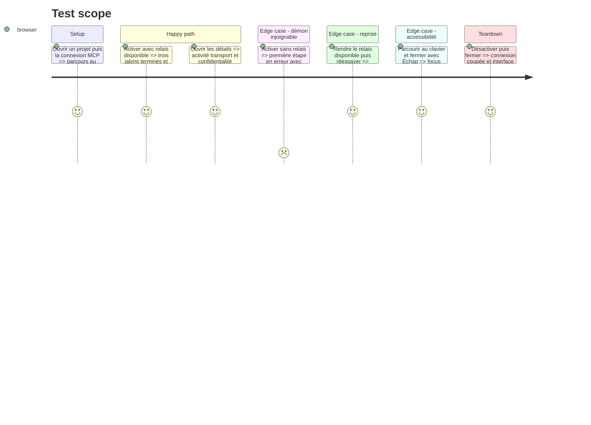

# Instruction: La boîte MCP devient un parcours de connexion clair

## Architecture projection

> Tree of the final files. ✅ create · ✏️ modify · ❌ delete

```txt
.
├── apps/web/src/
│   ├── components/mcp/McpDialog.tsx          ✏️ remplacer le statut isolé par le parcours en trois jalons
│   ├── components/mcp/McpStatusDot.tsx       ✏️ rester le témoin compact de la TopBar, aligné sur les nouveaux états
│   └── components/toolbar/TopBar.tsx          ✏️ clarifier le hint sans déplacer le point d’entrée
├── apps/web/e2e/
│   ├── mcp-live.spec.ts                       ✏️ couvrir étapes, détails, erreur, reprise et clavier
│   └── dialogs-a11y.spec.ts                   ✏️ vérifier focus, fermeture et noms accessibles
└── apps/mcp/README.md                         ✏️ aligner confidentialité et accès visuel sur le texte de la boîte
```

## User Journey



## Test Scope



## Wireframe

```txt
┌─────────────────────────────────────────────────────┐
│ Connexion MCP                                   [×] │
├─────────────────────────────────────────────────────┤
│ (1) Un agent externe peut piloter le projet ouvert. │
│                                                     │
│ ┌─────────────────────────────────────────────────┐ │
│ │ (2) ✓ Démon local                               │ │
│ │ (3) ◉ Éditeur ScreenForge          [ 2 sur 3 ] │ │
│ │       [ progression réelle                  ]   │ │
│ │ (4) ○ Prêt pour l’agent                         │ │
│ ├─────────────────────────────────────────────────┤ │
│ │ (5) › Détails de connexion                      │ │
│ │                                  action secours │ │
│ └─────────────────────────────────────────────────┘ │
├─────────────────────────────────────────────────────┤
│ (6) Portée et annulation                    action  │
└─────────────────────────────────────────────────────┘
```

1. Contexte : une phrase factuelle, sans tutoriel ni promesse marketing.
2. Démon : joignabilité du processus local et commande de reprise en cas d’échec.
3. Éditeur : appairage et flux SSE, seule étape marquée pendant la connexion.
4. Prêt : état utilisable par l’agent, sans prétendre connaître un client non observable.
5. Détails : version, port, lots appliqués, accès visuel et transport local.
6. Pied : conséquence de l’activation à gauche, action unique à droite.

## Tasks to do

### `1)` Recomposer la boîte autour des trois jalons

> Faire lire l’état et le prochain geste en moins d’un regard.

1. Passer `McpDialog` à la largeur nécessaire au parcours, sans nouvelle page ni drawer.
2. Construire les étapes depuis le sélecteur de phase 1 et `SetupFlow` ; garder `MCP_LABELS` comme résumé accessible et la pastille uniquement dans la TopBar.
3. Afficher la progression discrète `jalons terminés / 3` et une forme indéterminée seulement pendant une requête dont l’avancement interne est inconnu.
4. Laisser le contenu détaillé uniquement dans l’étape active ; replier les étapes acquises sur leur résultat.

### `2)` Donner une issue à chaque état

> Une erreur dit quoi faire au même endroit que ce qui a échoué.

1. Au repos, proposer `Activer`; pendant l’appairage, garder le libellé avec son spinner ; connecté, proposer `Désactiver`.
2. Quand le démon est absent, afficher la commande existante dans un bloc copiable et proposer `Réessayer` sans fermer la boîte.
3. Garder fermer et Échap pour quitter la boîte ; ne pas ajouter un second bouton `Fermer`.
4. Après une reconnexion, faire disparaître l’erreur et annoncer le nouveau statut sans toast redondant.

### `3)` Mettre les détails techniques à leur juste niveau

> Rendre la sécurité vérifiable sans la placer devant le geste principal.

1. Utiliser un `<details>` natif pour la version MCP, l’adresse loopback, le nombre de lots et d’appels, ainsi que la règle d’un seul onglet.
2. Dire explicitement que l’agent peut lire l’état et une miniature rendue du projet ouvert, puis créer et modifier des écrans tant que le mode est actif.
3. Aligner `apps/mcp/README.md` sur cette portée et retirer l’affirmation contradictoire selon laquelle l’agent ne peut pas lire d’image.

### `4)` Vérifier l’expérience complète

> Contrôler les états, pas seulement la capture idéale.

1. Étendre `mcp-live.spec.ts` avec les états repos, connexion, erreur, reprise, prêt, activité et désactivation.
2. Vérifier `role=status`, `role=alert`, `aria-expanded`, progression accessible, ordre de tabulation et retour du focus.
3. Exécuter les scénarios MCP et assistant ciblés, les audits contraste et échelle, puis le détecteur Impeccable sur les fichiers UI modifiés.
4. Inspecter en une passe groupée dark/light aux largeurs desktop et étroite ; corriger en un lot, puis confirmer une seule fois.

## Test acceptance criteria

| Task | Acceptance criteria |
| ---- | ------------------- |
| 1    | Au repos, en connexion, connecté et en erreur, la boîte rend exactement trois jalons et un seul état actif ou fautif. |
| 1    | La progression affichée correspond aux jalons réellement atteints et ne continue jamais seule avec le temps. |
| 2    | Sans démon, l’utilisateur voit la commande, peut la copier puis relancer la détection sans fermer la boîte. |
| 2    | Connecté, `Désactiver` coupe le flux ; fermer la boîte seule ne modifie pas le choix de connexion. |
| 3    | Les détails nomment loopback, version, activité, accès aux miniatures et pouvoir de modification sans exposer le jeton. |
| 3    | Le README et la boîte décrivent la même portée de lecture et d’écriture. |
| 4    | Le parcours est entièrement utilisable au clavier, rend le focus au bouton de TopBar et annonce chaque échec puis reprise. |
| 4    | Les audits contraste et échelle passent en dark et light, y compris à largeur étroite et en mouvement réduit. |
