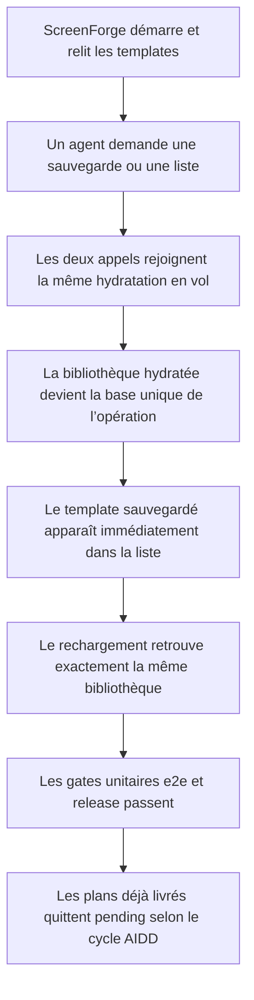
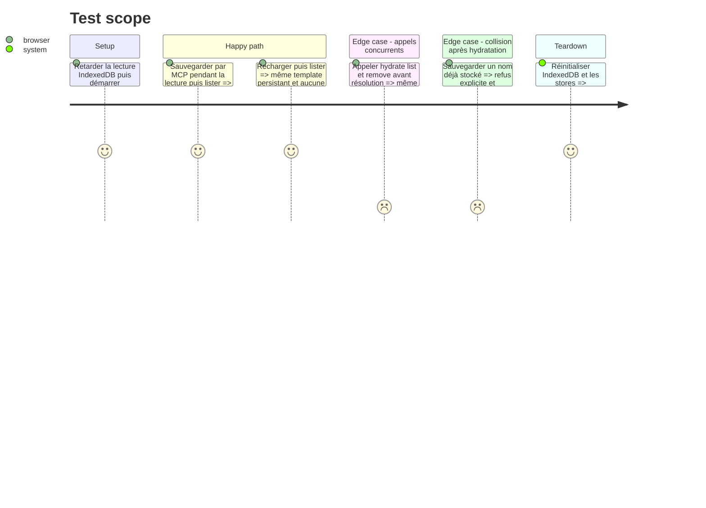

# Instruction: Templates hydratés avant usage et review refermée

## Architecture projection

> Tree of the final files. ✅ create · ✏️ modify · ❌ delete

```txt
.
├── apps/web/src/
│   ├── App.tsx                                             ✏️ réutiliser l’unique hydratation de la bibliothèque
│   ├── lib/mcp/client.ts                                   ✏️ attendre la liste asynchrone des templates
│   ├── lib/mcp/session.ts                                  ✏️ faire attendre hydratation aux opérations MCP
│   ├── stores/templates.store.ts                           ✏️ rendre l’hydratation idempotente et partagée
│   └── stores/__tests__/templates.store.test.ts            ✅ verrouiller les courses hydrate/list/save/remove
├── apps/web/e2e/mcp-templates.spec.ts                      ✏️ couvrir save puis list pendant un démarrage retardé
└── aidd_docs/tasks/2026_08/
    └── 2026_08_16_font-metrics-invalidation/
        ├── plan.md                                         ✏️ aligner le statut via le cycle AIDD après vérification
        ├── phase-1.md                                      ✏️ aligner le statut via le cycle AIDD après vérification
        └── phase-2.md                                      ✏️ aligner le statut via le cycle AIDD après vérification
```

## User Journey



## Test Scope



## Tasks to do

### `1)` Une seule hydratation pour tous les appelants

> Corriger la course à sa source dans le store, pas dans chaque écran.

1. Reprendre le motif single-flight déjà utilisé par `lib/ai/session.ts` : une promesse de module partage la lecture en cours et `hydrated` court-circuite les appels suivants.
2. Faire attendre cette promesse à `save` et `remove` avant toute lecture ou mutation de `templates`.
3. Garder l’écriture IndexedDB avant le `set`, et ne jamais laisser une hydratation tardive remplacer une mutation plus récente.
4. Laisser `App.tsx` lancer l’hydratation au démarrage, mais faire de cet appel un consommateur de la même promesse plutôt qu’un chemin privilégié.

### `2)` Rendre les opérations MCP cohérentes dès la première requête

> Garantir que save puis list fonctionne même si l’agent arrive pendant le démarrage.

1. Faire attendre `hydrate()` à `saveRelayTemplate` et transformer `listRelayTemplates` en opération asynchrone qui attend la même promesse.
2. Dans `client.ts`, attendre explicitement `listRelayTemplates()` comme les autres formes de `RelayRequest`.
3. Ajouter un test unitaire avec lecture différée qui lance hydrate, save et list dans cet ordre avant de résoudre IndexedDB.
4. Étendre le scénario Playwright MCP pour vérifier sauvegarde, liste immédiate, reload et collision de nom.

### `3)` Aligner les statuts sans falsifier la review

> Corriger le finding documentaire selon le cycle AIDD existant.

1. Vérifier les critères des deux phases `font-metrics-invalidation` avec leurs tests ciblés et la gate agrégée.
2. Quand l’exécution est réellement terminée, faire passer le plan et ses deux phases de `pending` à `implemented` via l’étape d’implémentation.
3. Ne pas écrire `reviewed` dans cette phase : seul un nouveau passage de review approuvé peut porter ce statut.
4. Conserver `mcp-composition-quality/review.md` comme constat historique `changes-requested`; la nouvelle review produira le verdict après les correctifs.

### `4)` Fermer les cinq findings par la preuve

> Terminer sur les gates du dépôt, pas sur une inspection locale du nouveau dialogue.

1. Rejouer les tests ciblés templates, cycle MCP, métriques de police et parcours assistant.
2. Exécuter `pnpm test`, puis `pnpm run test:release` pour inclure typecheck, lint, audits, probe MCP et suite e2e complète.
3. Relancer `aidd-dev:05-review` sur le diff initial plus les correctifs et demander un verdict sans warning fonctionnel ouvert.

## Test acceptance criteria

| Task | Acceptance criteria |
| ---- | ------------------- |
| 1    | Plusieurs appels à `hydrate()` avant sa résolution déclenchent une seule lecture IndexedDB et partagent la même issue. |
| 1    | Une sauvegarde ou suppression lancée pendant l’hydratation ne peut jamais être remplacée par le résultat plus ancien de cette hydratation. |
| 2    | `save_template` suivi immédiatement de `list_templates` dans une session en démarrage rend le nouveau template exactement une fois. |
| 2    | Après reload, la même liste est rendue et une collision de nom reste refusée explicitement. |
| 3    | Le plan et les deux phases de métriques de police portent `implemented` seulement après passage de leurs critères et ne portent jamais `reviewed` sans review approuvée. |
| 4    | La probe MCP passe avec `findings`, une désactivation ne laisse aucune mutation tardive, et README comme dialogue déclarent l’accès réel aux miniatures. |
| 4    | `pnpm test` et `pnpm run test:release` passent sans exception ni test ignoré ajouté pour contourner un finding. |
| 4    | La review de clôture ne contient plus les trois warnings ni les deux findings mineurs du rapport initial. |
