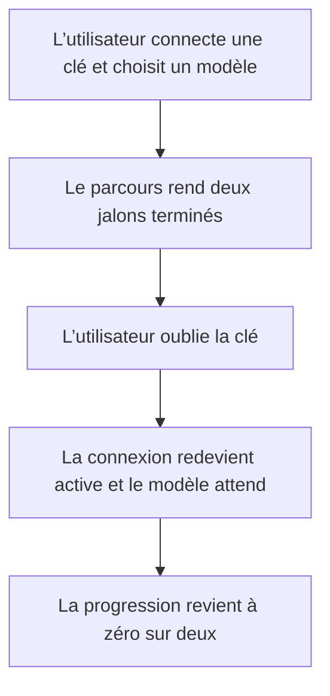
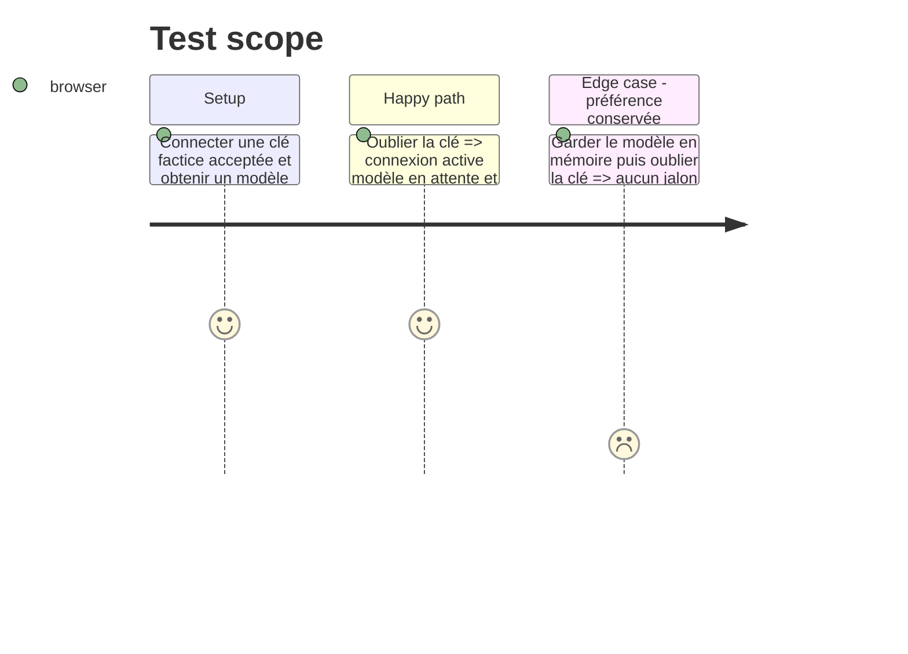

# Instruction: La progression assistant reste honnête après oubli d’une clé

## Architecture projection

> Tree of the final files. ✅ create · ✏️ modify · ❌ delete

```txt
.
└── apps/web/
    ├── src/components/campaign-dialog/AssistantSetup.tsx  ✏️ compter seulement les jalons réellement acquis
    └── e2e/ai-provider.spec.ts                            ✏️ verrouiller la progression après oubli de la clé
```

## User Journey



## Test Scope



## Wireframe

```txt
┌───────────────────────────────────────────┐
│ (1) Progression                       0/2 │
│ (2) ◉ Connexion                           │
│ (3) ○ Modèle retenu, en attente           │
└───────────────────────────────────────────┘
```

1. Progression : compte uniquement les jalons terminés dans l’état courant.
2. Connexion : redevient l’unique étape active après l’oubli de la clé.
3. Modèle : reste une préférence mais ne vaut pas un jalon sans connexion.

## Tasks to do

### `1)` Dériver le compte depuis les mêmes préconditions que les jalons

> Une barre ne doit jamais contredire les étapes qu’elle résume.

1. Compter le modèle seulement quand la connexion est prête.
2. Ne pas effacer la préférence de modèle lors de l’oubli de la clé.

### `2)` Verrouiller le parcours de retrait

> Couvrir la transition qui exposait le décalage.

1. Étendre le scénario de clé acceptée puis oubliée.
2. Vérifier valeur de progression et états des deux jalons après le geste.

## Test acceptance criteria

| Task | Acceptance criteria |
| ---- | ------------------- |
| 1 | Un modèle retenu sans connexion prête ne compte aucun jalon terminé. |
| 1 | Une connexion prête avec son modèle rend exactement deux jalons terminés. |
| 2 | Après « Oublier cette clé », la barre affiche `0 sur 2`, la connexion est active et le modèle attend. |
