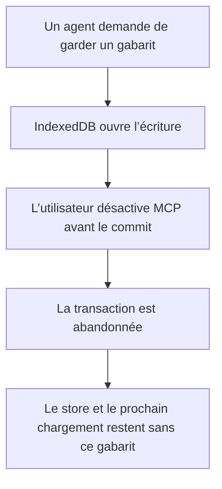
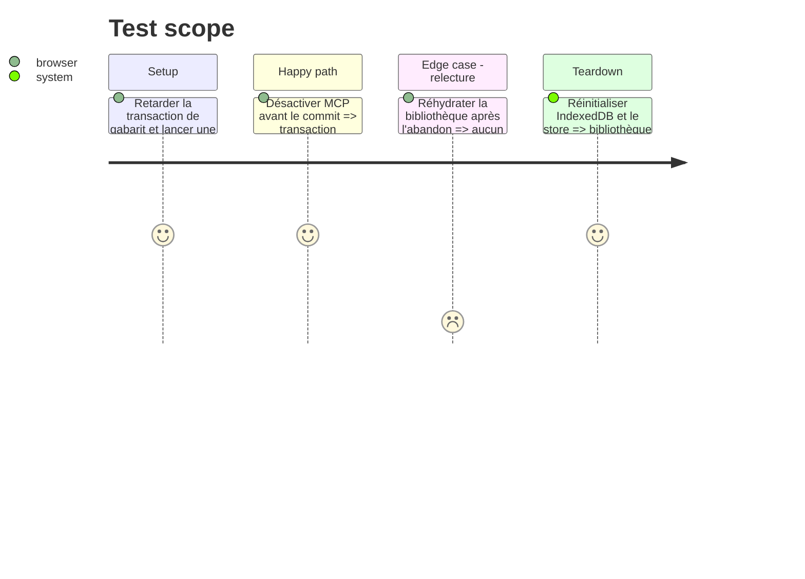

# Instruction: Une coupure MCP annule atomiquement la sauvegarde d’un gabarit

## Architecture projection

> Tree of the final files. ✅ create · ✏️ modify · ❌ delete

```txt
.
└── apps/web/src/
    ├── lib/custom-templates.ts                       ✏️ écrire le gabarit dans une transaction annulable
    ├── lib/mcp/client.ts                             ✏️ transmettre l’annulation du cycle courant
    ├── lib/mcp/session.ts                            ✏️ relayer le signal à la bibliothèque
    ├── stores/templates.store.ts                     ✏️ traiter l’abandon sans suppression compensatoire
    └── stores/__tests__/templates.store.test.ts      ✏️ prouver absence disque et store après abandon
```

## User Journey



## Test Scope



## Tasks to do

### `1)` Faire porter l’annulation par l’écriture persistante

> Supprimer la fenêtre entre écriture réussie et nettoyage compensatoire.

1. Transmettre le signal du contrôleur MCP jusqu’à l’écriture IndexedDB.
2. Abandonner la transaction si le signal tombe avant son commit.
3. Conserver le chemin utilisateur sans signal inchangé.

### `2)` Rendre l’abandon observable et stable

> Un abandon est un résultat attendu, pas une erreur de stockage.

1. Retourner le refus d’annulation existant sans modifier le store.
2. Retirer la suppression compensatoire devenue inutile.
3. Tester le store et la relecture durable après l’abandon.

## Test acceptance criteria

| Task | Acceptance criteria |
| ---- | ------------------- |
| 1 | Une coupure du cycle avant le commit abandonne la transaction IndexedDB au lieu d’écrire puis supprimer. |
| 1 | Une sauvegarde utilisateur sans signal conserve le comportement existant. |
| 2 | Après abandon, ni le store courant ni une nouvelle hydratation ne contiennent le gabarit. |
| 2 | Le chemin d’abandon ne dépend plus d’un `delete` compensatoire susceptible d’échouer. |
