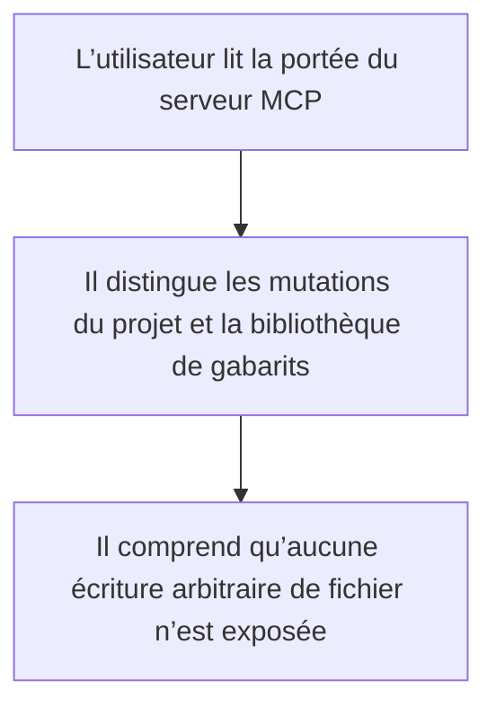
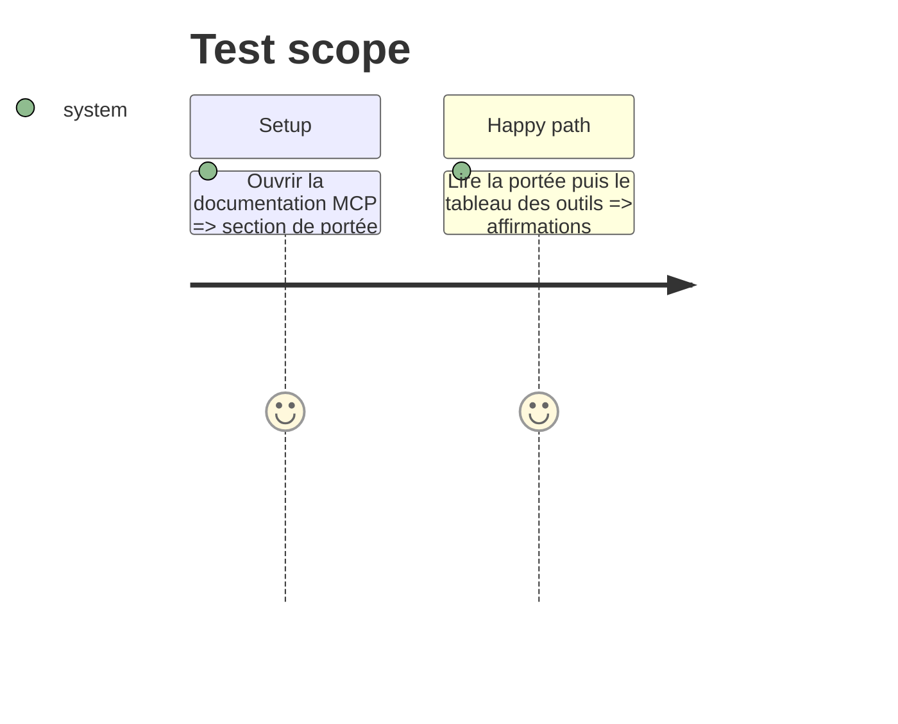

# Instruction: La documentation borne exactement les écritures MCP

## Architecture projection

> Tree of the final files. ✅ create · ✏️ modify · ❌ delete

```txt
.
└── apps/mcp/README.md  ✏️ distinguer projet, bibliothèque de gabarits et écriture arbitraire
```

## User Journey



## Test Scope



## Tasks to do

### `1)` Nommer les seules destinations d’écriture

> La documentation de sécurité ne doit pas se contredire trois lignes plus bas.

1. Remplacer l’interdiction générale par l’absence d’écriture arbitraire.
2. Nommer le projet ouvert et la bibliothèque locale de gabarits.

## Test acceptance criteria

| Task | Acceptance criteria |
| ---- | ------------------- |
| 1 | Le README ne prétend plus que toute écriture hors projet est impossible. |
| 1 | Le README limite explicitement les écritures au projet ouvert et à la bibliothèque locale de gabarits, sans accès arbitraire au système de fichiers. |
