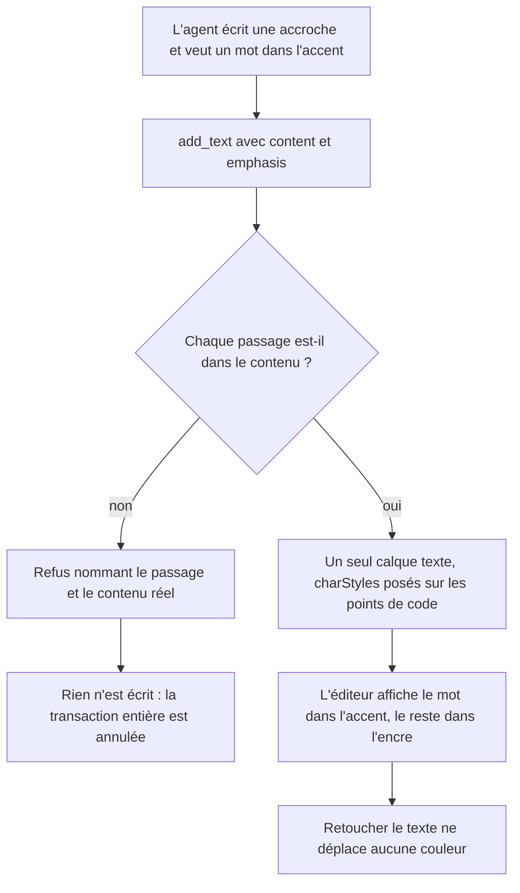
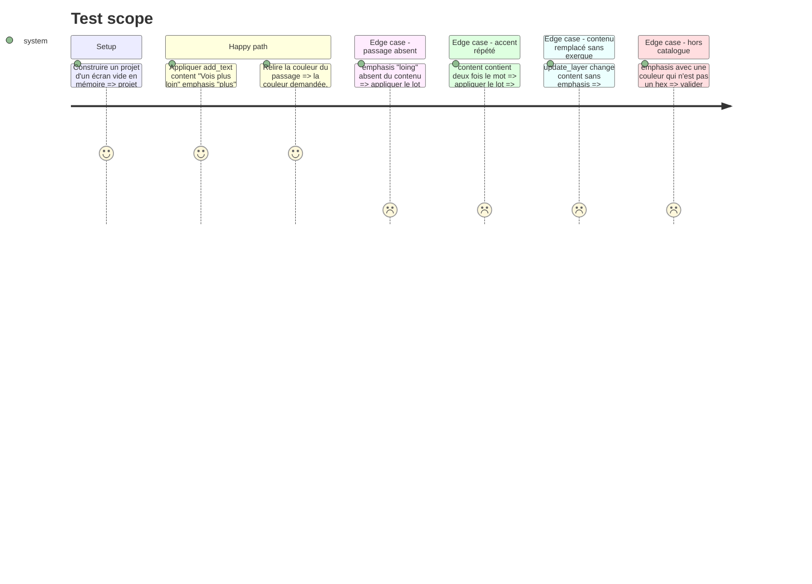

# Instruction: Le passage en exergue traverse le contrat

## Architecture projection

> Tree of the final files. ✅ create · ✏️ modify · ❌ delete

```txt
.
├── packages/project-format/src/
│   └── ai-tools.ts                       ✏️ `emphasis` sur `add_text` et sur le patch, + PATCHABLE_PROPS.text
├── apps/web/src/lib/ai/
│   └── tools.ts                          ✏️ résout les passages en `charStyles`, refuse ce qu'il ne trouve pas
└── apps/web/src/lib/__tests__/
    └── ai-builder.test.ts                ✏️ le contrat porte l'exergue, et le refuse quand le mot n'y est pas
```

## User Journey



## Test Scope



## Tasks to do

### `1)` Le schéma partagé nomme l'exergue

> Un seul endroit décrit ce qu'un modèle peut demander.

1. Dans `packages/project-format/src/ai-tools.ts`, déclarer `emphasis` : tableau de 4 entrées au plus, chacune `{ text: string (1..80), color: hex }`, `additionalProperties: false`.
2. L'ajouter aux paramètres de `add_text` et au `patch` de `update_layer`.
3. Ajouter `'emphasis'` à `PATCHABLE_PROPS.text` — sans quoi l'exécuteur refuse la clé qu'il vient d'accepter.
4. Décrire le champ pour ce qu'il fait : « colore un passage du contenu, sans couper le calque ».

### `2)` L'exécuteur résout les passages

> Le modèle nomme le mot, le dépôt calcule les index.

1. Dans `apps/web/src/lib/ai/tools.ts`, écrire un helper qui prend le contenu final, la liste d'exergues, et rend soit des `charStyles`, soit un message de refus.
2. Localiser chaque passage par sa **première** occurrence, convertir l'index UTF-16 en index de point de code (`[...content.slice(0, at)].length`) et appeler `setRangeFill` — c'est lui qui sait que `\n` ouvre une ligne sans occuper de colonne.
3. Brancher le helper sur `add_text` après la copie des propriétés, et sur `update_layer` après application du patch.
4. Sur `update_layer`, recalculer depuis le contenu **final** : un `content` changé sans `emphasis` retire `charStyles` au lieu de laisser des couleurs sur les mauvaises colonnes.
5. Le refus rend le passage cherché et le contenu réel, et fait sortir `applyToolCalls` par son chemin d'erreur : rien du lot ne s'écrit.

### `3)` Le test tient la règle

> Ce qui se répare doit se casser bruyamment.

1. Dans `apps/web/src/lib/__tests__/ai-builder.test.ts`, ajouter les cas du Test Scope.
2. Vérifier que la sortie est **un seul** calque : c'est le défaut mesuré (18 calques pour 4 accroches).
3. Vérifier qu'un passage introuvable laisse le projet inchangé.

## Test acceptance criteria

| Task | Acceptance criteria                                                                                                                     |
| ---- | ----------------------------------------------------------------------------------------------------------------------------------------- |
| 1    | `validateToolCall` accepte un `add_text` portant `emphasis`, et refuse une couleur qui n'est pas un hexadécimal ou un cinquième passage. |
| 2    | Un `add_text` avec exergue produit un unique calque texte dont `charStyles` porte la couleur sur le passage, et rien ailleurs.           |
| 2    | Un `update_layer` qui remplace `content` sans redonner `emphasis` rend un calque sans `charStyles`.                                      |
| 2    | Un passage absent du contenu fait échouer le lot entier et le message nomme le passage cherché.                                          |
| 3    | `pnpm --filter web run test:unit` passe, et échoue si l'exergue est retirée de l'exécuteur.                                              |
