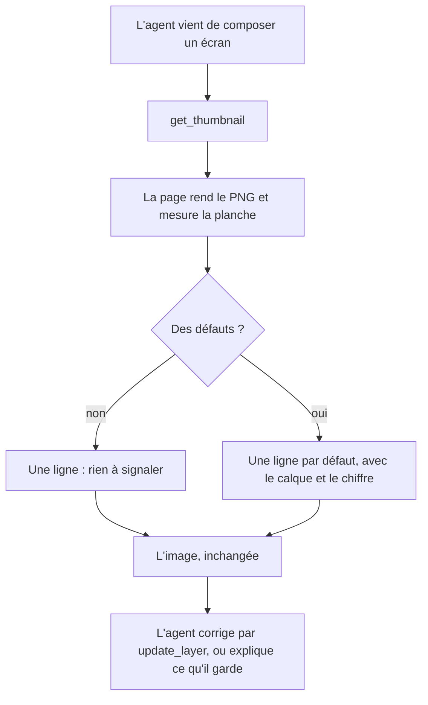
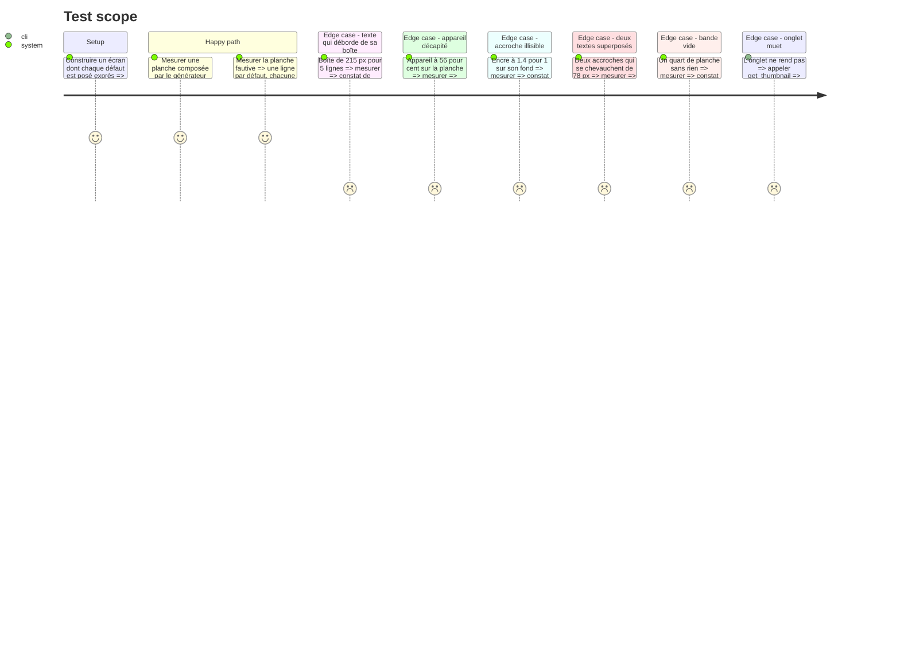

# Instruction: La miniature rend un constat mesuré à côté de l'image

## Architecture projection

> Tree of the final files. ✅ create · ✏️ modify · ❌ delete

```txt
.
├── apps/web/src/lib/ai/
│   ├── board-review.ts                   ✅ les défauts d'une planche, mesurés sur les boîtes et le texte
│   └── archetypes.ts                     ✏️ `tallestEmptyBand` délègue à une fonction qui prend des boîtes
├── apps/web/src/lib/mcp/
│   └── session.ts                        ✏️ `renderRelayScreen` joint le constat au PNG
├── apps/mcp/src/relay/
│   └── protocol.ts                       ✏️ `RelayRendered.findings: string[]`
├── apps/mcp/src/tools/
│   └── get-thumbnail.ts                  ✏️ le bloc texte porte les constats, l'image reste l'image
└── apps/web/src/lib/__tests__/
    └── board-review.test.ts              ✅ un défaut constaté par ligne du constat
```

## User Journey



## Test Scope



## Tasks to do

### `1)` Une bande vide se mesure sur des boîtes

> La règle existe déjà, elle est juste enfermée dans la forme du générateur.

1. Dans `apps/web/src/lib/ai/archetypes.ts`, extraire le calcul de `tallestEmptyBand` en une fonction qui prend `readonly PlanBox[]`.
2. `tallestEmptyBand(layout)` l'appelle avec ses quatre listes — `archetypes.test.ts` reste vert sans être touché.

### `2)` Le constat d'une planche

> Les mêmes règles que le générateur s'impose, appliquées à ce que l'agent a posé.

1. Créer `apps/web/src/lib/ai/board-review.ts` : une fonction qui prend l'écran, les calques partagés et un `TextMeasure` injectable (comme `reviewLocale`), et rend une liste de constats.
2. Débordement : `measuredHeight` de `locale.ts` contre `layer.height`, sur chaque calque texte.
3. Hors cadre : boîte qui sort de `SCREEN_WIDTH` × `SCREEN_HEIGHT` (`lib/canvas/canvas-utils.ts`, jamais un littéral), avec le côté qui sort.
4. Appareil : `onBoardRatio` sous 0,70 — le seuil d'alerte, pas les 0,90 que le générateur s'impose.
5. Contraste : `contrastRatio` de `palette.ts` entre l'encre de chaque texte et **chaque arrêt** du fond de l'écran, seuil 4,5:1.
6. Chevauchement : intersection de boîtes entre deux calques **texte** seulement — une pastille sous une accroche est une composition, pas un défaut.
7. Bande vide : la fonction de la tâche 1 sur toutes les boîtes visibles de la planche, seuil un quart de 956.
8. Chaque constat est une phrase courte portant le nom du calque et le chiffre mesuré : c'est ce que l'agent relit, pas un code.

### `3)` Le constat voyage avec l'image

> Deux blocs, un tour.

1. `RelayRendered` gagne `findings: string[]` dans `apps/mcp/src/relay/protocol.ts`.
2. `renderRelayScreen` appelle la revue sur l'écran rendu et la joint au résultat, sans rien changer au PNG ni au projet.
3. `renderThumbnail` compose son bloc texte : la ligne de dimensions existante, puis les constats, ou une ligne qui dit qu'il n'y en a pas.
4. Le résultat reste sans `isError` : un constat n'est pas un refus.

### `4)` Le test tient les seuils

> Un seuil qu'aucun test ne touche redevient une opinion.

1. Créer `apps/web/src/lib/__tests__/board-review.test.ts` avec un cas par section du Test Scope, mesure injectée pour ne dépendre d'aucune police.
2. Reprendre les chiffres de la session mesurée : la boîte de 215 px, l'appareil à 56 %, le chevauchement de 78 px.
3. Vérifier qu'une planche du générateur local (`composeArchetype` → `planToolCalls`) ne rend aucun constat : le générateur et la revue doivent lire la même règle.

## Test acceptance criteria

| Task | Acceptance criteria                                                                                                     |
| ---- | ------------------------------------------------------------------------------------------------------------------------- |
| 1    | `archetypes.test.ts` passe sans modification après l'extraction.                                                        |
| 2    | Chaque défaut posé exprès produit exactement un constat, nommant son calque et son chiffre.                             |
| 2    | Une pastille de forme sous une accroche ne produit aucun constat de chevauchement.                                      |
| 3    | `get_thumbnail` rend un bloc texte suivi de l'image, et n'est jamais en erreur du seul fait d'un constat.                |
| 3    | Un écran sans défaut rend une ligne qui le dit, jamais un bloc vide.                                                    |
| 4    | Une planche composée par le générateur local ne rend aucun constat.                                                     |
