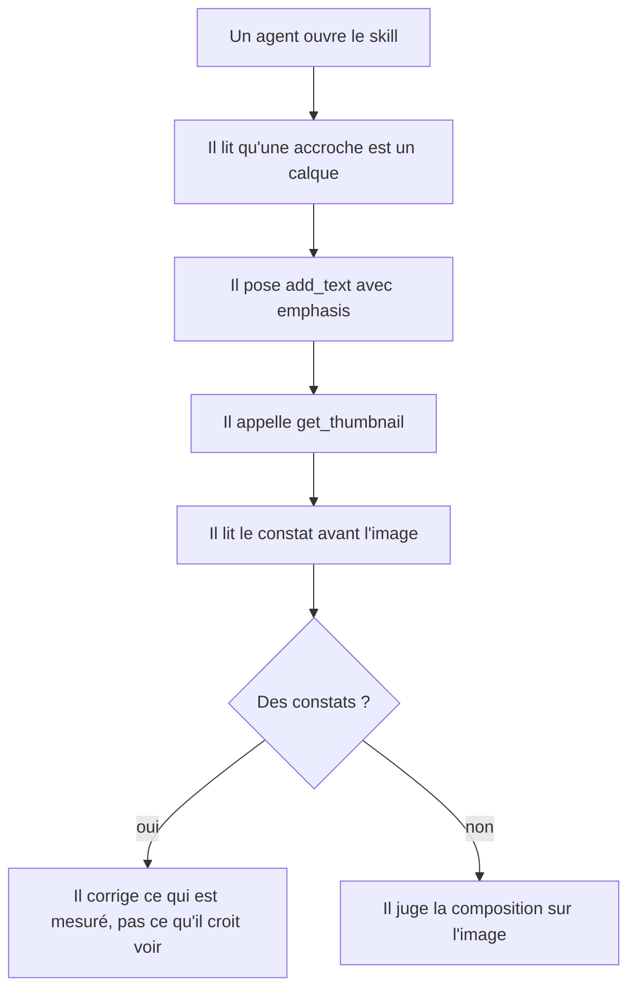
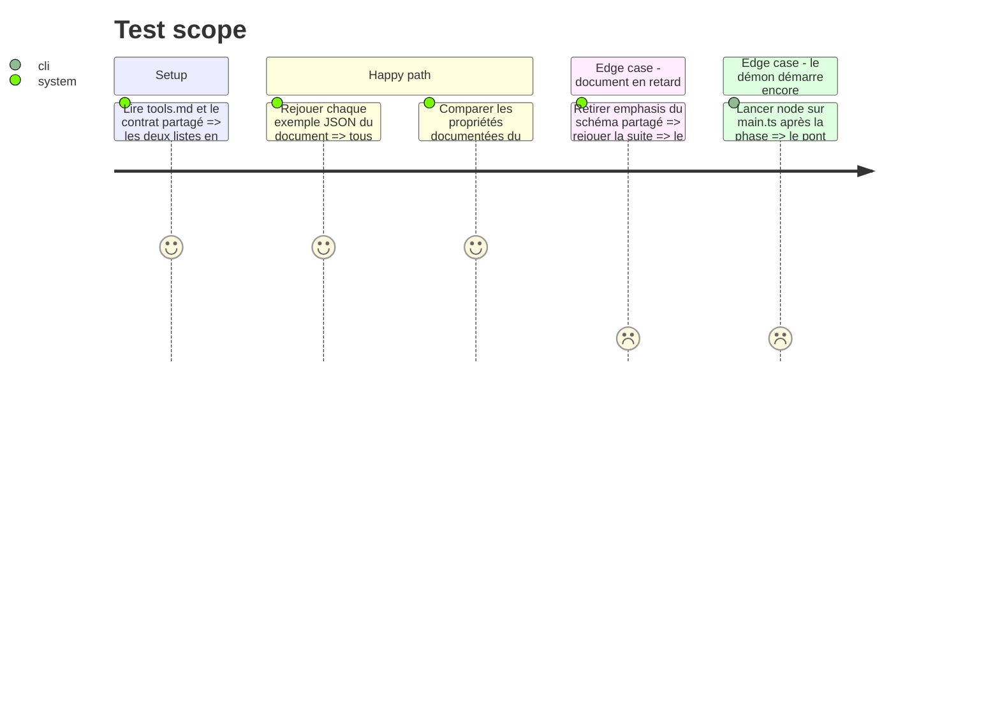

# Instruction: Le skill dit ce que le contrat sait faire

## Architecture projection

> Tree of the final files. ✅ create · ✏️ modify · ❌ delete

```txt
.
├── apps/mcp/skills/screenforge-mcp/
│   ├── references/tools.md               ✏️ `emphasis`, et ce que `get_thumbnail` rend désormais
│   ├── references/pitfalls.md            ✏️ « couper une accroche en morceaux » devient un défaut nommé
│   └── actions/03-verify.md              ✏️ la vérification lit le constat avant de regarder l'image
└── apps/mcp/src/
    └── skill-doc.test.ts                 ✏️ le nouvel exemple JSON est rejoué contre le schéma
```

## User Journey



## Test Scope



## Tasks to do

### `1)` La référence porte l'exergue

> Une accroche est un calque.

1. Dans `references/tools.md`, ajouter `emphasis` à la table des propriétés de `add_text` et à celles patchables sur un calque texte.
2. Ajouter un exemple JSON — le format que `skill-doc.test.ts` rejoue déjà.
3. Redater la copie du contrat en tête de fichier.

### `2)` La référence porte le constat

> Ce que la miniature rend maintenant.

1. Dans `references/tools.md`, décrire ce que `get_thumbnail` retourne : un bloc de constats puis l'image.
2. Nommer les six mesures et leurs seuils, dans les mêmes mots que le constat lui-même.

### `3)` Le piège devient nommé

> Le défaut mesuré ne doit pas se reproduire faute d'être écrit.

1. Dans `references/pitfalls.md`, ajouter la ligne : couper une accroche en plusieurs calques pour colorer un mot — le symptôme constaté, la correction (`emphasis`), et pourquoi le repositionnement à la main finit en chevauchement.
2. Dans `actions/03-verify.md`, faire lire le constat **avant** l'image, et ne corriger que ce qui est mesuré ou visiblement faux.

### `4)` Le garde-fou tient encore

> Le test de dérive doit couvrir ce qui vient d'être ajouté.

1. Vérifier que `apps/mcp/src/skill-doc.test.ts` rejoue le nouvel exemple sans modification ; l'ajuster seulement si le nouveau bloc sort de sa collecte.
2. Prouver la morsure : retirer `emphasis` du schéma partagé, constater l'échec, remettre.
3. Lancer `node apps/mcp/src/main.ts` une fois — Node lit ces sources sans les réécrire, et seul l'exécutable le prouve.

## Test acceptance criteria

| Task | Acceptance criteria                                                                                                |
| ---- | -------------------------------------------------------------------------------------------------------------------- |
| 1    | `tools.md` liste `emphasis` là où le schéma partagé l'accepte, et nulle part ailleurs.                              |
| 2    | Le document décrit les six mesures et leurs seuils dans les mots du constat rendu.                                  |
| 3    | `pitfalls.md` nomme le découpage d'accroche, avec sa correction.                                                    |
| 4    | `pnpm --filter mcp run test:unit` passe, et échoue quand `emphasis` disparaît du contrat partagé.                   |
| 4    | `node apps/mcp/src/main.ts` démarre et annonce son port.                                                            |
