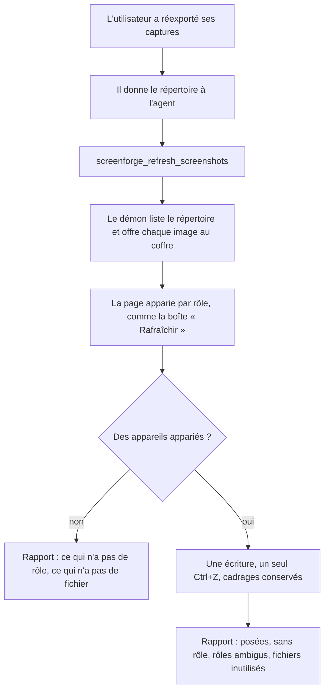
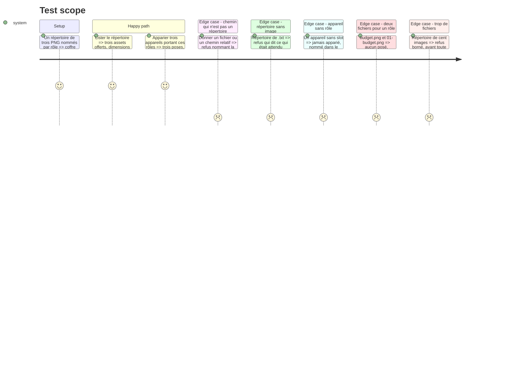

# Instruction: Un répertoire de captures se repose sans toucher à la composition

## Architecture projection

> Tree of the final files. ✅ create · ✏️ modify · ❌ delete

```txt
.
├── apps/mcp/src/relay/
│   └── protocol.ts                       ✏️ `RelayRefresh`, `RelayRefreshed`, le champ sur `RelayRequest`
├── apps/mcp/src/tools/
│   ├── refresh-screenshots.ts            ✅ ouvre le répertoire, offre chaque fichier au coffre
│   └── editor-tools.ts                   ✏️ enregistre `screenforge_refresh_screenshots`
├── apps/web/src/lib/mcp/
│   └── session.ts                        ✏️ apparie par `planRefresh`, pose par `applyRefresh`
├── apps/mcp/skills/screenforge-mcp/
│   ├── references/tools.md               ✏️ l'outil, et ce que son rapport nomme
│   └── references/workflows.md           ✏️ « j'ai refait mes captures » devient un parcours
└── apps/mcp/src/
    └── refresh.test.ts                   ✅ le répertoire lu, et chaque refus nommé
```

## User Journey



## Test Scope



## Tasks to do

### `1)` Le démon ouvre un répertoire, jamais le disque

> Le coffre reste la seule porte, et il n'en gagne pas une seconde.

1. Créer `apps/mcp/src/tools/refresh-screenshots.ts` avec son `ParamSchema` : `directory` (chemin absolu, requis) et `manifest` (objet `{ rôle: nomDeFichier }`, facultatif).
2. Refuser un chemin relatif et un chemin qui n'est pas un répertoire, avec le message qui nomme la cause — la règle et les mots d'`AssetVault.offer`, pas une seconde formulation.
3. Lister le répertoire **sans récursion**, ne garder que les extensions que `MEDIA_TYPES` déclare, trier par nom pour que deux exécutions identiques rendent le même ordre.
4. Borner le nombre de fichiers **avant** d'en lire un seul, et dire le plafond dans le refus.
5. Offrir chaque fichier retenu par `AssetVault.offer` : les dimensions viennent de l'en-tête, comme pour `add_image`, et le chemin ne voyage pas jusqu'à la page.

### `2)` La page apparie et pose, en une écriture

> La règle d'appariement existe déjà et n'est pas recopiée.

1. `RelayRequest` gagne `refreshScreenshots?: RelayRefresh` — un champ de plus, pas un second protocole, comme `saveTemplate` et `render`.
2. Dans `apps/web/src/lib/mcp/session.ts`, enchaîner `describeFiles` → `refreshTargets` → `planRefresh` → `applyRefresh` de `lib/batch-refresh.ts`, sans réécrire une ligne de la règle.
3. L'appariement est fait dans l'onglet et non dans le démon, pour la même raison que le constat de la phase 2 : c'est là que vit le projet, et une seconde implémentation de la règle finirait par ne pas être d'accord avec la boîte « Rafraîchir ».
4. `applyRefresh` est déjà une transaction : la pose vaut un seul pas d'annulation, et un appareil disparu entre-temps annule le lot entier plutôt que d'en poser la moitié.
5. Aucune géométrie, aucun cadrage, aucun rôle n'est touché — seuls `screenshotAssetId` et `screenshotSize` changent.

### `3)` Le rapport nomme ce qui n'a pas été posé

> Un « 3 posées » qui tait les quatre autres est un mensonge par omission.

1. `RelayRefreshed` porte les quatre listes que `RefreshPlan` distingue déjà : appareils sans rôle, rôles sans fichier, rôles réclamés par deux fichiers, fichiers que personne n'a pris.
2. Les nommer par ce que l'agent peut relire — nom d'écran et nom de calque, jamais un identifiant nu.
3. Un lot où rien n'est apparié n'est pas une erreur : c'est un rapport qui dit qu'aucun appareil ne porte de rôle, et pointe `assign_screenshot_slot`.

### `4)` Le test tient la porte

> Le coffre est ce qui empêche l'onglet de lire ce disque.

1. Créer `apps/mcp/src/refresh.test.ts` avec un cas par section du Test Scope, sur un répertoire temporaire.
2. Vérifier qu'un fichier hors extension n'est **jamais** offert : il ne doit apparaître dans aucun `assetId`.
3. Vérifier que le plafond mord avant la première lecture.

## Test acceptance criteria

| Task | Acceptance criteria                                                                                             |
| ---- | --------------------------------------------------------------------------------------------------------------- |
| 1    | Un chemin relatif, un fichier, un répertoire absent et un répertoire sans image rendent quatre refus distincts.  |
| 1    | Aucun fichier hors `MEDIA_TYPES` n'entre dans le coffre.                                                         |
| 2    | Trois captures posées valent **un** pas d'annulation, et aucun `placement` n'a changé.                           |
| 3    | Un appareil sans rôle est nommé dans le rapport, avec son écran, et n'a rien reçu.                               |
| 3    | Deux fichiers pour un même rôle n'en posent aucun et l'ambiguïté est rendue.                                     |
| 4    | `pnpm --filter mcp run test:unit` et `pnpm --filter web run test:unit` passent.                                  |
