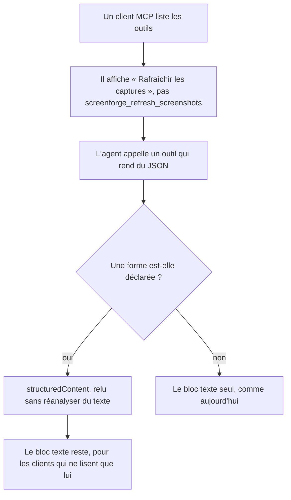
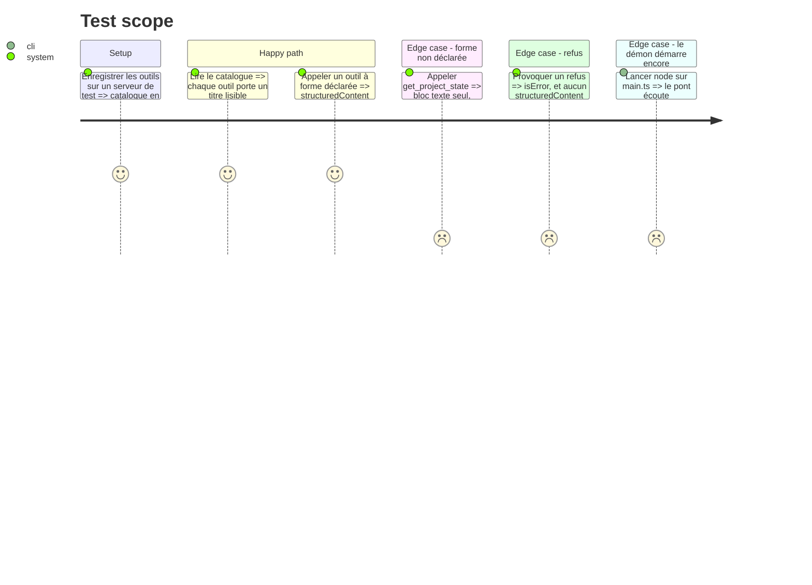

# Instruction: Le serveur rend ce que la spec 2026-07-28 sait lire

## Architecture projection

> Tree of the final files. ✅ create · ✏️ modify · ❌ delete

```txt
.
├── apps/mcp/src/tools/
│   ├── editor-tools.ts                   ✏️ `title` partout, `outputSchema` + `structuredContent` là où la forme est déclarée
│   ├── templates.ts                      ✏️ rend sa forme structurée en plus de son texte
│   └── get-thumbnail.ts                  ✏️ les constats de la phase 2 deviennent lisibles par la machine
└── apps/mcp/src/
    └── relay.test.ts                     ✏️ un outil sans titre est un échec, comme un exemple qui dérive
```

## User Journey



## Test Scope



## Tasks to do

### `1)` Chaque outil porte un titre

> Le nom technique est une adresse, pas une étiquette.

1. Donner un `title` à chaque `registerTool` : ce que l'outil fait, dans les mots de l'utilisateur, jamais le nom préfixé.
2. Le préfixe `screenforge_` reste sur le nom — c'est ce qui distingue `add_text` de l'outil homonyme d'un autre serveur.

### `2)` La sortie structurée, là où la forme est déjà écrite

> Une forme déclarée deux fois est une forme qui divergera.

1. Ajouter `outputSchema` + `structuredContent` aux outils dont la sortie est **déjà** une interface nommée et courte du protocole : les gabarits et la miniature.
2. Ne **pas** en donner à `get_project_state` ni `get_screen` : leur forme est la vue complète du projet, et la recopier en JSON Schema créerait exactement la dérive que `createAiTools` existe pour empêcher. Écrire ce refus dans le fichier, pas seulement dans ce plan.
3. Le bloc texte reste dans tous les cas : un client qui ne lit pas `structuredContent` doit continuer à voir la même chose qu'avant.
4. Un refus (`isError`) ne porte jamais de `structuredContent` : une forme valide à côté d'une erreur est une invitation à lire la première et ignorer la seconde.

### `3)` Le test tient le catalogue

> Un titre oublié au prochain outil ajouté doit se voir.

1. Dans `apps/mcp/src/relay.test.ts`, balayer le catalogue enregistré : tout outil sans `title` est un échec.
2. Vérifier qu'un outil qui déclare un `outputSchema` rend bien un `structuredContent`, et qu'aucun n'en rend sans l'avoir déclaré.
3. Lancer `node apps/mcp/src/main.ts` une fois — Node lit ces sources sans les réécrire, et seul l'exécutable le prouve.

## Test acceptance criteria

| Task | Acceptance criteria                                                                                   |
| ---- | ------------------------------------------------------------------------------------------------------- |
| 1    | Aucun outil enregistré n'est sans `title`, et le test échoue si l'on en retire un.                    |
| 2    | Tout outil déclarant un `outputSchema` rend un `structuredContent` conforme.                          |
| 2    | `get_project_state` et `get_screen` rendent leur bloc texte seul, sans `structuredContent`.           |
| 2    | Un refus ne porte aucun `structuredContent`.                                                          |
| 3    | `pnpm --filter mcp run test:unit` passe, et `node apps/mcp/src/main.ts` démarre en annonçant son port. |
