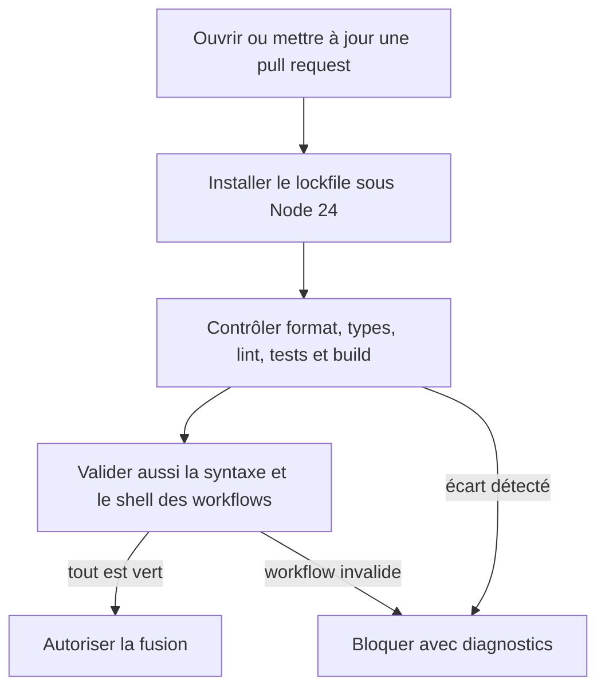
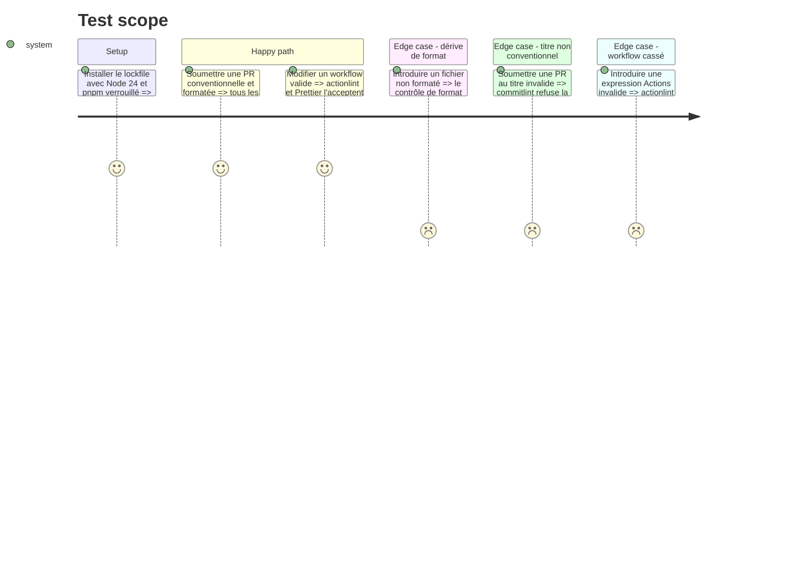

# Instruction: aligner le runtime et durcir la CI qualité

## Architecture projection

> Tree of the final files. ✅ create · ✏️ modify · ❌ delete

```txt
.
├── .github/
│   └── workflows/
│       └── quality.yml ✏️ permissions minimales, contrôles format/workflows et actions immuables
├── .node-version ✅ même Node 24 LTS en local, CI et Vercel
└── package.json ✏️ contrat Node 24 et scripts qualité réutilisés par la CI

❌ Aucun fichier supprimé.
```

## User Journey



## Test Scope



## Tasks to do

### `1)` Épingler le runtime supporté

> Aligner le développement, GitHub Actions et Vercel sur Node 24 LTS.

1. Ajouter `.node-version` et `engines.node` sans dupliquer la version pnpm déjà portée par `packageManager`.
2. Passer les jobs de qualité à Node 24 et confirmer la compatibilité de toute la suite.
3. Garder Node 26 Current hors production jusqu'à son passage LTS.

### `2)` Fermer les trous du gate qualité

> Réutiliser les commandes existantes et ajouter seulement les preuves absentes.

1. Limiter le token du workflow à `contents: read` et éviter les doubles runs push + PR.
2. Ajouter `pnpm run format:check` au gate distant; conserver ESLint flat config, Prettier, Husky et lint-staged existants.
3. Valider le titre des PR avec le commitlint déjà installé afin que le squash final soit un Conventional Commit exploitable.
4. Ajouter actionlint avec version et SHA-256 vérifiés pour relire YAML, expressions, jobs et blocs shell.
5. Conserver les timeouts, l'annulation des runs qualité obsolètes et les diagnostics Playwright sur échec.

### `3)` Durcir la chaîne d'actions

> Rendre chaque action tierce immuable sans perdre les mises à jour automatisées.

1. Résoudre chaque tag d'action vers le SHA complet de sa release officielle courante et garder le commentaire de version adjacent.
2. Mettre checkout, setup-node et pnpm/action-setup aux générations Node 24 validées en 2026.
3. Vérifier que Dependabot continue de proposer les mises à jour npm et GitHub Actions épinglées.

## Test acceptance criteria

| Task | Acceptance criteria |
| --- | --- |
| 1 | Une installation et le gate complet réussissent sous Node 24; une version Node hors plage reçoit un diagnostic explicite. |
| 2 | Une PR propre passe format, unités, types, lint, builds, E2E et audits; chaque défaut injecté dans le format, le titre ou un workflow rend le check correspondant rouge. |
| 3 | Toutes les actions distantes sont référencées par SHA complet vérifié, avec leur version lisible, et Dependabot reconnaît encore ces références. |
