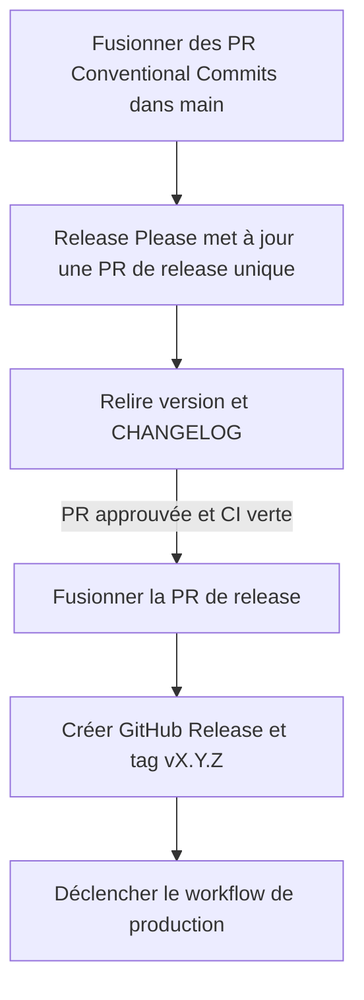
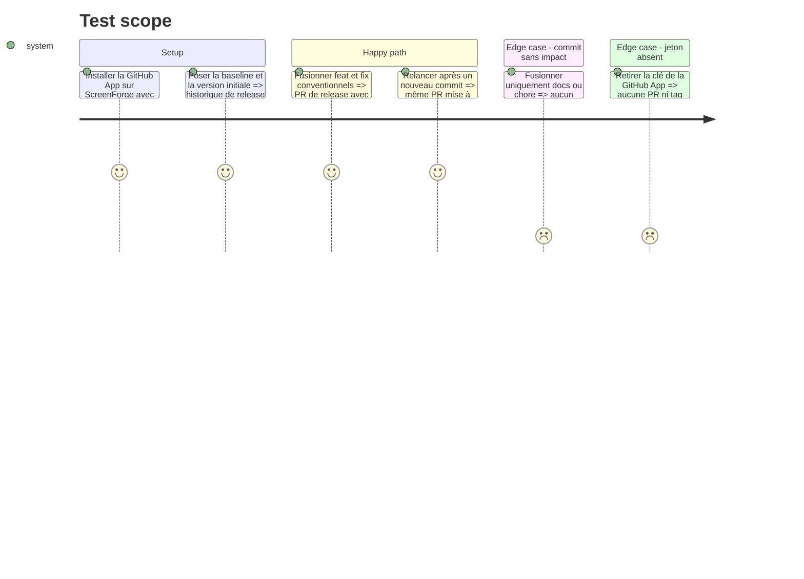

# Instruction: automatiser SemVer, changelog, GitHub Release et tags

## Architecture projection

> Tree of the final files. ✅ create · ✏️ modify · ❌ delete

```txt
.
├── .github/
│   └── workflows/
│       └── release-please.yml ✅ maintient la PR de release avec un jeton GitHub App
├── .release-please-manifest.json ✅ état de version du produit racine
├── CHANGELOG.md ✅ historique généré et relu dans chaque PR de release
├── package.json ✏️ version SemVer mise à jour par la PR de release
└── release-please-config.json ✅ stratégie Node racine, bootstrap et sections du changelog

❌ Aucun fichier supprimé.
```

## User Journey



## Test Scope



## Tasks to do

### `1)` Configurer le produit de release unique

> Versionner ScreenForge comme une application, pas comme trois paquets publiables.

1. Configurer le composant racine en stratégie `node`, tag préfixé `v`, release publiée et changelog au dépôt racine.
2. Fixer la première version à `0.1.0` et `eb12bc5` comme `bootstrap-sha` exclusif.
3. Mapper `feat`, `fix`, `perf`, `refactor`, `docs`, `test`, `build`, `ci` et `chore` vers des sections lisibles inspirées de Largo, avec SemVer seulement pour les types prévus.
4. Garder les paquets workspace privés et hors d'un versionnement indépendant.

### `2)` Créer l'automate Release Please

> Ouvrir et maintenir une seule PR de release puis créer le tag approuvé.

1. Déclencher Release Please sur les pushes de `main` avec permissions du `GITHUB_TOKEN` en lecture seule.
2. Générer un jeton d'installation via `actions/create-github-app-token`, limité au dépôt courant et à contents/issues/pull requests nécessaires.
3. Passer ce jeton à Release Please, les deux actions étant épinglées à leur SHA complet.
4. Étiqueter clairement la PR et conserver une seule PR ouverte mise à jour au fil des changements.

### `3)` Protéger la provenance du tag

> Faire du tag un artefact de la PR de release, pas une commande libre.

1. Créer un ruleset `v*` qui interdit mise à jour et suppression, et réserve la création à la GitHub App de release.
2. Ne donner aucun bypass de `main` à l'app : la version et le changelog passent par une PR et les checks normaux.
3. Activer le squash comme mode de fusion et conserver le titre de PR conventionnel comme message de commit final.
4. Garder la première PR de release ouverte jusqu'à ce que le workflow tagué et l'Environment production des phases suivantes soient prêts.

## Test acceptance criteria

| Task | Acceptance criteria |
| --- | --- |
| 1 | Une séquence `feat` + `fix` depuis la baseline produit une première proposition `v0.1.0` et un changelog retraçant les changements produit sans versionner séparément les workspaces. |
| 2 | La GitHub App met à jour une PR de release unique; son secret n'apparaît ni dans les logs, ni dans un diff, et le jeton est révoqué à la fin du job. |
| 3 | Un humain ne peut ni créer, ni déplacer, ni supprimer un tag `v*`; la première PR de release reste non fusionnée tant que le consommateur du tag n'est pas prêt. |
