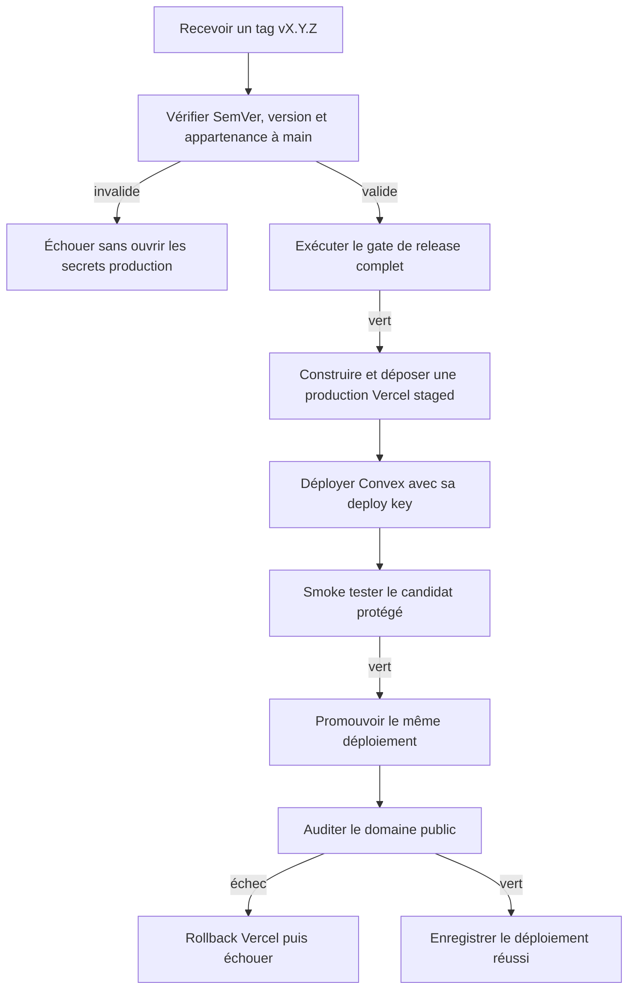
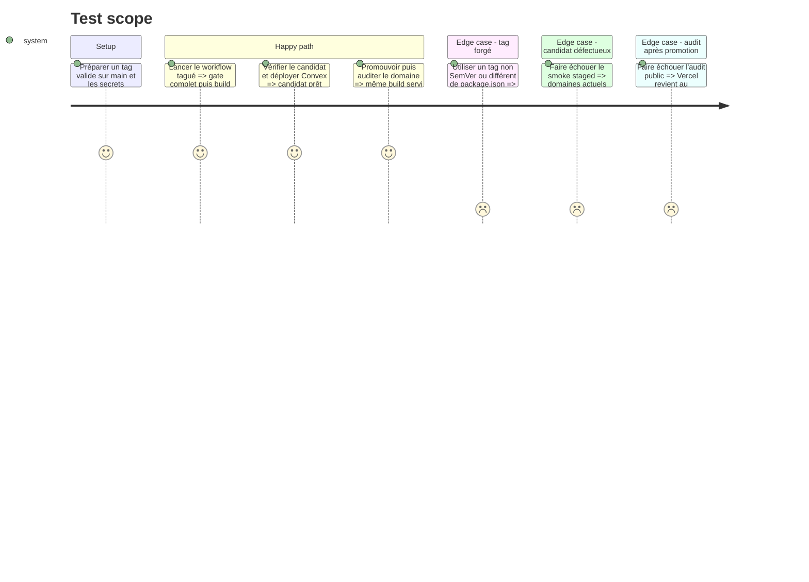

# Instruction: déployer Convex et Vercel exclusivement depuis un tag valide

## Architecture projection

> Tree of the final files. ✅ create · ✏️ modify · ❌ delete

```txt
.
├── .github/
│   └── workflows/
│       └── deploy-production.yml ✅ vérifie le tag, stage, smoke, promeut et rollback le web
├── .gitignore ✏️ exclut l'état local `.vercel`
├── package.json ✏️ contrat de tag, commande Convex CI, audit et CLI Vercel verrouillée
├── pnpm-lock.yaml ✏️ verrouille la version transitivement exacte de Vercel CLI
├── scripts/
│   └── verify-release-tag.mjs ✅ assertion SemVer/version avec auto-test natif Node
└── vercel.json ✏️ désactive les auto-déploiements Git au profit des tags

❌ Aucun fichier supprimé.
```

## User Journey



## Test Scope



## Tasks to do

### `1)` Rendre le contrat de tag exécutable

> Refuser tout tag qui ne décrit pas exactement la release checkoutée.

1. Écrire un script Node standard-library qui accepte seulement `vMAJOR.MINOR.PATCH`, compare au `package.json` racine et possède son auto-test positif/négatif.
2. Vérifier dans le workflow que le commit tagué appartient à `origin/main` avec un historique Git complet.
3. Lancer ces assertions dans le job sans Environment ni secret, avant `pnpm run test:release` et `pnpm run format:check`.
4. Publier les diagnostics Playwright si le gate échoue et ne jamais atteindre le job de déploiement.

### `2)` Construire un candidat production immuable

> Produire une seule fois les octets qui seront ensuite promus.

1. Installer Vercel CLI comme devDependency verrouillée; ne jamais installer `latest` globalement dans le runner.
2. Verrouiller les correctifs transitifs nécessaires et faire échouer la CI dès qu’un advisory connu touche le lockfile.
3. Injecter `VERCEL_ORG_ID` et `VERCEL_PROJECT_ID`, puis exécuter `vercel pull --environment=production` et `vercel build --prod` depuis la racine.
4. Déployer le résultat avec `--prebuilt --prod --skip-domain --archive=tgz` et capturer son URL sans journaliser de secret.
5. Déclarer `git.deploymentEnabled: false` afin qu'aucun push de branche ne crée une seconde voie de production.

### `3)` Déployer le backend avec une clé bornée

> Mettre Convex à jour sans fichier `.env.production` reconstruit dans le runner.

1. Ajouter une commande racine CI qui délègue à `convex deploy` et cible uniquement `CONVEX_DEPLOY_KEY`.
2. Exécuter le déploiement après création réussie du candidat Vercel mais avant sa promotion.
3. Garder chaque évolution backend compatible expand/contract avec le frontend encore servi; interdire le rollback automatique de schéma ou de données.
4. Stopper immédiatement si Convex refuse types, schéma ou déploiement.

### `4)` Vérifier, promouvoir et récupérer

> Ne déplacer les domaines qu'après preuve sur le candidat exact.

1. Utiliser `vercel curl --deployment` pour vérifier éditeur, landing, assets critiques et absence d'erreurs HTTP malgré la Deployment Protection.
2. Promouvoir l'URL staged avec `vercel promote` seulement après le smoke vert.
3. Relancer sur le domaine public l'audit de headers existant et les probes HTTP sans écriture de données client.
4. Si un contrôle post-promotion échoue, exécuter `vercel rollback`, constater le retour du domaine précédent puis terminer en échec.
5. Sérialiser les releases avec `concurrency.group: screenforge-production`, `queue: max`, sans annulation d'un run commencé.

## Test acceptance criteria

| Task | Acceptance criteria |
| --- | --- |
| 1 | Le self-check accepte les tags SemVer canoniques, rejette préfixes/suffixes/zéros ambigus et refuse toute divergence avec la version racine ou `main`; aucun secret production n'est alors accessible. |
| 2 | Le lockfile n’a aucun advisory connu; un tag valide produit une URL staged construite avec les variables production, tandis qu'un push ordinaire sur `main` ne déclenche aucun déploiement Vercel. |
| 3 | Convex reçoit exactement le code du tag via la deploy key production; un échec arrête la chaîne avant promotion et aucune clé n'est écrite sur disque ou dans les logs. |
| 4 | Le candidat testé est celui promu; le domaine public passe le smoke et l'audit des headers, et une panne post-promotion simulée sur un environnement sûr prouve le rollback web. |
