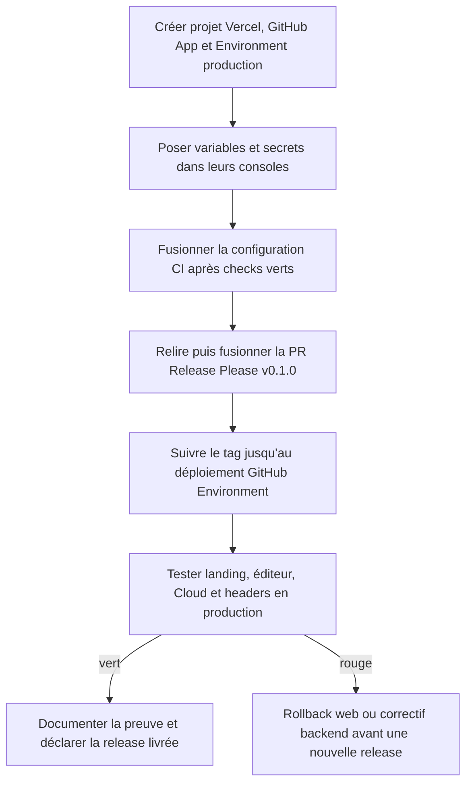
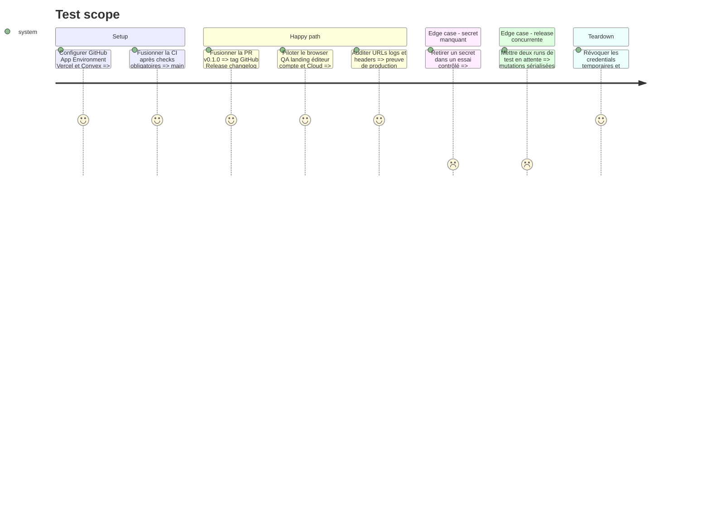

# Instruction: configurer les protections externes et prouver la première release

## Architecture projection

> Tree of the final files. ✅ create · ✏️ modify · ❌ delete

```txt
.
├── README.md ✏️ expose les commandes et renvoie vers le runbook de release
├── RELEASING.md ✅ procédure release, secrets, récupération et responsabilités
└── aidd_docs/tasks/
    ├── 2026_08/2026_08_15_local-cloud-plans/
    │   └── production-security-evidence.md ✏️ ferme les preuves Vercel/CI réellement observées
    └── 2026_08/2026_08_16_tagged-vercel-releases/
        └── release-evidence.md ✅ trace nettoyée de la première release taguée

❌ Aucun fichier supprimé.
```

## User Journey



## Test Scope



## Tasks to do

### `1)` Configurer GitHub sans élargir les droits

> Faire des consoles GitHub la seconde moitié vérifiable du contrat versionné.

1. Installer la GitHub App uniquement sur `neogenz/screenforge`; stocker client id en variable et clé privée en secret sans les afficher.
2. Protéger `main` avec la CI qualité obligatoire, squash-only, conversation résolue et branche à jour selon les capacités du plan GitHub.
3. Activer le ruleset de tags `v*` et l'Environment `production`, limité aux tags `v*`, sans bypass administrateur silencieux.
4. Poser dans l'Environment `VERCEL_TOKEN`, `CONVEX_DEPLOY_KEY`, les identifiants Vercel non secrets et l'URL production.

### `2)` Configurer Vercel et Convex une fois

> Relier la CI à des cibles explicites avant le premier tag.

1. Créer/importer le projet ScreenForge depuis la racine, confirmer build/output et Node 24, puis relever org id et project id.
2. Ne garder dans Vercel Production que `VITE_CONVEX_URL` et `VITE_COMMERCIAL_LAUNCH`; conserver Auth, Resend et Polar dans Convex.
3. Vérifier que les auto-déploiements Git sont désactivés et que la Deployment Protection laisse `vercel curl` contrôler un staged sans le rendre public.
4. Créer une deploy key Convex production dédiée CI, la poser dans GitHub puis révoquer tout jeton de bootstrap devenu inutile.

### `3)` Livrer et observer `v0.1.0`

> Fermer la boucle avec une vraie release, pas uniquement des fichiers YAML plausibles.

1. Attendre la CI verte sur la PR Release Please, relire le changelog et fusionner la release.
2. Constater la chaîne unique PR → GitHub Release → tag `v0.1.0` → Environment → staged → promotion.
3. Exécuter le contrôle production des headers, les smoke tests publics et un browser QA desktop sur landing EN/FR, éditeur, compte et chemin Cloud sans paiement réel.
4. Corriger toute cause racine, produire une nouvelle release patch et réitérer jusqu'au vert; ne jamais déplacer `v0.1.0`.

### `4)` Écrire le runbook et les preuves

> Permettre une release ou une récupération future sans dépendre de cette conversation.

1. Documenter Conventional Commits, PR de release, tag immuable, secrets attendus, rerun sûr et lecture des diagnostics.
2. Documenter Vercel staged/promote/rollback et la règle Convex forward-fix/expand-contract.
3. Enregistrer commit, tag, URL de déploiement, résultats des gates, headers et browser QA sans valeur secrète.
4. Mettre à jour la preuve Local/Cloud existante uniquement pour les contrôles externes réellement observés; laisser tout contrôle non prouvé bloqué.

## Test acceptance criteria

| Task | Acceptance criteria |
| --- | --- |
| 1 | Seule la GitHub App bornée peut créer un tag `v*`; seul un job issu de ce tag accède aux secrets de l'Environment production, et `main` ne fusionne pas sans la CI requise. |
| 2 | Le projet Vercel correspond à la racine du monorepo, aucun push de branche ne publie, et les deux credentials CI ciblent sans ambiguïté leurs services production respectifs. |
| 3 | `v0.1.0` génère exactement une GitHub Release et un déploiement promu; le gate local/cloud, les smoke tests, l'audit de headers et le browser QA production sont verts, ou une release patch immuable boucle jusqu'à ce résultat. |
| 4 | Un mainteneur peut suivre `RELEASING.md` pour préparer, observer, relancer et récupérer une release; les preuves relient tag, SHA et URL sans exposer de secret ni marquer un contrôle non exécuté comme réussi. |
