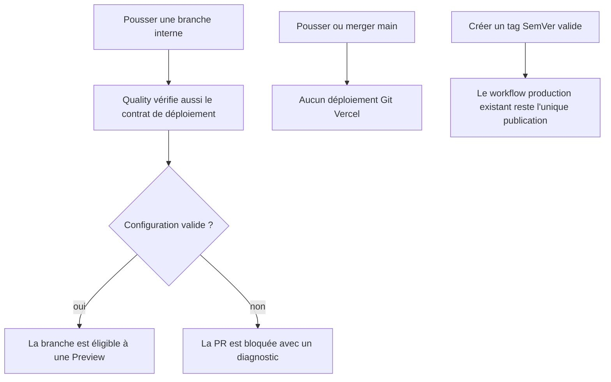
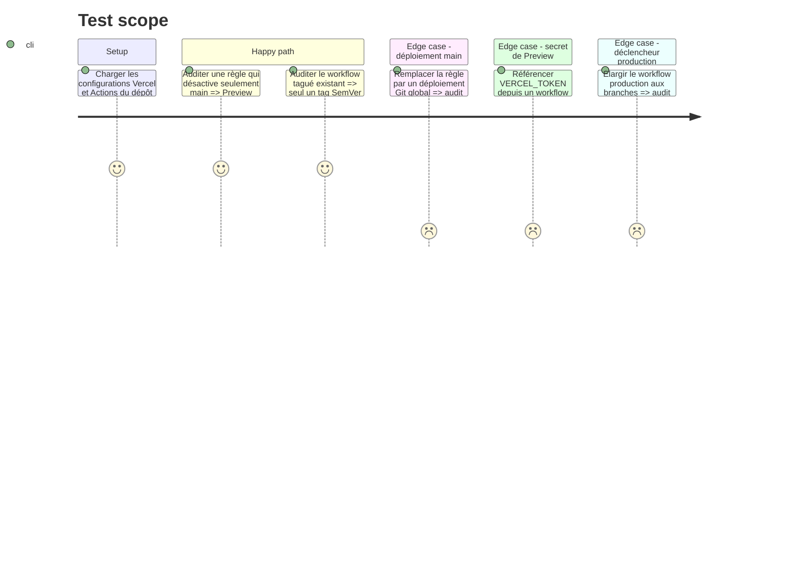

# Instruction: rendre le contrat Preview/Production exécutable

## Architecture projection

> Tree of the final files. ✅ create · ✏️ modify · ❌ delete

```txt
.
├── vercel.json                              ✏️ previews sur branches, jamais sur main
├── package.json                             ✏️ audit de configuration dans les tests
└── scripts/
    └── deployment-config-audit.mjs          ✅ contrat Vercel et GitHub Actions auto-testé

❌ Aucun fichier supprimé.
```

## User Journey



## Test Scope



## Tasks to do

### `1)` Ouvrir seulement le chemin Preview

> Autoriser les branches sans réactiver la production Git automatique.

1. Remplacer `git.deploymentEnabled: false` par l'objet documenté qui fixe `main: false`; ne déclarer aucune branche comme production dans `vercel.json`.
2. Conserver le build Vite, les headers, les rewrites et la CSP existants à l'identique.
3. Ne modifier ni le déclencheur `push.tags` ni le déploiement staged/promotion de `.github/workflows/deploy-production.yml`.

### `2)` Poser un assert exécutable sur la configuration

> Une dérive de CI doit casser la PR qui l'introduit.

1. Ajouter un audit Node sans nouvelle dépendance qui lit `vercel.json` et les workflows sous `.github/workflows/`.
2. Échouer si `main` peut être déployée automatiquement, si le workflow production accepte une branche, si un workflow de PR utilise `VERCEL_TOKEN`, ou si `pull_request_target` apparaît.
3. Fournir un mode `--self-test` avec fixtures en mémoire couvrant au moins un succès et chaque refus ci-dessus.
4. Ajouter le self-test et l'audit du dépôt à `pnpm run test:unit`, déjà exécuté par Quality.

### `3)` Vérifier sans activer de fournisseur

> Cette phase prépare le dépôt mais ne connecte encore aucun compte externe.

1. Lancer l'audit ciblé, `pnpm run test:unit`, `pnpm run typecheck` et `pnpm run lint` depuis la racine.
2. Vérifier par diff que cette phase n'ajoute aucun workflow Preview, jeton, secret, identifiant de compte ou valeur d'environnement.
3. Conserver la visibilité GitHub actuelle et l'état Vercel actuel jusqu'à la phase 3.

## Test acceptance criteria

| Task | Acceptance criteria |
| --- | --- |
| 1 | Une branche non `main` est éligible à une Preview, tandis qu'un push ou merge sur `main` ne peut déclencher aucun déploiement Git Vercel. |
| 2 | L'audit passe sur le contrat attendu et ses auto-tests prouvent qu'il refuse production sur branche, secret dans une PR et `pull_request_target`. |
| 3 | Les gates locaux sont verts et le diff ne contient aucune autorité ni mutation de fournisseur. |
