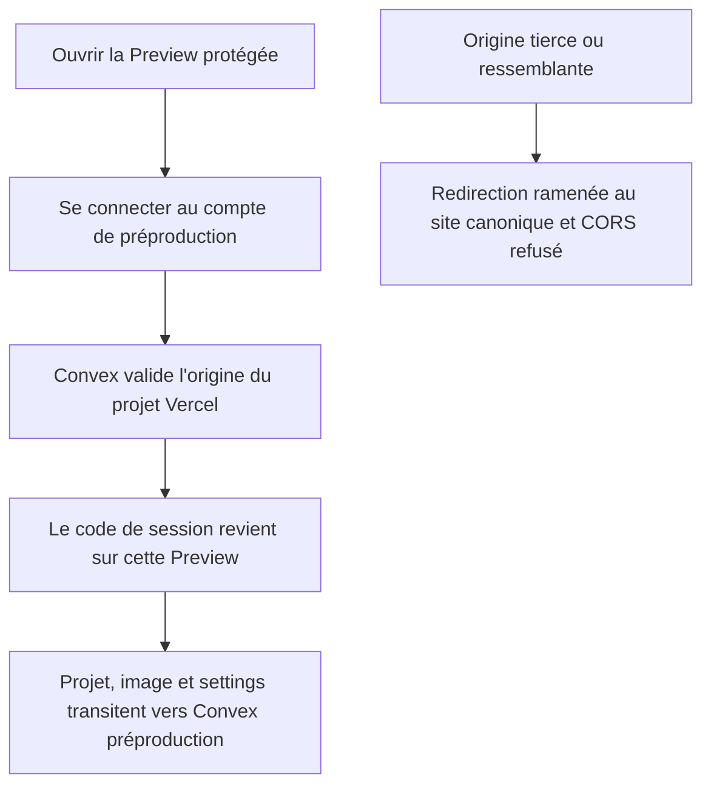
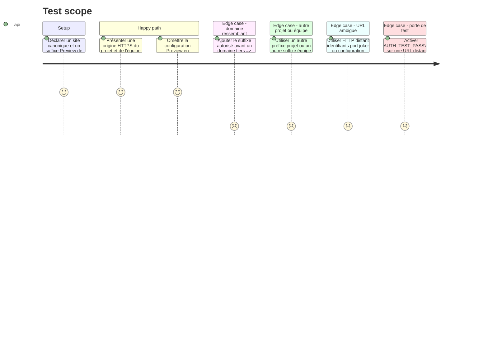

# Instruction: autoriser strictement les origines Preview dans Convex préproduction

> **Superseded le 2026-08-20.** Cette phase conserve la décision historique et
> ses preuves, mais sa politique de suffixe n'est plus active. Auth et CORS
> n'acceptent désormais que des origines exactes; les Previews éphémères restent
> Local-only et les parcours Cloud passent par l'origine stable de préproduction.

## Architecture projection

> Tree of the final files. ✅ create · ✏️ modify · ❌ delete

```txt
.
├── apps/backend/convex/
│   ├── origins.ts                            ✅ validation partagée des origines web
│   ├── origins.test.ts                       ✅ matrice d'origines légitimes et hostiles
│   ├── auth.ts                               ✏️ redirection vers une Preview approuvée
│   ├── auth.test.ts                          ✏️ non-régression des codes de session
│   ├── http.ts                               ✏️ CORS exact ou Preview approuvée
│   ├── assets.test.ts                        ✏️ requêtes HTTP depuis une Preview
│   ├── convex.config.ts                      ✏️ configuration Preview typée et optionnelle
│   └── _generated/server.d.ts                ✏️ sortie Convex régénérée, jamais éditée à la main
└── aidd_docs/tasks/2026_08/2026_08_11_migration-convex/
    └── environnements.md                     ✏️ séparation préproduction et production

❌ Aucun fichier supprimé.
```

## User Journey



## Test Scope



## Tasks to do

### `1)` Écrire une seule règle d'origine

> Réutiliser la même frontière pour les octets Cloud et les codes de connexion.

1. Extraire dans `origins.ts` la normalisation des origines exactes déjà portée par `http.ts`.
2. Ajouter une configuration optionnelle `VERCEL_PREVIEW_HOST_SUFFIX` qui n'accepte qu'un suffixe DNS Vercel sans schéma, port, chemin, identifiants ni joker.
3. N'accepter une Preview que si l'URL est HTTPS, sans identifiants, commence par le préfixe du projet ScreenForge et finit exactement par le suffixe configuré, avec au moins un segment généré entre les deux.
4. Garder les origines loopback existantes uniquement pour le développement local; toute configuration invalide échoue fermée.

### `2)` Fermer CORS et les redirections avec ce helper

> Aucune redirection de session ne doit être plus permissive que les uploads Cloud.

1. Faire consommer le helper par `corsHeaders` pour les uploads et téléchargements de projets/images.
2. Faire consommer le même helper par `safeRedirect`; préserver les chemins relatifs et le `SITE_URL` exact existants.
3. Refuser les domaines ressemblants, les userinfo URLs, HTTP distant, ports inattendus et namespaces d'un autre projet ou d'une autre équipe.
4. Ne modifier ni `requireCloud`, ni les entitlements, ni la restriction loopback de `AUTH_TEST_PASSWORD`.

### `3)` Borner la configuration au déploiement préproduction

> La possibilité Preview doit disparaître par simple absence de variable en production.

1. Déclarer la variable optionnelle dans `convex.config.ts`, régénérer les types Convex et documenter son rôle sans écrire sa valeur dans Git ou AIDD.
2. Mesurer d'abord le namespace réellement émis par une Preview Vercel du projet; n'enregistrer que le suffixe minimal qui distingue ce projet et cette équipe.
3. Poser cette variable uniquement sur Convex préproduction; vérifier par liste de noms qu'elle est absente de production, sans imprimer aucune valeur d'environnement.
4. Conserver `SITE_URL` et `CORS_ALLOWED_ORIGINS` exacts par déploiement et mettre à jour `environnements.md` avec des commandes interactives ou `--names-only` uniquement.

### `4)` Tester la frontière comme un attaquant

> Chaque forme de contournement connue doit avoir un échec observable.

1. Ajouter des tests purs de parsing et des tests Convex sur les réponses CORS et le callback de redirection.
2. Couvrir l'origine légitime, l'absence de configuration en production, un suffixe ajouté devant un domaine tiers, les identifiants URL, un autre projet, une autre équipe, HTTP, port, chemin et joker de configuration.
3. Vérifier qu'une requête autorisée conserve `Vary: Origin` et qu'un refus ne renvoie jamais `Access-Control-Allow-Origin`.
4. Lancer unités backend, typecheck et lint après régénération.

## Test acceptance criteria

| Task | Acceptance criteria |
| --- | --- |
| 1 | Une fonction pure accepte seulement les origines exactes ou le namespace HTTPS étroit de ScreenForge et échoue fermée sur toute configuration ambiguë. |
| 2 | La même décision gouverne CORS et le retour d'authentification; une origine hostile ne reçoit ni octet Cloud ni code de session. |
| 3 | Le nom de la configuration Preview existe en préproduction et est absent de production, sans valeur sensible écrite dans le dépôt, les commandes, les logs ou AIDD. |
| 4 | Les tests attaquants, unités backend, types et lint sont verts et échouent bien lorsque la frontière est volontairement élargie. |
