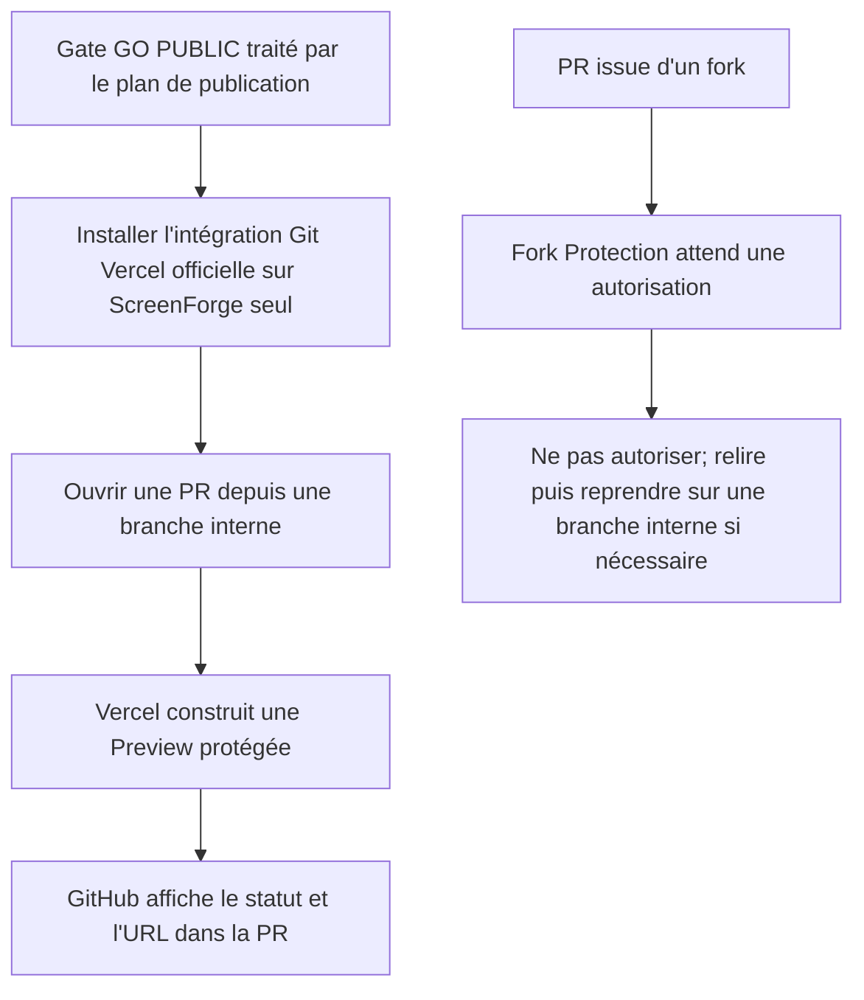
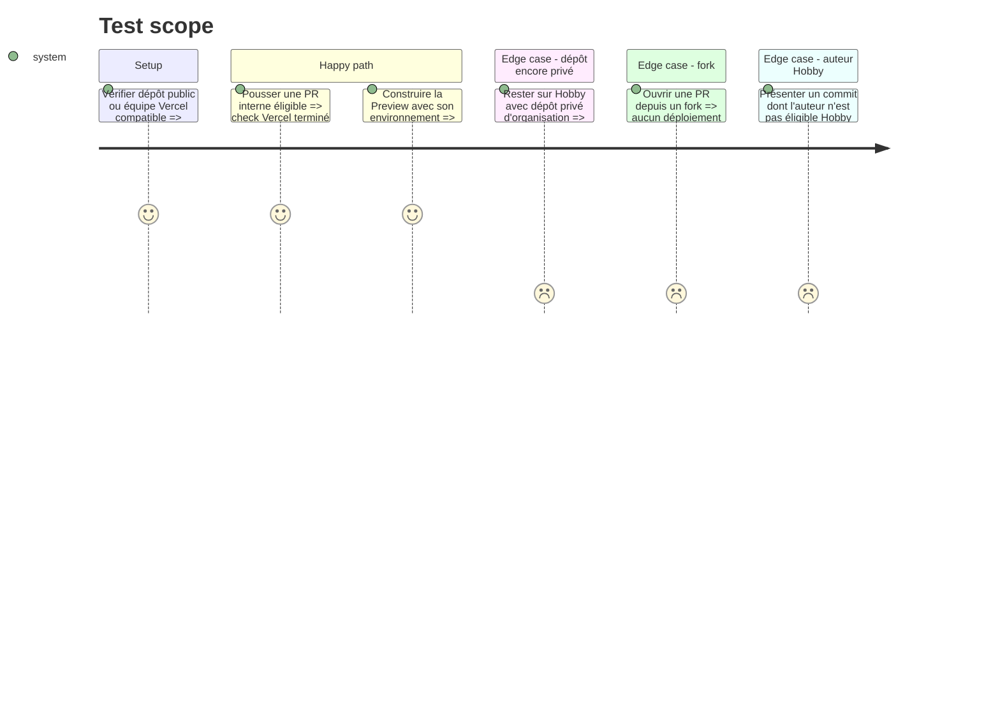

# Instruction: activer et documenter l'intégration Git Vercel après le gate public

## Architecture projection

> Tree of the final files. ✅ create · ✏️ modify · ❌ delete

```txt
.
├── RELEASING.md                           ✏️ cycle branche Preview puis tag Production
└── aidd_docs/memory/
    ├── testing.md                         ✏️ preuve Preview et politique des forks
    └── vcs.md                             ✏️ intégration Git Vercel et limites Hobby

❌ Aucun fichier supprimé.
```

## User Journey



## Test Scope



## Tasks to do

### `1)` Respecter le gate de visibilité et le plan Vercel

> Cette phase consomme un état public validé; elle ne rend jamais le dépôt public elle-même.

1. Vérifier que le plan de publication a déjà reçu et exécuté le gate littéral `GO PUBLIC`; sinon laisser cette phase en attente.
2. Si le dépôt reste privé, ne poursuivre que si l'utilisateur a séparément choisi Vercel Pro; ne déclencher aucun achat depuis ce plan.
3. Vérifier que le propriétaire GitHub qui signe les commits internes est éligible sur l'équipe Vercel Hobby avant de promettre une Preview.

### `2)` Installer l'intégration officielle au moindre privilège

> Une intégration Vercel remplace tout workflow Preview personnalisé.

1. Installer ou restreindre l'application GitHub officielle Vercel au seul dépôt `neogenz/screenforge`, puis relier le projet Vercel existant à ce dépôt.
2. Conserver `main` comme branche de production dans les métadonnées Vercel mais laisser `vercel.json` en interdire le déploiement Git; seule la CI taguée utilise `--prod`.
3. Activer Git Fork Protection et Standard Deployment Protection avec Vercel Authentication pour les URLs non production.
4. Ne créer aucun `VERCEL_TOKEN` supplémentaire, webhook maison, application GitHub personnalisée ou workflow `pull_request_target`.

### `3)` Séparer les environnements Vercel

> Preview reçoit une URL publique de préproduction, jamais une autorité serveur.

1. Configurer dans l'environnement Vercel Preview uniquement `VITE_CONVEX_URL` vers Convex préproduction et les éventuelles valeurs `VITE_*` déjà prouvées publiques.
2. Vérifier que les secrets Convex, Polar, Resend, OAuth et les clés de déploiement restent absents de Preview et vivent dans leurs stores serveur respectifs.
3. Vérifier que Production conserve son URL Convex production et que les identifiants/tokens de déploiement restent bornés au GitHub Environment `production` du workflow tagué.
4. Lancer une Preview témoin avant d'inscrire le namespace dans Convex préproduction; enregistrer seulement la décision de matcher, jamais les URLs temporaires ou identifiants dans AIDD.

### `4)` Documenter les usages et limites réels

> La Preview améliore la revue sans devenir un nouveau chemin de release.

1. Documenter dans `RELEASING.md` le parcours `branche interne → Preview protégée → Quality → merge → Release Please → tag → production`.
2. Documenter la règle fork : aucune autorisation Vercel directe; reprise sur branche interne seulement après revue du diff.
3. Garder le statut Vercel informatif sur Hobby; ne le rendre obligatoire dans le ruleset `main` qu'après preuve que PR humaines et Release Please le produisent toujours, ou après passage à un plan compatible.
4. Reporter les décisions durables dans les mémoires testing et VCS sans nom de personne, identifiant fournisseur, URL temporaire ni secret.

## Test acceptance criteria

| Task | Acceptance criteria |
| --- | --- |
| 1 | L'activation ne commence qu'après visibilité publique validée ou choix explicite de Vercel Pro; ce plan ne change jamais la visibilité ni la facturation. |
| 2 | L'intégration officielle ne voit que ScreenForge, protège previews et forks, et aucun workflow PR ne possède de jeton Vercel. |
| 3 | Une Preview interne utilise exclusivement Convex préproduction et aucun secret serveur n'apparaît dans ses variables, son bundle, ses logs ou ses artifacts. |
| 4 | La documentation décrit fidèlement les trois états Local, Preview/préproduction et Production taguée, sans transformer un check Hobby intermittent en blocage de merge. |
