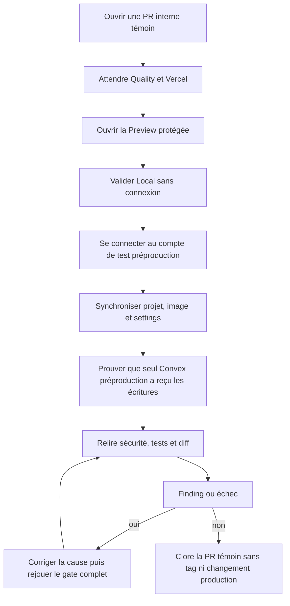
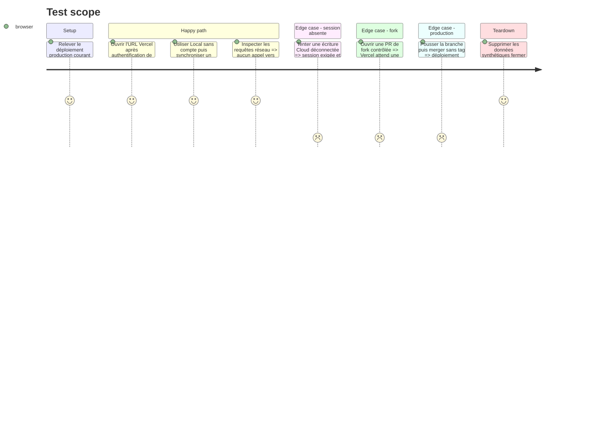

# Instruction: prouver le parcours complet et itérer jusqu'au vert

## Architecture projection

> Tree of the final files. ✅ create · ✏️ modify · ❌ delete

```txt
.
└── aidd_docs/tasks/2026_08/
    ├── 2026_08_16_vercel-pr-previews/
    │   ├── plan.md                          ✏️ statut AIDD après preuves
    │   ├── phase-1.md                       ✏️ statut AIDD après preuves
    │   ├── phase-2.md                       ✏️ statut AIDD après preuves
    │   ├── phase-3.md                       ✏️ statut AIDD après preuves
    │   └── phase-4.md                       ✏️ statut AIDD après preuves
    └── 2026_08_16_cloud-prelaunch-validation/
        └── verification.md                  ✏️ preuve unique asserts review et browser QA

❌ Aucun fichier supprimé.
```

## User Journey



## Test Scope



## Tasks to do

### `1)` Rejouer tous les asserts automatisés

> Une Preview fonctionnelle ne compense jamais une régression du produit.

1. Lancer l'audit de configuration, les auto-tests, `pnpm run test:unit`, `pnpm run typecheck`, `pnpm run lint`, `pnpm run build` puis `pnpm run test:release` depuis la racine.
2. Lancer Gitleaks et l'audit de publication sur le contenu suivi, le bundle et les artifacts de test.
3. Vérifier que Quality reste verte sur la PR sans accès aux secrets de production et que le workflow tagué n'a pas été exécuté.
4. Écrire dans la section Preview de `verification.md` uniquement commandes, SHA, statuts, compteurs et diagnostics expurgés.

### `2)` Exécuter le browser QA de la Preview

> Tester d'abord Local, puis Cloud contre de vraies surfaces de préproduction.

1. Depuis l'URL protégée publiée dans la PR, vérifier landing, éditeur, import, création et export Local sans session.
2. Utiliser un compte de test préproduction à entitlement Cloud active; synchroniser un projet, une image et des settings puis les relire après rechargement.
3. Inspecter les requêtes et confirmer que queries, auth, uploads et downloads visent uniquement Convex préproduction.
4. Vérifier les états déconnecté, entitlement absente, origine refusée et rechargement sur une nouvelle Preview du même PR.
5. Nettoyer les données synthétiques depuis les fonctions normales du produit; ne créer aucun bypass ou fournisseur de mot de passe distant.

### `3)` Prouver les frontières Git et production

> Une PR ne doit pouvoir modifier que sa Preview et la préproduction explicitement utilisée.

1. Comparer l'identité du déploiement production Vercel avant la PR, après chaque push et après un merge sans tag; elle doit rester inchangée.
2. Ouvrir une PR de fork contrôlée après publication et vérifier qu'aucun déploiement n'est produit sans autorisation; fermer la PR sans l'autoriser.
3. Vérifier une PR Release Please ou son équivalent : une limite d'auteur Hobby peut omettre la Preview mais ne doit pas bloquer Quality, le merge ni la release taguée.
4. Vérifier que seule la création ultérieure d'un tag SemVer valide peut entrer dans `deploy-production.yml`; ne créer aucun tag pour cette preuve.
5. Consigner dans la section Preview de `verification.md` les états et timestamps utiles, sans URL temporaire, identifiant fournisseur, adresse personnelle ni valeur d'environnement.

### `4)` Review et boucle corrective

> Le plan ne passe à `implemented`, puis à `reviewed`, qu’après correction de chaque finding confirmé.

1. Relire le diff pour les trust boundaries, fuites d'environnement, dérive du flux tagué, dépendances inutiles et divergence CORS/auth.
2. Classer les findings avec fichier et preuve dans la section Review de `verification.md`; corriger la cause partagée plutôt qu'un appel isolé.
3. Après chaque correction, rejouer le test ciblé puis le gate complet et le scénario navigateur concerné.
4. L’implémentation passe les phases et le plan à `implemented` lorsque les critères sont prouvés; seule la review approuvée les passe ensuite à `reviewed`.

## Test acceptance criteria

| Task | Acceptance criteria |
| --- | --- |
| 1 | Tous les gates locaux et CI sont verts, Gitleaks ne trouve aucun secret et aucun workflow de production n'est parti. |
| 2 | La Preview protégée couvre Local puis Cloud réel sur préproduction, y compris projets, images et settings, sans appel production ni porte de test distante. |
| 3 | Le fork reste non déployé, un merge sans tag laisse la production inchangée et la limitation Hobby éventuelle n'empêche pas la release. |
| 4 | Chaque finding confirmé est corrigé et retesté; plan et phases ne passent pas à `implemented` tant qu’une preuve manque ou qu’un gate échoue. |
