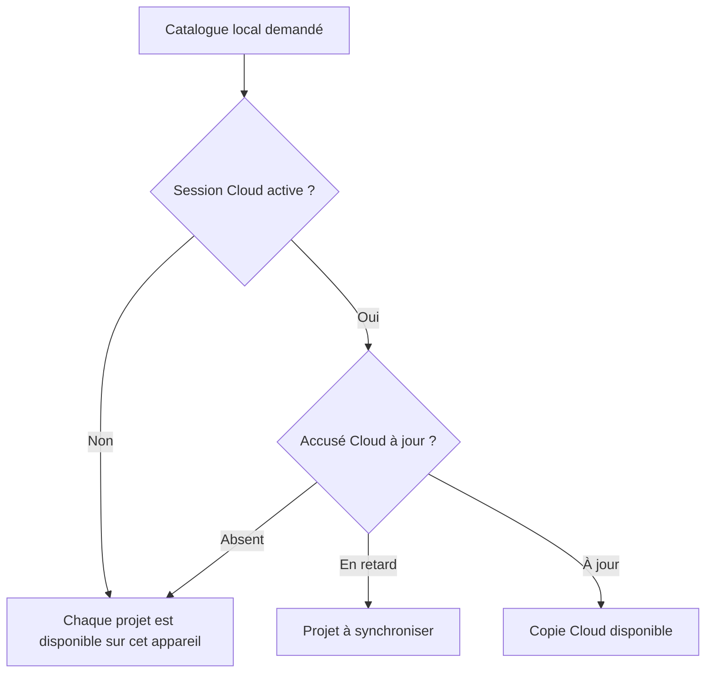
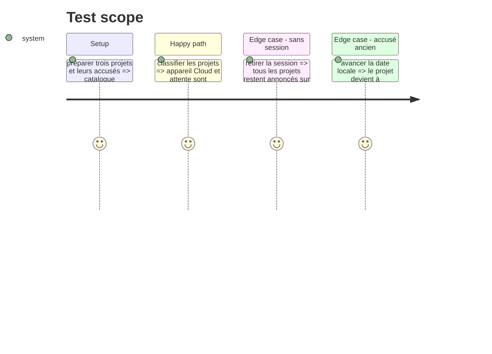

# Instruction: Définir le vocabulaire et les états de disponibilité

## Architecture projection

> Tree of the final files. ✅ create · ✏️ modify · ❌ delete

```txt
.
└── apps/web/src/lib
    ├── ✏️ sync.ts
    └── __tests__
        └── ✏️ sync.test.ts
```

## User Journey



## Test Scope



## Tasks to do

### `1)` Fixer un vocabulaire sans ambiguïté commerciale

> Décrire où une copie est disponible, pas quelle offre possède l'utilisateur.

1. Définir les états `device-only`, `cloud` et `pending` avec les libellés français `Cet appareil`, `Cloud` et `À synchroniser`.
2. Documenter que tout projet reste stocké localement, y compris lorsqu'une copie Cloud existe.
3. Ne déduire aucun droit depuis cet état d'affichage ; les writes restent protégés par l'autorisation serveur existante.

### `2)` Projeter l'état depuis les sources existantes

> Fournir au sélecteur une vue en lecture seule, sans requête réseau supplémentaire.

1. Réutiliser `listProjects`, l'utilisateur courant et les `SyncRecord` durables.
2. Classer `device-only` sans accusé, `pending` lorsque `updatedAt` dépasse `pushedUpdatedAt`, et `cloud` lorsque l'accusé couvre la version locale.
3. Retourner nom, identifiant, date et disponibilité dans l'ordre `updatedAt` décroissant, avec départage stable par identifiant.
4. Échouer en lecture seule : une indisponibilité du catalogue produit une erreur récupérable et ne crée aucun record de synchronisation.

### `3)` Verrouiller le contrat par tests unitaires

> Empêcher les badges de devenir une seconde logique d'autorisation ou de mentir après une modification locale.

1. Couvrir les trois états, l'absence de session, l'ordre stable et l'accusé plus récent que la copie locale.
2. Vérifier que la classification ne modifie aucun projet ni `SyncRecord`.

## Test acceptance criteria

| Task | Acceptance criteria |
| ---- | ------------------- |
| 1 | Les termes visibles décrivent sans ambiguïté la disponibilité de la copie et ne redéfinissent pas les offres Local/Cloud. |
| 2 | Un catalogue mixte est classé sans appel réseau ni écriture locale ou distante. |
| 2 | Une modification locale postérieure au dernier accusé affiche `À synchroniser`. |
| 3 | Les tests échouent si un projet sans accusé est annoncé dans le Cloud ou si la lecture crée un état de synchronisation. |
