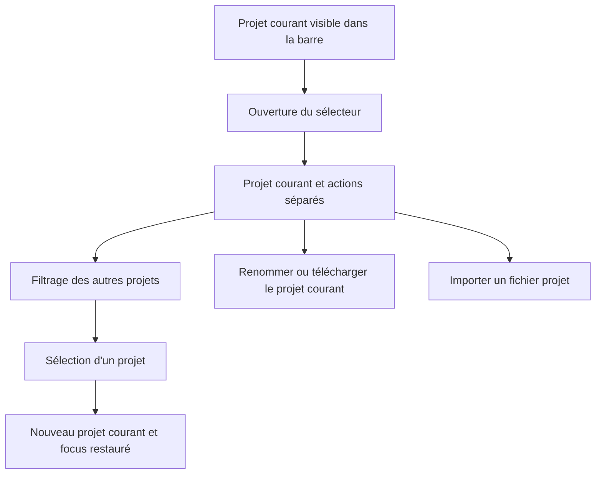
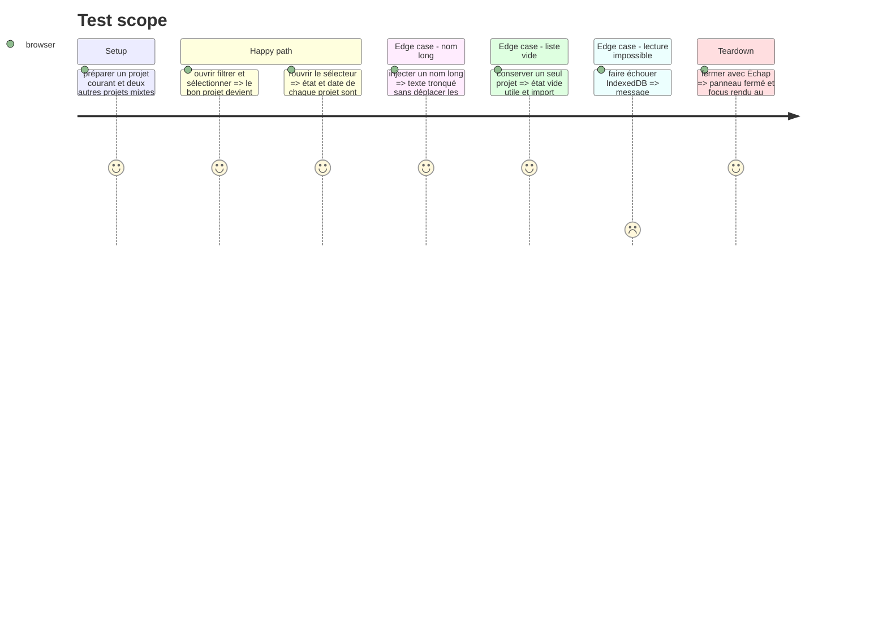

# Instruction: Construire un sélecteur de projets structuré

## Architecture projection

> Tree of the final files. ✅ create · ✏️ modify · ❌ delete

```txt
.
└── apps/web
    ├── src
    │   ├── components
    │   │   ├── project-switcher
    │   │   │   └── ✅ ProjectSwitcher.tsx
    │   │   └── toolbar
    │   │       └── ✏️ TopBar.tsx
    │   └── lib
    │       ├── __tests__
    │       │   └── ✏️ storage.test.ts
    │       └── ✏️ storage.ts
    └── e2e
        ├── ✏️ project-file.spec.ts
        ├── ✏️ semantics.spec.ts
        └── ✏️ sync.spec.ts
```

## User Journey



## Test Scope



## Wireframe

```txt
┌──────────────────────────────────────────────────────┐
│ (1) Barre : [projet courant ▾] · sauvegarde · cloud  │
│                                                      │
│       ┌──────────────────────────────────────────┐   │
│       │ (2) Projet courant                       │   │
│       │     identité · emplacement · état        │   │
│       │     (3) actions du projet courant        │   │
│       ├──────────────────────────────────────────┤   │
│       │ (4) Filtre de projets                    │   │
│       │ (5) Autres projets                       │   │
│       │     ligne · emplacement · date           │   │
│       │     ligne · emplacement · date           │   │
│       ├──────────────────────────────────────────┤   │
│       │ (6) Import                               │   │
│       └──────────────────────────────────────────┘   │
└──────────────────────────────────────────────────────┘
```

1. Barre : conserve l'identité du document et les témoins d'enregistrement.
2. Projet courant : une occurrence clairement désignée, jamais répétée dans les autres projets.
3. Actions : renommer et télécharger concernent uniquement le projet courant.
4. Filtre : réduit le catalogue par nom sans modifier son contenu.
5. Autres projets : chaque ligne porte nom, disponibilité et fraîcheur.
6. Import : action séparée de la navigation et toujours accessible.

## Tasks to do

### `1)` Construire le panneau spécialisé

> Donner une hiérarchie explicite à la navigation sans ajouter de dépendance.

1. Créer `ProjectSwitcher` avec le `Popover` et les primitives existantes.
2. Afficher le projet courant en tête avec `aria-current`, sa disponibilité et ses actions dédiées.
3. Afficher les autres projets dans une région nommée, triés par fraîcheur, avec disponibilité et date localisée.
4. Ajouter un filtre persistant par nom, un état vide contextualisé, un chargement annoncé et une erreur avec action Réessayer.
5. Garder l'import dans un pied séparé ; ne jamais faire ressembler une ligne de projet à un champ de texte.

### `2)` Intégrer sans dégrader la barre compacte

> Remplacer `ProjectFileMenu` tout en conservant l'édition rapide du nom et les témoins existants.

1. Brancher le chevron actuel sur `ProjectSwitcher` et conserver `ProjectName` comme seule surface d'édition.
2. Faire fermer Renommer avant de focaliser et sélectionner le champ du nom courant.
3. Préserver téléchargement, import, chargement, toasts et ouverture atomique existants.
4. Conserver le déclencheur, les états et les actions visibles sans chevauchement aux seuils définis par `stage.ts`.

### `3)` Verrouiller navigation, clavier et résilience

> Tester l'usage réel plutôt que la seule présence du panneau.

1. Adapter les scénarios de fichier projet aux nouveaux rôles et libellés accessibles.
2. Couvrir filtrage, choix, projet courant unique, états de disponibilité, dates, nom long, vide, erreur et reprise.
3. Vérifier Tab, Maj+Tab, Échap, activation clavier, focus visible et restauration du focus.
4. Maintenir le test de curseur calculé et les sélecteurs français accessibles.

## Test acceptance criteria

| Task | Acceptance criteria |
| ---- | ------------------- |
| 1 | À l'ouverture, le projet courant, ses actions et les autres projets se distinguent en moins d'un balayage visuel. |
| 1 | Chaque autre projet annonce son nom complet aux technologies d'assistance, sa disponibilité et sa date. |
| 2 | Le nom courant reste éditable et les opérations importer/télécharger/ouvrir conservent leurs garanties actuelles. |
| 2 | À largeur compacte et avec un nom long, aucun témoin ni action ne se chevauche. |
| 3 | Le panneau est entièrement utilisable au clavier et rend le focus au déclencheur après Échap ou sélection. |
| 3 | Une erreur de catalogue laisse le projet courant utilisable et propose une reprise explicite. |
