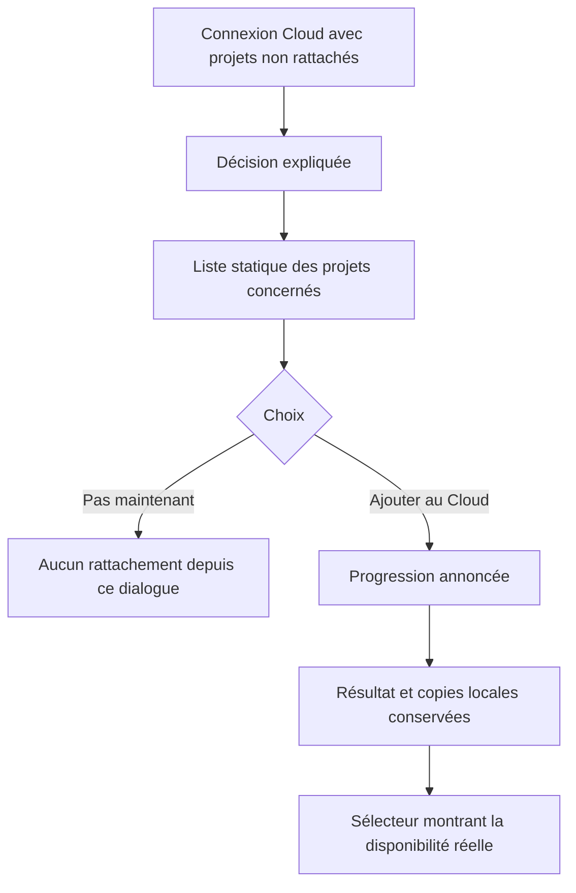
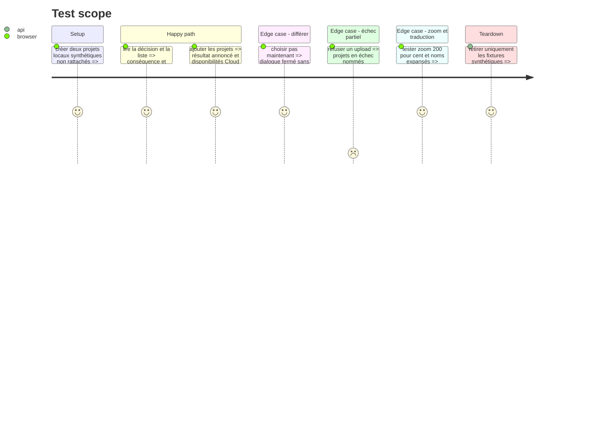

# Instruction: Clarifier le rattachement et valider le parcours complet

## Architecture projection

> Tree of the final files. ✅ create · ✏️ modify · ❌ delete

```txt
.
├── apps/web
│   ├── src/components/migrate-dialog
│   │   └── ✏️ MigrateProjectsDialog.tsx
│   ├── src/components/ui
│   │   └── ✏️ dialog.tsx
│   └── e2e
│       └── ✏️ sync.spec.ts
└── aidd_docs/memory
    ├── ✏️ design.md
    └── ✏️ navigation.md
```

## User Journey



## Test Scope



## Wireframe

```txt
┌──────────────────────────────────────────────┐
│ (1) Titre · fermer                          │
├──────────────────────────────────────────────┤
│ (2) Explication de la conséquence            │
│                                              │
│ (3) Liste statique                           │
│     projet · emplacement · date              │
│     projet · emplacement · date              │
│                                              │
│ (4) Garantie de conservation locale          │
├──────────────────────────────────────────────┤
│ (5) action différée · action Cloud explicite │
└──────────────────────────────────────────────┘
```

1. Titre : nomme la décision plutôt que le mécanisme interne de rattachement.
2. Explication : indique que les projets listés ne sont pas encore dans le Cloud.
3. Liste : information non éditable, sans bordure ni profondeur de champ.
4. Garantie : confirme que les copies locales restent disponibles.
5. Actions : la primaire nomme la quantité et la destination ; la secondaire diffère sans ambiguïté.

## Tasks to do

### `1)` Réécrire la hiérarchie du message

> Dire une fois ce qui est concerné, ce qui va arriver et ce qui restera intact.

1. Utiliser le titre `Ajouter ces projets au Cloud ?`.
2. Utiliser l'introduction `Ces projets sont enregistrés uniquement sur cet appareil. Ajoutez-les au Cloud pour les retrouver sur vos autres appareils.`
3. Nommer la liste `Projets à ajouter` et remplacer `Plus tard` par `Pas maintenant`.
4. Libeller l'action primaire `Ajouter ce projet au Cloud` au singulier et `Ajouter les N projets au Cloud` au pluriel, avec deux phrases complètes localisables.
5. Remplacer la répétition actuelle par la garantie concise `Leur copie locale reste disponible.`
6. Ne faire aucune affirmation sur les autres projets ou sur le moment où la synchronisation générale commence.

### `2)` Rendre la liste manifestement informative

> Supprimer l'affordance de champ qui a provoqué la confusion de renommage.

1. Présenter les projets comme une liste sémantique sous un libellé persistant.
2. Utiliser une séparation légère de lignes, un pictogramme de document, le nom et la date ; aucune surface inset, aucun contour de contrôle, aucun curseur de saisie.
3. Tronquer visuellement les noms longs tout en conservant le nom accessible complet.
4. Annoncer chargement, erreur, progression et résultat sans déplacer le focus ni masquer Fermer.

### `3)` Vérifier le parcours et mettre à jour la mémoire

> Clore sur des preuves fonctionnelles, visuelles et accessibles bornées.

1. Adapter le scénario Cloud avec fixtures synthétiques uniquement ; ne jamais utiliser, renommer ni supprimer un projet utilisateur réel.
2. Exécuter les E2E ciblés du sélecteur, du fichier projet, de la sémantique et du rattachement, puis la gate de release prévue par le dépôt.
3. Capturer en une passe groupée thème sombre/clair, largeur desktop/compacte, liste courte/longue et zoom 200 %.
4. Corriger tous les défauts observés en un lot, confirmer une seule fois, puis arrêter la boucle visuelle.
5. Exécuter une fois le détecteur Impeccable sur les cibles UI modifiées, ainsi que les audits contraste et échelle.
6. Documenter dans la mémoire la structure du sélecteur et le vocabulaire de disponibilité, sans donnée ni identifiant réel.

## Test acceptance criteria

| Task | Acceptance criteria |
| ---- | ------------------- |
| 1 | Sans connaissance du terme rattachement, la personne comprend quels projets sont concernés, où ils iront et ce qui restera local. |
| 1 | Les boutons annoncent leur résultat et la destination Cloud ; aucun libellé générique `OK`, `Oui` ou `Tout` ne subsiste. |
| 2 | Aucun élément statique de la liste ne ressemble à un input, un bouton ou une sélection modifiable. |
| 2 | Les noms longs, le pluriel, le chargement et l'erreur restent compréhensibles à 200 % de zoom. |
| 3 | Les tests prouvent que l'action différée ne rattache rien depuis ce dialogue et que l'action primaire traite exactement les fixtures listées. |
| 3 | Les deux passes visuelles, les audits de contraste/échelle, le détecteur Impeccable et la gate de release sont verts. |
| 3 | Aucune donnée utilisateur réelle n'est mutée ou supprimée pendant la vérification. |
