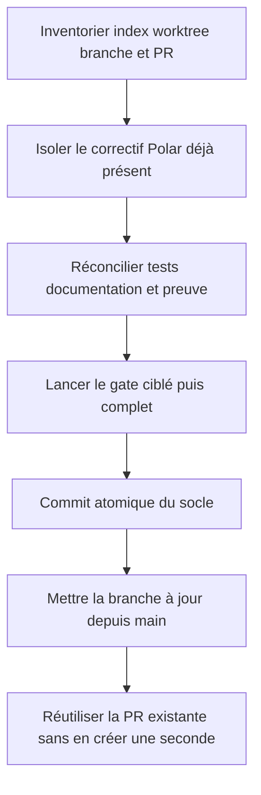
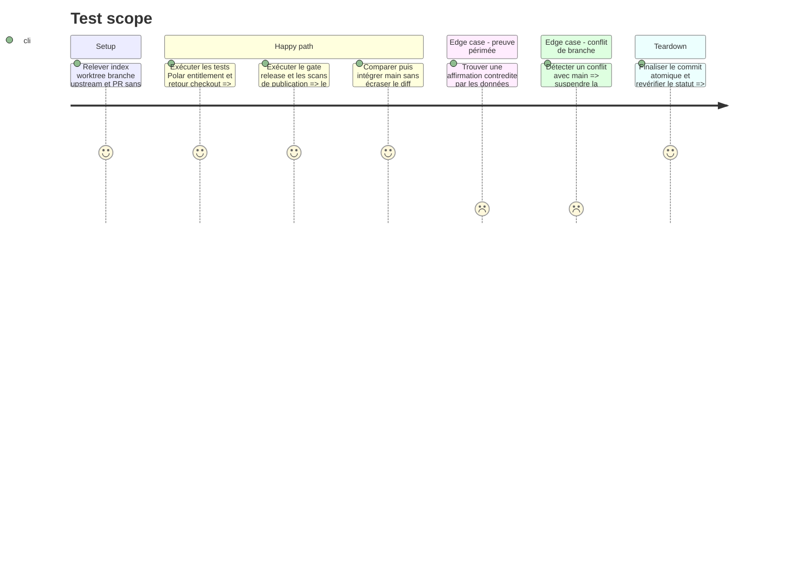

# Instruction: Stabiliser le socle Polar et la branche courante

## Architecture projection

> Tree of the final files. ✅ create · ✏️ modify · ❌ delete

```txt
.
├── README.md                                                        ✏️ état Cloud et liens documentaires exacts
├── CLOUD.md                                                         ✅ guide opérateur sans donnée sensible
├── apps/
│   ├── backend/
│   │   ├── package.json                                             ✏️ scripts de preuve Polar cohérents
│   │   └── convex/
│   │       ├── billing.test.ts                                      ✏️ achat et replay signés
│   │       ├── entitlements.test.ts                                 ✏️ états payants et dérogation propriétaire
│   │       ├── entitlements.ts                                      ✏️ calcul d’entitlement consolidé
│   │       └── polar.ts                                             ✏️ miroir Polar idempotent
│   └── web/src/stores/
│       ├── auth.store.ts                                            ✏️ retour checkout réconcilié
│       └── __tests__/auth.store.test.ts                             ✅ non-régression du retour client
├── pnpm-lock.yaml                                                   ✏️ lock aligné au manifeste backend
└── aidd_docs/tasks/2026_08/2026_08_16_cloud-prelaunch-validation/
    ├── phase-3.md                                                   ✏️ état réel Polar Sandbox
    ├── verification.md                                             ✏️ preuve expurgée unique
    └── review.md                                                   ✅ review réconciliée avec les preuves récentes

❌ Aucun fichier supprimé.
```

## User Journey



## Test Scope



## Tasks to do

### `1)` Figer l’état sans perdre le travail existant

> Traiter le diff Polar courant comme une entrée, jamais comme du bruit à réinitialiser.

1. Relever séparément les changements indexés, non indexés et non suivis, la branche, son upstream, son écart à `main` et la PR existante.
2. Vérifier que les fichiers Polar, entitlement, retour checkout et documentation appartiennent bien au correctif préproduction déjà exécuté.
3. Ne lancer aucun reset, checkout destructif, suppression de worktree ou nettoyage de fichier non attribué.
4. Si un fichier mélange deux sujets, séparer les hunks plutôt que réécrire le contenu utilisateur.

### `2)` Réconcilier les preuves Polar et Cloud

> Une seule matrice doit décrire ce qui a réellement été exécuté.

1. Aligner `phase-3.md`, `verification.md`, `review.md`, `README.md` et `CLOUD.md` sur l’achat Sandbox et le replay déjà prouvés.
2. Laisser l’annulation/échéance explicitement en attente tant qu’elle n’a pas été observée; ne jamais transformer un email reçu en preuve d’état serveur.
3. Retirer toute valeur, URL de checkout, adresse, identifiant client, jeton ou suffixe de secret des documents versionnés.
4. Vérifier que la dérogation propriétaire est décrite comme un entitlement client complémentaire, jamais comme un rôle administrateur.

### `3)` Prouver puis isoler le socle

> Commencer les nouveaux findings sur une base verte et relisible.

1. Lancer les tests ciblés billing, entitlement et auth store, puis `pnpm test`, le build, l’audit de publication, le format et Gitleaks.
2. Corriger uniquement une régression reproduite par ces tests; garder toute nouvelle correction sécurité pour sa phase dédiée.
3. Créer un commit atomique avec le workflow VCS AIDD, sans inclure les documents du présent plan encore en construction.
4. Vérifier que le commit ne contient aucun secret et que son message respecte Conventional Commits et la limite commitlint.

### `4)` Aligner la branche et la PR

> Conserver un seul historique candidat avant le durcissement.

1. Récupérer `main`, mesurer l’écart et intégrer ses commits sans supprimer une branche encore utile ni réécrire un commit publié sans nécessité.
2. En cas de conflit, préserver chaque changement métier et refaire le test ciblé du fichier résolu avant de continuer.
3. Réutiliser la PR existante si elle est ouverte; vérifier sa cible, son état ready-for-review et ses checks au lieu d’en créer une seconde.
4. Reporter uniquement le SHA, les statuts et les compteurs expurgés dans la matrice de preuve.

## Test acceptance criteria

| Task | Acceptance criteria |
| --- | --- |
| 1 | Chaque fichier présent avant la phase est conservé ou attribué; aucun changement utilisateur n’est supprimé ou écrasé. |
| 2 | Les documents décrivent exactement achat, replay, dérogation et travail restant sans donnée sensible ni preuve inventée. |
| 3 | Le socle Polar forme un commit atomique dont tests, build, publication, format et Gitleaks sont verts. |
| 4 | La branche contient `main` ou documente un conflit bloquant, et une seule PR correctement ciblée porte le candidat. |
