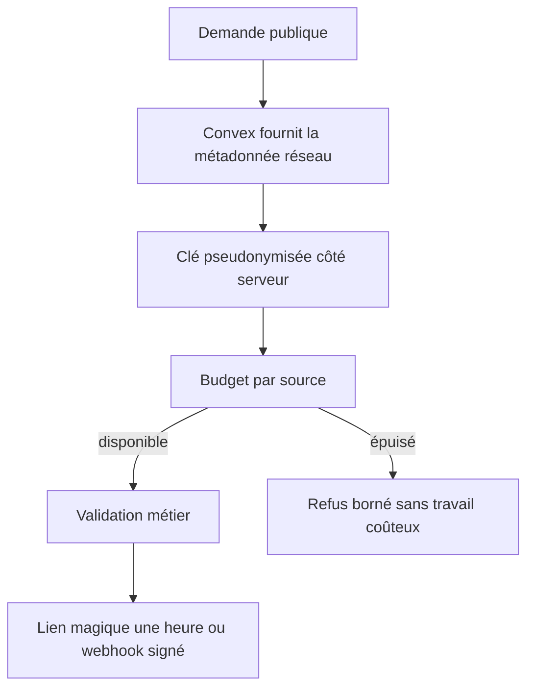
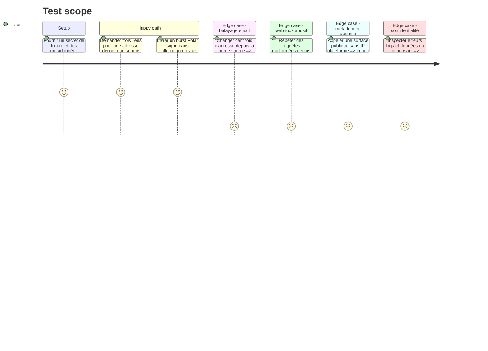

# Instruction: Borner les entrées publiques Auth et Polar

## Architecture projection

> Tree of the final files. ✅ create · ✏️ modify · ❌ delete

```txt
.
├── .env.example                                      ✏️ nom du secret de pseudonymisation uniquement
└── apps/backend/convex/
    ├── convex.config.ts                              ✏️ variable serveur typée
    ├── _generated/server.d.ts                        ✏️ sortie Convex régénérée
    ├── limits.ts                                     ✏️ clés réseau et budgets Auth/webhook
    ├── auth.ts                                       ✏️ expiration réelle et limite par source
    ├── auth.test.ts                                  ✏️ IP distinctes et expiration une heure
    ├── billing.ts                                    ✏️ admission avant lecture et signature
    ├── billing.test.ts                               ✏️ burst Polar et source abusive
    ├── accountDeletion.test.ts                       ✏️ attentes de compteurs mises à jour
    ├── preflight.ts                                  ✏️ secret anti-abus requis sans valeur
    └── preflight.test.ts                             ✏️ diagnostic expurgé

❌ Aucun fichier supprimé.
```

## User Journey



## Test Scope



## Tasks to do

### `1)` Construire une clé anti-abus fiable et privée

> Utiliser la métadonnée plateforme plutôt qu’un en-tête contrôlé par l’appelant.

1. Ajouter un secret serveur dédié de pseudonymisation, déclaré par son nom dans `.env.example`, `convex.config.ts` et le preflight sans aucune valeur versionnée.
2. Centraliser dans `limits.ts` la lecture de `ctx.meta.getRequestMetadata().ip` et la dérivation HMAC avec un domaine distinct pour Auth et Polar.
3. Refuser la surface anonyme si l’IP plateforme ou le secret manque; ne jamais reprendre `X-Forwarded-For`, `User-Agent`, email ou webhook id comme identité réseau.
4. Ne loguer, retourner ni documenter l’IP, le digest ou la valeur du secret; tester seulement égalité, séparation et absence dans les sorties.

### `2)` Corriger disponibilité et expiration du lien magique

> Protéger la boîte et l’expéditeur sans créer un coupe-circuit partagé mondial.

1. Remplacer `magicLinkSendGlobal` par un budget par source pseudonymisée, en conservant le budget par adresse normalisée.
2. Consommer les deux budgets avant l’appel Resend et laisser la transaction rendre ses jetons si l’envoi échoue.
3. Configurer `maxAge` à 3 600 secondes sur le fournisseur Resend afin que le jeton et le texte annoncent la même durée.
4. Retirer de l’email l’affirmation « depuis ce navigateur »; ne modifier ni le caractère bearer du lien ni le callback d’origine sûre.
5. Adapter la remise à zéro de compte pour ne toucher que les compteurs réellement liés au compte ou à son email, jamais une source réseau partagée.

### `3)` Fermer l’admission du webhook Polar

> Rejeter une source abusive avant le buffer et avant le runtime Node.

1. Vérifier présence et longueurs bornées des trois en-têtes Standard Webhooks avant de lire le corps, sans reproduire la vérification cryptographique du SDK.
2. Consommer un budget par source pseudonymisée avant `readWebhookBody`, avec une capacité qui accepte le burst et les retries mesurés en Sandbox.
3. Retourner `429` et un `Retry-After` borné quand le budget est épuisé; conserver `413`, `403`, `503` et l’idempotence existants pour leurs causes respectives.
4. Garder le corps brut pour la signature officielle Polar, ne jamais le parser ou le loguer avant validation, et ne créer aucun proxy Vercel supplémentaire.

### `4)` Tester les deux surfaces comme un attaquant

> Les tests doivent distinguer protection, disponibilité et comportement légitime.

1. Couvrir même source/adresses variables, sources distinctes, absence d’IP, secret absent et non-divulgation de la clé dérivée.
2. Vérifier par l’expiration persistée ou la date fournie au sender qu’un lien cesse réellement d’être valide après une heure.
3. Couvrir headers Polar absents/surdimensionnés, quota épuisé avant lecture, burst signé admis, replay signé idempotent et signature altérée sans mutation.
4. Exécuter unités backend, typecheck, lint, format et le test Cloud ciblé avant le gate global.

## Test acceptance criteria

| Task | Acceptance criteria |
| --- | --- |
| 1 | Une IP plateforme produit une clé stable et cloisonnée par usage; IP, digest et secret sont absents de toutes les sorties observables. |
| 2 | Une source ne peut pas contourner le quota en changeant d’email ni bloquer une autre source, et chaque lien expire effectivement après une heure. |
| 3 | Une source webhook abusive reçoit 429 avant lecture du corps ou action Node, tandis qu’un burst Polar signé et ses retries restent acceptés. |
| 4 | Les tests attaquants et légitimes passent ensemble; aucun refus global ne masque une fonctionnalité cassée. |
