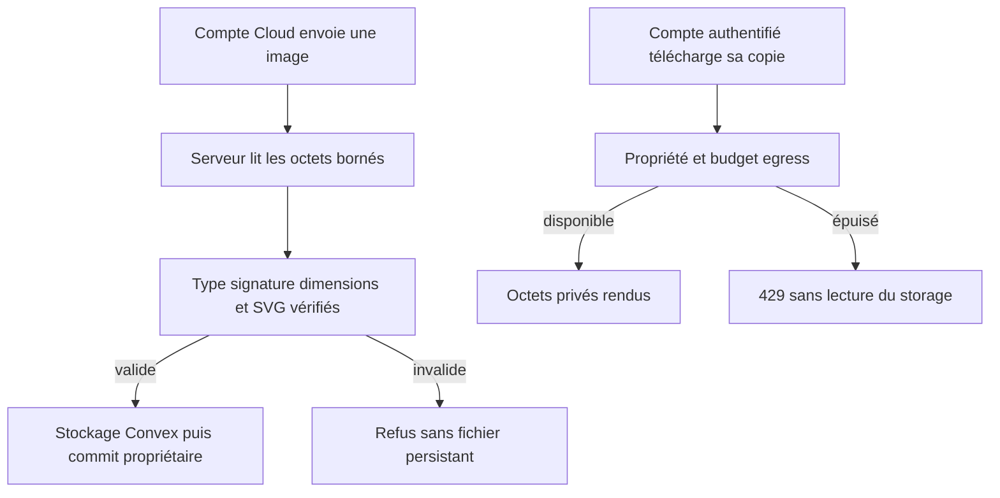
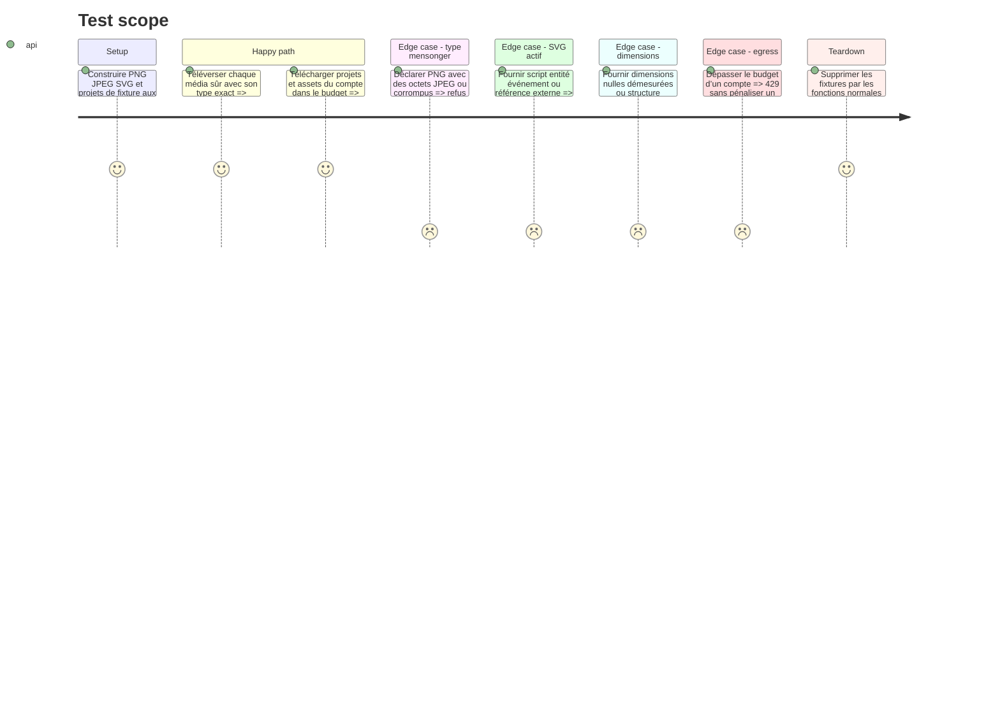

# Instruction: Valider les médias Cloud et borner les téléchargements

## Architecture projection

> Tree of the final files. ✅ create · ✏️ modify · ❌ delete

```txt
.
├── packages/project-format/
│   ├── package.json                                  ✏️ parseur XML minimal déclaré directement
│   └── src/media-validation.ts                       ✅ validation d’octets partagée par sous-chemin
├── apps/backend/
│   ├── package.json                                  ✏️ dépendance workspace au contrat média
│   └── convex/
│       ├── media.ts                                  ✏️ limites et types cohérents
│       ├── assets.ts                                 ✏️ commit du type validé uniquement
│       ├── assets.test.ts                            ✏️ formats réels et contenus hostiles
│       ├── download.ts                               ✏️ propriété et budget dans une mutation interne
│       ├── http.ts                                   ✏️ validation avant stockage et 429 en lecture
│       ├── limits.ts                                 ✏️ budgets egress par compte
│       ├── media-validation.test.ts                  ✅ contrat partagé et SVG hostile
│       ├── media.test-fixtures.ts                    ✅ fixtures PNG/JPEG structurelles
│       ├── projects.test.ts                          ✏️ budget egress projet et média valide
│       └── accountDeletion.test.ts                   ✏️ remise à zéro des nouveaux budgets
├── apps/web/e2e/sync.spec.ts                         ✏️ transport PNG réel à la taille limite
└── pnpm-lock.yaml                                    ✏️ dépendances verrouillées

❌ Aucun fichier supprimé.
```

## User Journey



## Test Scope



## Tasks to do

### `1)` Mutualiser l’inspection des octets

> Faire décider le contenu par les octets, pas par l’extension ou le header.

1. Ajouter un module pur sous le sous-chemin `@screenforge/project-format/media-validation`, sans l’exporter depuis le barrel principal chargé par le navigateur.
2. Réutiliser la dépendance XML légère déjà présente dans le graphe en la déclarant directement; ne pas ajouter de framework image, DOM serveur ou pipeline de conversion.
3. Détecter PNG et JPEG par signatures et structure, lire leurs dimensions bornées, et exiger que le type déclaré corresponde au type détecté.
4. Parser SVG comme XML et n’accepter qu’une racine SVG, des dimensions finies sous 16 mégapixels, sans doctype, entité, script, `foreignObject`, handler `on*`, import CSS ni référence autre qu’un fragment interne.
5. Rendre un résultat minimal `type/width/height` ou un refus stable; ne jamais corriger, réécrire ou supprimer silencieusement les octets utilisateur.

### `2)` Valider avant le stockage Convex

> Aucun octet non inspecté ne doit devenir un fichier Cloud durable.

1. Lire le corps dans la limite existante, inspecter exactement le buffer qui sera stocké et construire le Blob avec le type validé côté serveur.
2. Conserver l’autorisation Cloud, le plafond de taille, le quota de compte et le nettoyage du blob en cas d’échec de commit.
3. Persister le type issu de la validation, jamais `Content-Type` ou `Blob.type` seul.
4. Refuser un contenu actif, corrompu, incohérent ou au-delà de 16 mégapixels sans créer de ligne asset ni de fichier orphelin.
5. Garder les imports Local inchangés; ce changement ne doit ajouter aucune dépendance réseau ou backend au mode gratuit.

### `3)` Borner les lectures privées sans paywall de sortie

> Limiter le coût d’egress tout en laissant chacun récupérer ses données après expiration.

1. Remplacer les lookup internes de téléchargement par des mutations internes qui tirent l’utilisateur de la session, vérifient la propriété et consomment un budget par compte avant `storage.get`.
2. Garder `requireUser` et ne pas appeler `requireCloud`; un ancien abonné conserve lecture, export et suppression.
3. Utiliser des budgets distincts ou pondérés pour projets et assets afin qu’un spam de petits fichiers comme un gros egress soient bornés sans pénaliser les usages normaux.
4. Conserver le 404 indifférencié pour session absente, identifiant absent ou autre propriétaire; retourner 429 uniquement au propriétaire authentifié ayant épuisé son budget.
5. Inclure les budgets egress dans la remise à zéro lors de la suppression de compte.

### `4)` Couvrir contenu, propriété, coût et compatibilité

> Un test de refus doit toujours avoir son contre-test légitime.

1. Tester de vrais en-têtes PNG/JPEG, dimensions limites, type mensonger, fichier tronqué et pixels au-dessus du plafond.
2. Tester SVG minimal sûr puis chaque catégorie active/externe refusée, y compris casse, namespace, attributs et CSS ambigus.
3. Tester propriétaire, autre compte, anonyme, compte expiré, quota egress épuisé et second compte intact.
4. Exécuter unités backend, build du contrat partagé, typecheck, lint, test Cloud upload/download et audit du bundle critique.

## Test acceptance criteria

| Task | Acceptance criteria |
| --- | --- |
| 1 | Une seule inspection partagée identifie type et dimensions depuis les octets et refuse les constructions SVG actives ou externes. |
| 2 | Aucun média mensonger, corrompu, actif ou surdimensionné ne crée de fichier ou ligne Cloud; les médias sûrs restent byte-for-byte utilisables. |
| 3 | Seul le propriétaire authentifié lit ses données, dans son budget, même après expiration; aucun autre compte n’est affecté par son quota. |
| 4 | Les contre-tests légitimes, les attaques, le build partagé et le parcours Cloud réel sont verts sans grossir le bundle de démarrage. |
