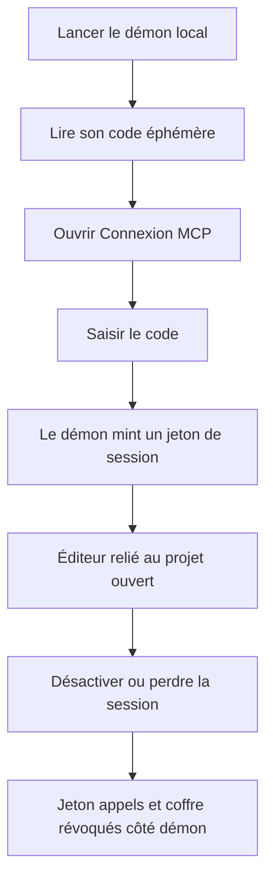
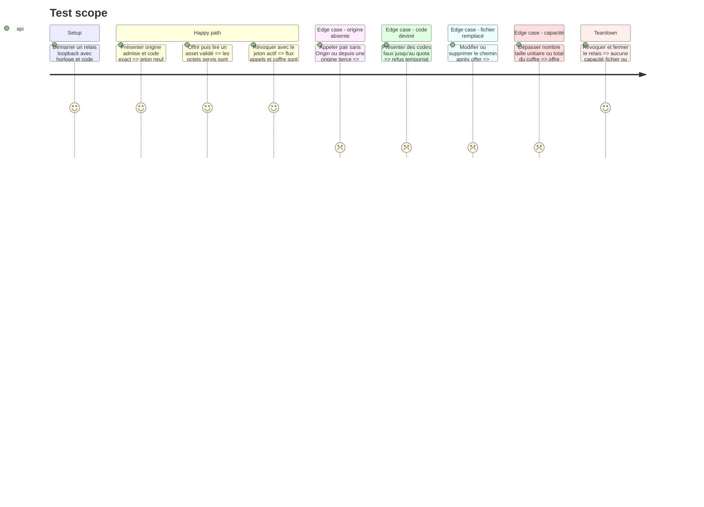

# Instruction: Sécuriser l’appairage MCP et son coffre d’assets

## Architecture projection

> Tree of the final files. ✅ create · ✏️ modify · ❌ delete

```txt
.
├── apps/mcp/src/
│   ├── main.ts                                         ✏️ code éphémère annoncé sur stderr
│   ├── relay/
│   │   ├── pairing.ts                                  ✏️ code usage unique et rotation du jeton
│   │   ├── protocol.ts                                 ✏️ schémas pair et revoke
│   │   ├── server.ts                                   ✏️ origine obligatoire et révocation serveur
│   │   ├── session.ts                                  ✏️ coupure des appels en vol
│   │   └── assets.ts                                   ✏️ octets immuables et coffre borné
│   ├── relay.test.ts                                   ✏️ appairage attaque rotation revoke
│   └── assets.test.ts                                  ✏️ TOCTOU limites et purge
├── apps/web/src/
│   ├── lib/mcp/client.ts                               ✏️ code explicite reconnexion et unpair
│   ├── stores/mcp.store.ts                             ✏️ étape d’appairage sans jeton
│   └── components/mcp/McpDialog.tsx                    ✏️ champ code et révocation accessible
└── apps/web/e2e/
    ├── mcp-relay.ts                                    ✏️ fixture du code éphémère
    ├── mcp-live.spec.ts                                ✏️ parcours clavier et reconnexion
    ├── mcp-assets.spec.ts                              ✏️ octets validés de bout en bout
    └── semantics.spec.ts                               ✏️ rôles focus et annonces

❌ Aucun fichier supprimé.
```

## User Journey



## Test Scope



## Wireframe

```txt
┌──────────────────────────────────────────────┐
│ [Titre du dialogue]                 [Statut] │
│ [Résumé de la capacité accordée]             │
├──────────────────────────────────────────────┤
│ [Progression de configuration]               │
│                                              │
│ [Région : commande du démon local]           │
│ [Région : champ du code d’appairage]         │
│ [Région : action de connexion]               │
│                                              │
│ [Région : éditeur relié]                     │
│ [Région : prêt pour l’agent]                 │
├──────────────────────────────────────────────┤
│ [Détails techniques repliables]              │
│ [Note de portée et de révocation]             │
├──────────────────────────────────────────────┤
│                         [Action secondaire]   │
└──────────────────────────────────────────────┘
```

## Tasks to do

### `1)` Remplacer l’appairage implicite

> Exiger une preuve locale autre que la seule origine navigateur.

1. Maintenir un code aléatoire court, éphémère et à usage unique, annoncé uniquement sur stderr avec sa durée de validité.
2. Exiger sur `/pair` une origine présente et autorisée, un corps conforme et le code exact comparé en temps constant.
3. Borner les essais de code en mémoire par fenêtre et rendre un refus générique; ne jamais retourner code attendu, nombre d’essais restant ou jeton avant succès.
4. Émettre un bearer token neuf seulement après succès, invalider le code présenté puis générer et annoncer le prochain code sans le rendre à la page; un démon relancé ou une page ayant perdu son token peut ainsi refaire un appairage explicite.
5. Garder le relais sur `127.0.0.1` et ne pas ajouter de compte Cloud, backend ou secret persistant à cette capacité locale.

### `2)` Ajouter une révocation serveur réelle

> Désactiver doit retirer l’autorité, pas seulement oublier sa copie dans la page.

1. Ajouter une route authentifiée de révocation qui tourne le bearer token, détache la session, rejette les appels en vol et vide le coffre.
2. Faire appeler cette route par `disableMcp` avant le teardown local, avec un fallback sûr si le démon est déjà arrêté.
3. Conserver le jeton uniquement en mémoire; ne le placer ni dans Zustand, ni dans localStorage/sessionStorage, ni dans un message, une capture ou un log.
4. Pendant une panne transitoire du même onglet, réutiliser le jeton actif pour le flux; après 401, reload, révocation ou restart, revenir à l’étape code plutôt que rappeler `/pair` sans preuve.

### `3)` Supprimer le TOCTOU du coffre

> Servir exactement les octets inspectés, jamais un chemin relu plus tard.

1. À `offer`, lire une seule fois les octets bornés, les valider avec le module média partagé et conserver une copie immuable en mémoire avec ses métadonnées.
2. Retirer le chemin de la valeur rendue à la route; seul l’identifiant opaque peut voyager jusqu’à la page.
3. Poser des plafonds explicites sur taille unitaire, nombre d’entrées et total mémoire; un refus ne doit laisser aucune entrée partielle.
4. Autoriser la réutilisation des mêmes octets pendant la session, puis les libérer tous lors de la révocation ou de l’arrêt.
5. Vérifier que remplacer, tronquer ou supprimer le fichier original après `offer` ne change jamais les octets servis.

### `4)` Adapter l’interface et les preuves

> Rendre la nouvelle frontière compréhensible et utilisable au clavier.

1. Ajouter au dialogue le champ de code avec le primitive `Input`, un label explicite, une erreur `role="alert"`, un état de chargement et une action primaire unique.
2. Ne jamais afficher ou exposer le bearer token; les détails restent limités à adresse loopback, version et activité.
3. Restaurer le focus après succès, erreur, fermeture et révocation; annoncer progression et statut sans dépendre de la couleur ou du mouvement.
4. Tester clavier, code faux/expiré, démon absent, succès, reconnexion, révocation, préférence mémorisée sans token et mode réduit.
5. Rejouer le probe MCP, les unités MCP/web, les E2E live/assets/semantics, contraste, scale, typecheck, lint et build.

## Test acceptance criteria

| Task | Acceptance criteria |
| --- | --- |
| 1 | Aucune requête sans origine admise et code valide ne reçoit de jeton; le code ne peut être rejoué ni deviné sans quota. |
| 2 | Désactiver, recharger après perte du token ou relancer le démon retire l’autorité côté serveur et exige une nouvelle preuve locale. |
| 3 | La route sert uniquement les octets inspectés à `offer`, dans un coffre borné vidé à la révocation, quelle que soit l’évolution du fichier original. |
| 4 | Le parcours est compréhensible, entièrement clavier, correctement annoncé et tous les probes/tests/audits MCP restent verts sans jeton observable. |
