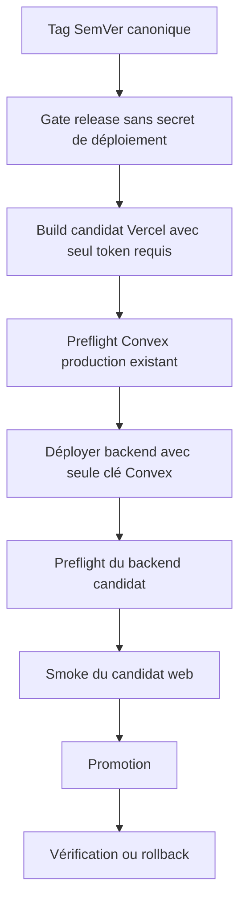
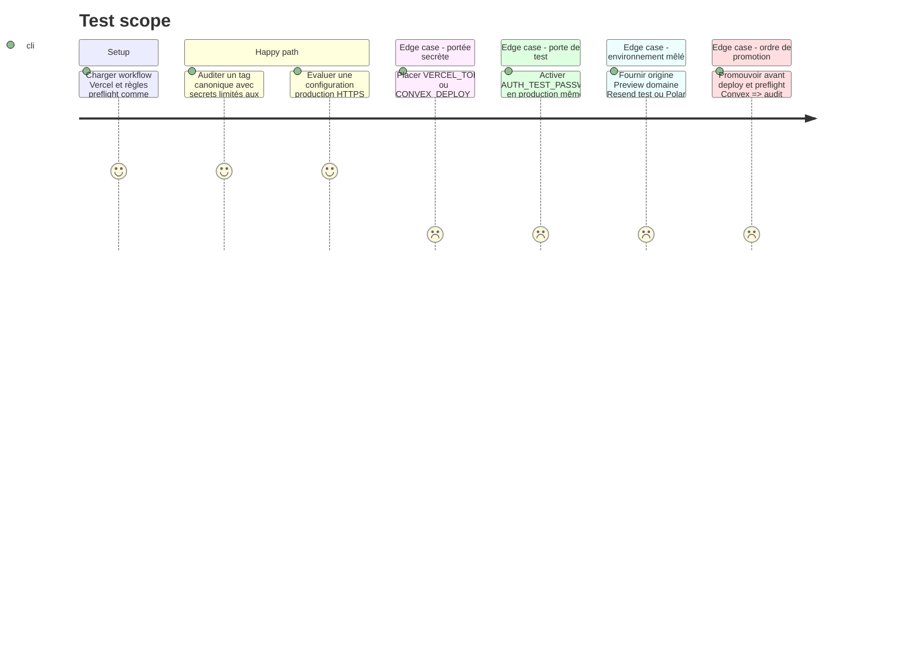

# Instruction: Réduire la portée des secrets CI et fermer le preflight production

## Architecture projection

> Tree of the final files. ✅ create · ✏️ modify · ❌ delete

```txt
.
├── .env.example                                      ✏️ contrat de noms sans valeur réelle
├── .github/workflows/deploy-production.yml           ✏️ secrets par étape et preflight ordonné
├── package.json                                      ✏️ audit de déploiement dans les gates
├── scripts/deployment-config-audit.mjs               ✅ invariants CI Vercel et Convex auto-testés
├── apps/backend/convex/
│   ├── preflight.ts                                  ✏️ règles production strictes et expurgées
│   └── preflight.test.ts                             ✏️ matrice production et Sandbox
├── RELEASING.md                                      ✏️ ordre tag preflight promotion rollback
└── aidd_docs/tasks/2026_08/2026_08_11_migration-convex/
    └── environnements.md                             ✏️ clé CI au moindre privilège et commandes sûres

❌ Aucun fichier supprimé.
```

## User Journey



## Test Scope



## Tasks to do

### `1)` Descendre les secrets au niveau de chaque étape

> L’installation, les tests et les outils non concernés ne doivent recevoir aucune autorité de production.

1. Retirer `CONVEX_DEPLOY_KEY` et `VERCEL_TOKEN` du `env` du job; garder au niveau global uniquement les constantes publiques nécessaires.
2. Injecter `VERCEL_TOKEN` seulement dans pull/build/deploy/smoke protégé/promotion/rollback qui l’exigent, et `CONVEX_DEPLOY_KEY` seulement dans preflight/deploy Convex.
3. Borner `VERCEL_ORG_ID`, `VERCEL_PROJECT_ID`, `PRODUCTION_URL` aux étapes qui les lisent, même s’ils ne sont pas des secrets.
4. Conserver l’environnement GitHub `production`, ses approbations et des credentials fournisseur au moindre privilège; ne créer aucun token duplicatif.
5. Vérifier que les diagnostics, outputs shell et artifacts ne recopient ni arguments, ni environnement, ni réponse contenant une valeur sensible.

### `2)` Rendre le preflight production réellement discriminant

> Une configuration de test complète ne doit jamais être considérée comme une production prête.

1. Refuser `AUTH_TEST_PASSWORD` en production quelle que soit `SITE_URL`; conserver sa restriction loopback en local/préproduction.
2. Exiger en production une origine `SITE_URL` HTTPS canonique, un `CHECKOUT_SUCCESS_URL` de même origine et la liste CORS exacte attendue.
3. Refuser Polar Sandbox ou indéterminé, le domaine d’envoi Resend de test, toute règle Preview et l’absence du secret anti-abus.
4. Retourner uniquement des codes de règles et noms manquants; aucune branche de diagnostic ne doit inclure la valeur rejetée.
5. Garder la préproduction compatible avec loopback/Preview et Polar Sandbox selon ses règles dédiées.

### `3)` Bloquer la promotion sur le backend réellement déployé

> Le workflow doit vérifier la cible avant et après la mutation Convex.

1. Appeler le preflight du backend actuellement déployé avant toute mutation fournisseur, avec une clé CI bornée au déploiement production.
2. Déployer Convex, puis appeler le preflight du code candidat avant smoke et promotion Vercel; un refus arrête le workflow.
3. Accorder à la clé CI seulement les permissions de déploiement et d’exécution de la query interne nécessaires; documenter sa rotation sans jamais l’afficher.
4. Conserver le candidat Vercel en `--skip-domain` jusqu’au succès; le domaine courant ne change qu’à la promotion.
5. Garder la vérification post-promotion et le rollback web existants; documenter séparément la récupération backend puisqu’un rollback Vercel ne restaure pas Convex.

### `4)` Poser un audit exécutable du pipeline

> Une future dérive doit casser Quality avant de créer un tag.

1. Ajouter un script Node sans nouvelle dépendance qui parse le workflow et `vercel.json` comme données.
2. Échouer sur secret de production au niveau workflow/job, trigger de branche production, `pull_request_target`, promotion avant preflight ou secret Vercel dans un workflow PR.
3. Fournir des self-tests en mémoire pour le succès et chaque refus, puis intégrer self-test et audit du dépôt à `pnpm test`/`test:release`.
4. Lancer format, tests du script, preflight unitaires, typecheck, lint et audit de publication.

## Test acceptance criteria

| Task | Acceptance criteria |
| --- | --- |
| 1 | Chaque secret n’existe que pendant les étapes qui l’utilisent; install, tests et étapes de l’autre fournisseur ne peuvent pas le lire. |
| 2 | Une production avec fixture, HTTP, CORS divergent, Resend test, Preview, Sandbox ou secret anti-abus absent est refusée sans valeur divulguée. |
| 3 | Aucune promotion Vercel ne se produit si le preflight échoue avant ou après le déploiement Convex candidat. |
| 4 | L’audit accepte le pipeline attendu et refuse automatiquement chaque dérive de trigger, ordre ou portée secrète. |
