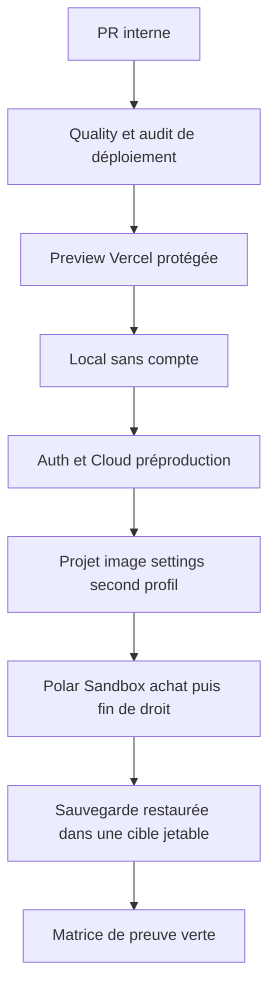
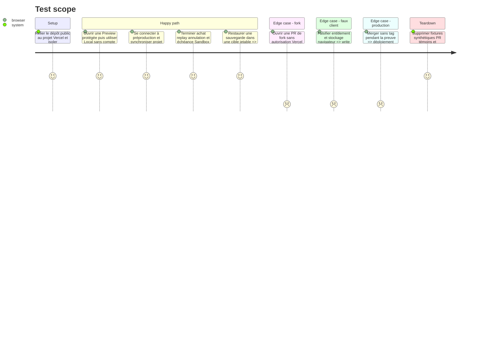

# Instruction: Terminer les Previews Vercel et les preuves préproduction

## Architecture projection

> Tree of the final files. ✅ create · ✏️ modify · ❌ delete

```txt
.
├── vercel.json                                                    ✏️ previews branches et main désactivée
├── RELEASING.md                                                   ✏️ parcours Preview puis tag
├── scripts/deployment-config-audit.mjs                            ✏️ contrat Preview et production commun
├── apps/backend/convex/
│   ├── origins.ts                                                 ✅ origine canonique et namespace Preview
│   ├── origins.test.ts                                            ✅ domaines légitimes et ressemblants
│   ├── auth.ts                                                    ✏️ redirections Preview sûres
│   ├── auth.test.ts                                               ✏️ codes de session bornés à l’origine
│   ├── http.ts                                                    ✏️ CORS partagé
│   ├── convex.config.ts                                           ✏️ variable Preview optionnelle
│   └── _generated/server.d.ts                                     ✏️ types régénérés
├── aidd_docs/memory/
│   ├── testing.md                                                 ✏️ preuve Preview et préproduction
│   └── vcs.md                                                     ✏️ intégration Git Vercel
└── aidd_docs/tasks/2026_08/
    ├── 2026_08_16_vercel-pr-previews/
    │   ├── plan.md                                                ✏️ sous-plan exécuté
    │   ├── phase-1.md                                             ✏️ statut prouvé
    │   ├── phase-2.md                                             ✏️ statut prouvé
    │   ├── phase-3.md                                             ✏️ statut prouvé
    │   └── phase-4.md                                             ✏️ statut prouvé
    └── 2026_08_16_cloud-prelaunch-validation/
        ├── plan.md                                                ✏️ état directeur
        ├── phase-3.md                                             ✏️ cycle Polar Sandbox complet
        ├── phase-4.md                                             ✏️ Preview exécutée
        ├── phase-5.md                                             ✏️ gate préproduction
        └── verification.md                                       ✏️ matrice unique expurgée

❌ Aucun fichier supprimé.
```

## User Journey



## Test Scope



## Tasks to do

### `1)` Exécuter le sous-plan Preview existant

> Garder une seule spécification de l’intégration Git Vercel.

1. Exécuter dans l’ordre les quatre phases de `2026_08_16_vercel-pr-previews`; ne pas recopier ou réinterpréter leur frontière.
2. Activer l’intégration GitHub officielle sur le seul dépôt ScreenForge, désactiver `main` dans `git.deploymentEnabled` et conserver les forks non autorisés.
3. Mettre uniquement les valeurs frontend publiques nécessaires dans Preview; aucun secret Convex, Polar, Resend, OAuth ou Vercel ne doit atteindre le code de PR.
4. Mesurer le namespace Vercel réel, puis faire partager sa règle étroite à CORS et aux redirections Auth seulement en préproduction.
5. Laisser le check Vercel informatif tant que les PR de bot et Release Please ne sont pas toutes couvertes par le plan Vercel courant.

### `2)` Fermer les preuves fournisseurs préproduction

> Compléter ce qui manque sans toucher aux fournisseurs production.

1. Rejouer le lien magique Resend de test avec l’expiration corrigée et vérifier deux sessions réelles sans consigner adresse ou URL.
2. Confirmer le droit propriétaire complémentaire, la synchronisation projet/image/settings et les refus sans session ou entitlement.
3. Terminer dans Polar Sandbox l’annulation, la transition à l’échéance et la restauration du droit propriétaire, avec confirmation d’action au moment de la mutation externe.
4. Vérifier que le produit, le token et le webhook Sandbox restent uniques et séparés de toute organisation production.
5. Reporter seulement SHA, compteurs, statuts et dates arrondies dans `verification.md`.

### `3)` Prouver sauvegarde, limites et restauration

> Un Cloud vendu doit être récupérable, pas seulement synchronisable.

1. Vérifier les limites d’usage/coût de préproduction et provoquer uniquement des seuils synthétiques réversibles.
2. Créer une sauvegarde incluant le file storage après des fixtures connues, sans télécharger ni versionner son URL signée.
3. Restaurer dans un déploiement jetable distinct, comparer comptes, entitlements, projets, assets et settings, puis tester une lecture de fichier.
4. Supprimer seulement le déploiement jetable après comparaison; conserver Pulpe et toute autre donnée utilisateur réelle intactes.
5. Documenter la procédure et les résultats expurgés dans le plan directeur Cloud.

### `4)` Fermer le gate préproduction sans domaine

> Prouver la v1 technique tout en gardant la publication réelle bloquée.

1. Exécuter la browser QA Local puis Cloud sur la Preview du même SHA et inspecter les destinations réseau.
2. Confirmer qu’aucun appel, cookie ou valeur de bundle ne vise Convex, Polar, Resend ou OAuth production.
3. Vérifier que push et merge sans tag ne modifient pas la production et que le workflow tagué ne s’est pas exécuté.
4. Passer les sous-plans aux statuts AIDD justifiés par les preuves, sans marquer le gate domaine/production accompli.

## Test acceptance criteria

| Task | Acceptance criteria |
| --- | --- |
| 1 | Chaque PR interne éligible obtient une Preview protégée reliée uniquement à préproduction; `main` et les forks non autorisés ne sont pas déployés par Git. |
| 2 | Resend, compte propriétaire, sync et cycle Polar Sandbox complet sont prouvés sans donnée personnelle ou secret dans le dépôt. |
| 3 | Une sauvegarde base plus fichiers se restaure fidèlement dans une cible jetable ensuite supprimée, sans toucher aux données utilisateur utiles. |
| 4 | Local et Cloud préproduction sont verts sur un SHA commun; aucune production, domaine, tag ou transaction réelle n’a été créé. |
