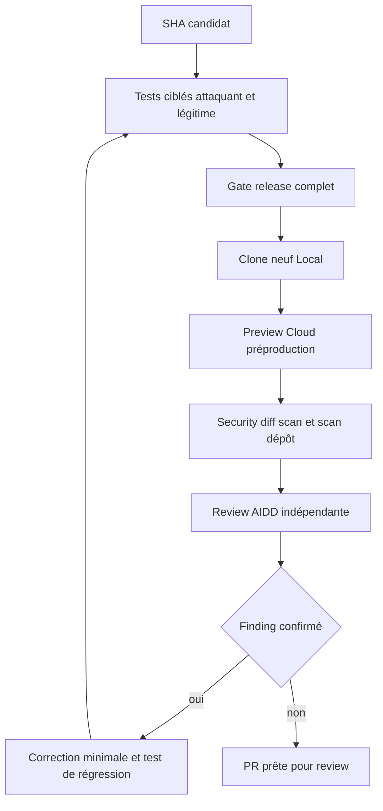
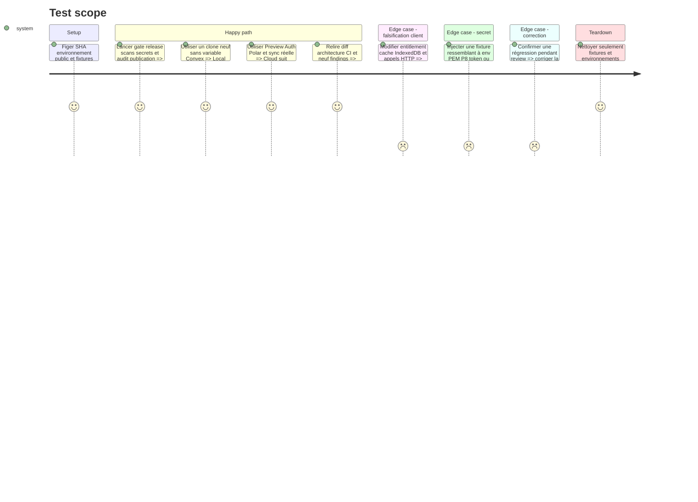

# Instruction: Asserter, reviewer, rescanner et itérer jusqu’au vert

## Architecture projection

> Tree of the final files. ✅ create · ✏️ modify · ❌ delete

```txt
.
├── aidd_docs/memory/
│   ├── architecture.md                                  ✏️ frontières durcies finales
│   ├── coding-assertions.md                             ✏️ gates sécurité et CI
│   ├── database.md                                      ✏️ validation média et egress
│   ├── design.md                                        ✏️ appairage MCP final
│   ├── forms.md                                         ✏️ champ de code et erreurs
│   ├── navigation.md                                    ✏️ parcours MCP et Preview
│   ├── testing.md                                       ✏️ régressions attaquant/légitime
│   └── vcs.md                                           ✏️ release taguée et secret scope
└── aidd_docs/tasks/2026_08/2026_08_18_security-hardening-production-readiness/
    ├── plan.md                                          ✏️ statut après preuves
    ├── phase-1.md                                       ✏️ statut après preuves
    ├── phase-2.md                                       ✏️ statut après preuves
    ├── phase-3.md                                       ✏️ statut après preuves
    ├── phase-4.md                                       ✏️ statut après preuves
    ├── phase-5.md                                       ✏️ statut après preuves
    ├── phase-6.md                                       ✏️ statut après preuves
    ├── phase-7.md                                       ✏️ statut après preuves
    ├── verification.md                                 ✅ preuves expurgées et findings
    └── review.md                                       ✅ review AIDD finale

❌ Aucun fichier supprimé.
```

## User Journey



## Test Scope



## Tasks to do

### `1)` Exécuter les assertions locales et release

> Une correction sécurité sans sa contre-preuve fonctionnelle est incomplète.

1. Lancer les tests ciblés de chaque phase, puis format, publication, dépendances, `pnpm test`, build, CSP, E2E Cloud strict, contraste, scale et landing via `pnpm run test:release`.
2. Exécuter Gitleaks sur l’index, le diff, le répertoire et tous les refs Git avec redaction; scanner avant upload tout artifact ou diagnostic créé.
3. Vérifier l’export critique 1320×2868, PNG opaque et ZIP valide, ainsi que le bundle de démarrage après la dépendance média.
4. Écrire seulement commandes, SHA, versions, compteurs, statuts et diagnostics expurgés dans `verification.md`.

### `2)` Prouver Local et Cloud comme deux produits distincts

> Le durcissement serveur ne doit jamais introduire un paywall local.

1. Créer un clone/worktree jetable du SHA candidat sans `.env`, Convex ni session; vérifier création, import, autosave, images, export illimité et absence de filigrane.
2. Sur la Preview du même SHA, vérifier Auth, droit propriétaire, droit Polar, projet, média, settings, second profil, expiration et récupération des données.
3. Falsifier localStorage, IndexedDB, réponses client et appels directs; confirmer que `requireCloud` reste l’unique mur des writes et que les reads ne traversent jamais la propriété.
4. Vérifier clavier, focus, annonces, reduced motion, responsive utile et absence d’erreur console pour le dialogue MCP modifié.

### `3)` Faire les reviews et scans indépendants

> Repartir des neuf findings et de leurs trust boundaries, pas seulement du diff heureux.

1. Exécuter `aidd-dev:03-assert`, `aidd-dev:05-review` et `aidd-dev:11-browser-qa` avec leurs livrables AIDD.
2. Exécuter `codex-security:security-diff-scan` sur le diff puis `codex-security:security-scan` sur le dépôt candidat, en incluant auth, billing, fichiers, MCP et workflows dans la couverture.
3. Comparer le rapport final aux neuf findings initiaux; chaque finding doit être fermé par code et test, pas seulement reclassé.
4. Bloquer sur tout secret, contournement Cloud, accès inter-compte, média actif persisté, appairage implicite, secret CI trop large ou perte de données.

### `4)` Itérer et préparer la PR

> Corriger la cause commune puis refaire la preuve entière.

1. Pour chaque finding confirmé, reproduire avec le plus petit test, corriger au point partagé et relancer test ciblé puis tâches 1 à 3.
2. Mettre à jour mémoire, phase, vérification et review seulement après le comportement vert; ne jamais modifier une preuve pour cacher un échec.
3. Rebaser ou fusionner le `main` courant selon l’état publié, résoudre les conflits avec tests ciblés et vérifier un diff sans changement parasite.
4. Pousser la branche, mettre la PR existante en ready-for-review et attendre tous les checks; ne pas merger, taguer ou déployer production dans cette phase.

## Test acceptance criteria

| Task | Acceptance criteria |
| --- | --- |
| 1 | Le gate release, les scans secrets, l’export critique et les audits sont verts sur le même SHA sans artifact sensible. |
| 2 | Un clone neuf garde Local complet sans backend, tandis que Cloud réel exige session, propriété et entitlement serveur pour chaque write. |
| 3 | Les neuf findings initiaux sont fermés, la review AIDD est approuvée et aucun nouveau finding confirmé bloquant ne reste ouvert. |
| 4 | Chaque correction a sa régression, la branche est alignée et la PR ready-for-review est entièrement verte sans merge, tag ou production. |
