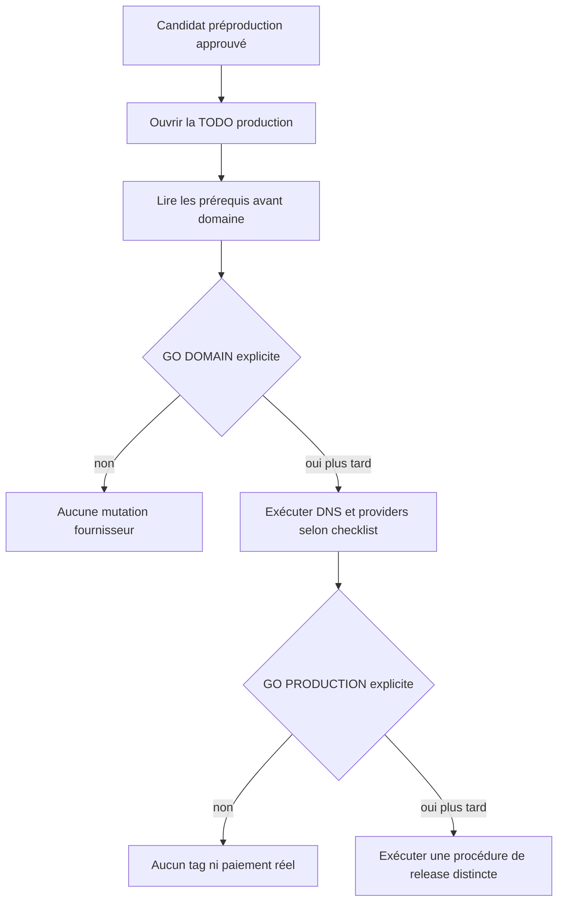
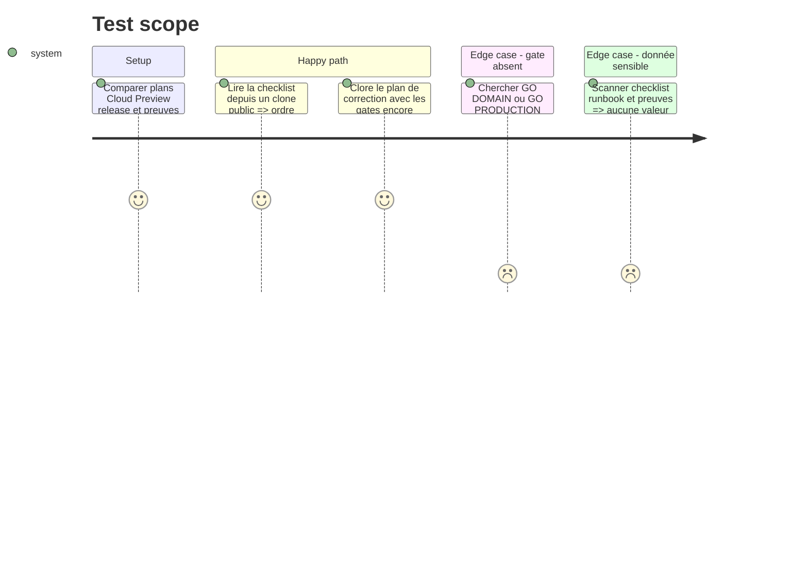

# Instruction: Formaliser le handoff et la TODO production

## Architecture projection

> Tree of the final files. ✅ create · ✏️ modify · ❌ delete

```txt
.
├── RELEASING.md                                                      ✏️ gates humains et ordre opérateur
└── aidd_docs/tasks/2026_08/
    ├── 2026_08_16_cloud-prelaunch-validation/
    │   └── phase-6.md                                                ✏️ renvoi vers la checklist courante
    └── 2026_08_18_security-hardening-production-readiness/
        ├── plan.md                                                   ✏️ plan implémenté sans prétendre production
        ├── phase-8.md                                                ✏️ handoff prouvé
        ├── production-todo.md                                       ✏️ checklist opérateur finale
        └── verification.md                                          ✏️ état final préproduction et gates absents

❌ Aucun fichier supprimé.
```

## User Journey



## Test Scope



## Tasks to do

### `1)` Réconcilier une seule checklist opérateur

> Transformer le travail restant en ordre exécutable, sans dupliquer les plans techniques.

1. Comparer `production-todo.md` à la phase 6 Cloud, `RELEASING.md`, aux preuves finales et aux exigences fournisseur officielles courantes.
2. Classer les éléments sous quatre seuils : avant domaine, après `GO DOMAIN`, avant `GO PRODUCTION`, après publication.
3. Garder chaque item observable et cochable; lier vers les runbooks existants plutôt que recopier commandes ou valeurs.
4. Retirer doublons, tâches déjà prouvées et suppositions; laisser non cochée toute action qui exige un compte, un domaine, un secret, une dépense ou un accord humain.

### `2)` Garantir l’absence de secret et de porte de test

> La checklist est publique et doit le rester.

1. N’écrire que les noms de variables, jamais leurs valeurs, suffixes, identifiants, emails, URLs signées ou captures de dashboard.
2. Inclure les contrôles d’absence de Sandbox, fixture, `AUTH_TEST_PASSWORD`, namespace Preview et droit artificiel en production.
3. Inclure rotation/révocation, sauvegarde/restauration, limites d’usage et rollback, sans donner une commande destructive visant une cible non résolue.
4. Passer Prettier, audit publication et Gitleaks sur les documents finaux.

### `3)` Marquer exactement ce qui est terminé

> “Prêt pour production” ne signifie pas “production exécutée”.

1. Marquer les phases 1 à 7 selon leurs preuves et la phase 8 comme terminée lorsque le handoff est complet.
2. Passer le plan de correction à `implemented` seulement si les findings sont fermés et la checklist complète; garder le plan Cloud directeur et sa phase production au statut que leurs gates justifient.
3. Écrire dans `verification.md` que domaine, KYC, secrets production, tag, promotion et paiement réel n’ont pas été exécutés.
4. Ne pas créer de tag, fusionner Release Please, acheter de domaine ou modifier un fournisseur production pendant ce handoff.

### `4)` Préparer la reprise future

> Le prochain opérateur doit savoir où commencer et où s’arrêter.

1. Indiquer le premier item non satisfait, le SHA/PR candidat et les gates attendus sans données privées.
2. Prévoir une nouvelle vérification documentaire des règles fournisseur au moment de `GO DOMAIN` et `GO PRODUCTION`.
3. Exiger une confirmation explicite au moment d’un paiement réel, d’un achat, d’un changement DNS ou d’une promotion irréversible.
4. Après chaque futur lot, cocher uniquement les preuves observées et rejouer le contrôle de secret sur les documents.

## Test acceptance criteria

| Task | Acceptance criteria |
| --- | --- |
| 1 | Une checklist unique couvre domaine, Resend, OAuth, Convex, Polar, release, smoke, surveillance et rollback sans doublon contradictoire. |
| 2 | La checklist et les preuves publiques passent publication, format et Gitleaks sans valeur sensible ni porte de test production. |
| 3 | Le plan de correction reflète fidèlement les preuves préproduction, tandis que domaine et production restent explicitement non exécutés. |
| 4 | Le prochain travail démarre sur un item et un gate précis, sans devoir deviner un secret, une cible ou une autorisation. |
