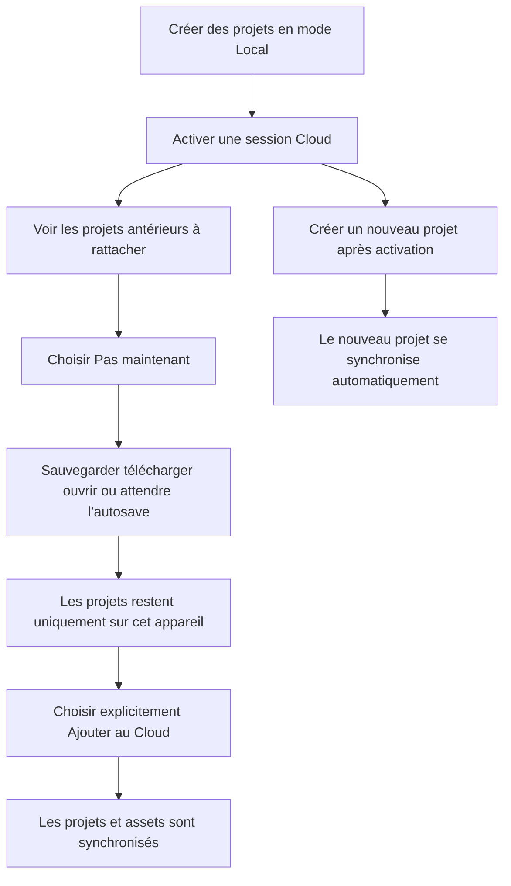
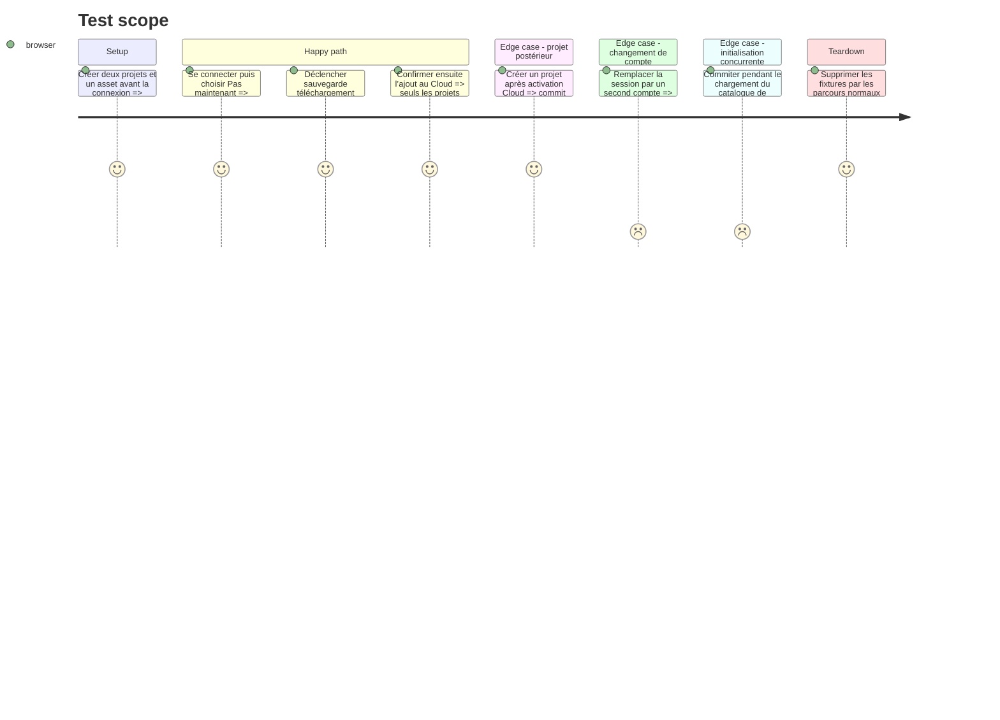

# Instruction: rendre le refus Cloud durable

## Architecture projection

> Tree of the final files. ✅ create · ✏️ modify · ❌ delete

```txt
.
└── apps/web/
    ├── e2e/
    │   └── ✏️ sync.spec.ts
    └── src/lib/
        ├── ✏️ sync.ts
        └── __tests__/
            └── ✏️ sync.test.ts

❌ Aucun fichier supprimé.
```

## User Journey



## Test Scope



## Tasks to do

### `1)` Séparer consentement et accusé de synchronisation

> L’absence ou la présence d’un commit ne décide plus ce qui peut quitter l’appareil.

1. À chaque activation Cloud ou changement de compte, construire la liste des projets déjà locaux et encore non rattachés pour cette paire compte/projet.
2. Garder cette barrière dans `sync.ts`, au même endroit que la file et l’identité active; ne pas ajouter de préférence UI ni de second store global.
3. Fermer la file tant que cette classification initiale n’est pas prête; une erreur IndexedDB doit échouer côté confidentialité et laisser le projet local.
4. Réinitialiser barrière, file, adoption distante et état de pull quand l’identité change afin qu’aucun record du compte précédent ne soit réutilisé.

### `2)` Filtrer tous les commits par la même barrière

> Corriger la racine commune plutôt que chaque bouton qui provoque une sauvegarde.

1. Avant `ensureSyncRecord`, refuser la mise en file d’un projet encore dans la liste de consentement du compte actif.
2. Faire de `attachProjects` l’unique geste qui crée les records de ces projets et les retire de la barrière après succès local durable.
3. Continuer à enrôler les nouveaux identifiants créés après l’activation Cloud, sans considérer l’ouverture d’un projet historique comme une création.
4. Préserver `ignoredAdoptionCommit`, le mode hors-ligne, le dernier-écrivain-gagne et l’ordre asset avant projet.

### `3)` Fermer les chemins manquants dans les tests

> Le scénario doit rester rouge tant qu’un simple commit peut contourner Pas maintenant.

1. Extraire ou exposer le minimum de logique pure nécessaire pour tester classification, compte actif et décision de queue sans démarrer Convex.
2. Étendre le scénario E2E existant après Pas maintenant avec ⌘S, téléchargement, ouverture d’un autre projet et attente supérieure à deux secondes.
3. Vérifier après chaque geste que le catalogue reste Cet appareil, qu’aucun record distant n’apparaît et que le dialogue repropose les mêmes projets.
4. Conserver les contre-tests de rattachement explicite, nouveau projet post-login, changement de compte et retry hors-ligne.

## Test acceptance criteria

| Task | Acceptance criteria |
| --- | --- |
| 1 | Lorsqu’un compte Cloud devient actif, chaque projet déjà local et non rattaché est classé avant qu’un commit puisse créer un record. |
| 1 | Un changement de compte ne réutilise ni barrière, ni record, ni file appartenant à l’identité précédente. |
| 2 | Après Pas maintenant, sauvegarde, ⌘S, téléchargement, ouverture, import et autosave ne créent aucun upload implicite des projets protégés. |
| 2 | Un projet réellement créé après l’activation Cloud continue à se synchroniser automatiquement. |
| 3 | Le test E2E attend au-delà du délai d’autosave et prouve zéro projet et zéro asset distant avant l’action Ajouter au Cloud. |
| 3 | Après rattachement explicite, les projets listés et leurs assets sont envoyés exactement une fois et restent disponibles localement. |
