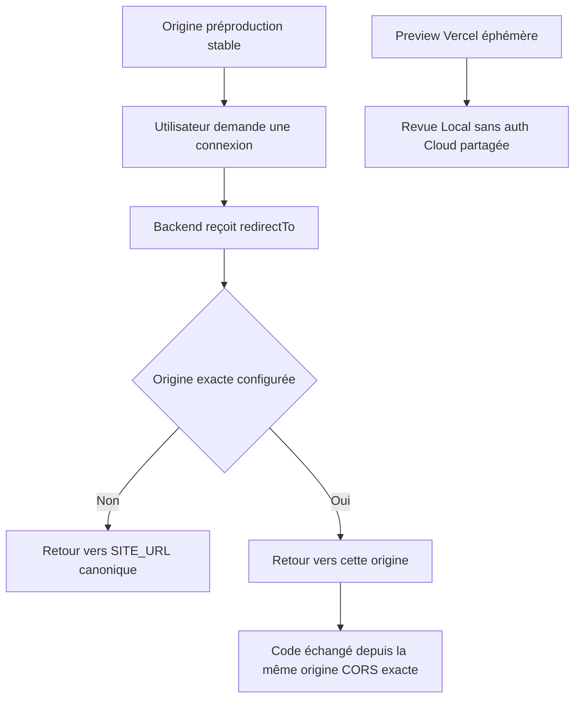
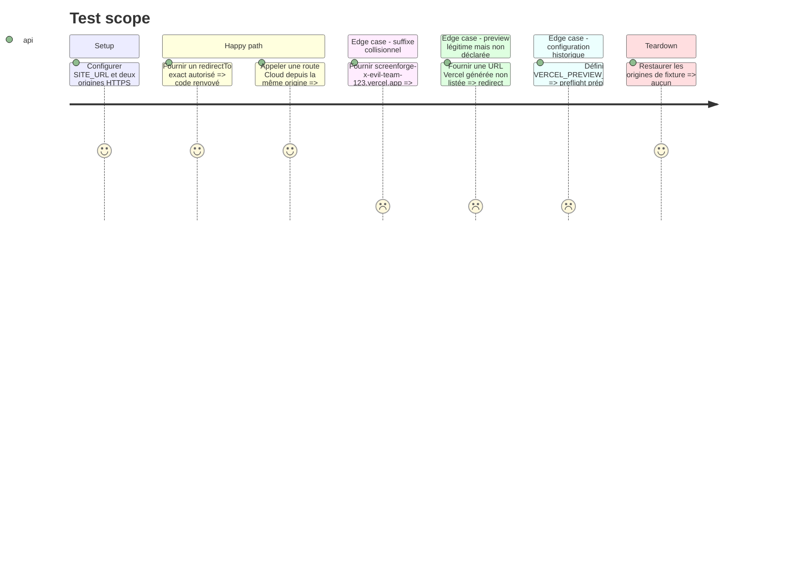

# Instruction: remplacer les suffixes Preview par des origines exactes

## Architecture projection

> Tree of the final files. ✅ create · ✏️ modify · ❌ delete

```txt
.
├── apps/backend/convex/
│   ├── ✏️ auth.ts
│   ├── ✏️ auth.test.ts
│   ├── ✏️ convex.config.ts
│   ├── ✏️ http.ts
│   ├── ✏️ assets.test.ts
│   ├── ✏️ origins.ts
│   ├── ✏️ origins.test.ts
│   ├── ✏️ preflight.ts
│   └── ✏️ preflight.test.ts
└── aidd_docs/tasks/2026_08/
    ├── 2026_08_11_migration-convex/
    │   └── ✏️ environnements.md
    └── 2026_08_16_vercel-pr-previews/
        └── ✏️ phase-2.md

❌ Aucun fichier supprimé manuellement; les types Convex générés suivent la configuration au prochain typecheck.
```

## User Journey



## Test Scope



## Tasks to do

### `1)` Réduire la politique à des origines canoniques exactes

> Un nom DNS accepté doit être une valeur configurée, pas une forme qui lui ressemble.

1. Retirer le paramètre de suffixe de `isAllowedOrigin` et conserver uniquement les origines canoniques produites par `configuredOrigins`.
2. Faire utiliser la même politique exacte par `safeRedirect` et `corsHeaders`, avec fallback vers `SITE_URL` pour toute destination non listée.
3. Retirer `VERCEL_PREVIEW_HOST_SUFFIX` du contrat Convex et de tous les appelants; laisser le générateur mettre à jour les déclarations dérivées.
4. Ajouter explicitement le domaine collisionnel `screenforge-x-evil-team-123.vercel.app` aux refus de régression.

### `2)` Fermer aussi la configuration de déploiement

> Une ancienne variable ne doit pas pouvoir réactiver silencieusement la politique vulnérable.

1. Faire refuser par le preflight toute présence de `VERCEL_PREVIEW_HOST_SUFFIX` en préproduction comme en production pendant la transition.
2. Exiger pour l’auth hébergée une `SITE_URL` stable et des entrées `CORS_ALLOWED_ORIGINS` exactes; conserver les origines loopback explicites en développement local.
3. Réserver les Previews Vercel éphémères à la revue Local et tester le Cloud authentifié sur l’origine de préproduction stable.
4. Aligner les tests HTTP/CORS sur des origines exactes et conserver les refus anonyme, autre compte et port/chemin non canoniques.

### `3)` Corriger les instructions devenues dangereuses

> Aucun runbook actif ne doit recommander la variable retirée.

1. Retirer `VERCEL_PREVIEW_HOST_SUFFIX` du runbook d’environnements et indiquer l’origine stable utilisée pour les parcours auth de préproduction sans publier sa valeur.
2. Ajouter au plan Preview historique une note de supersession qui renvoie vers cette correction, sans réécrire les preuves passées comme si elles avaient toujours été exactes.
3. Vérifier qu’aucun exemple, commentaire ou test ne décrit encore un suffixe `.vercel.app` comme une preuve d’autorisation.

## Test acceptance criteria

| Task | Acceptance criteria |
| --- | --- |
| 1 | Seules `SITE_URL` et les origines exactes configurées peuvent recevoir un code d’authentification ou une réponse CORS lisible. |
| 1 | Le domaine collisionnel et toute Preview non déclarée sont refusés même s’ils commencent par `screenforge-` et finissent par le slug attendu. |
| 2 | Les preflights préproduction et production refusent l’ancienne variable de suffixe et une configuration auth sans origine stable. |
| 2 | Localhost et `127.0.0.1` restent utilisables uniquement via leurs entrées explicites de développement. |
| 3 | Aucun document opérationnel n’invite encore à partager l’auth Cloud avec toutes les URLs correspondant à un suffixe Vercel. |
