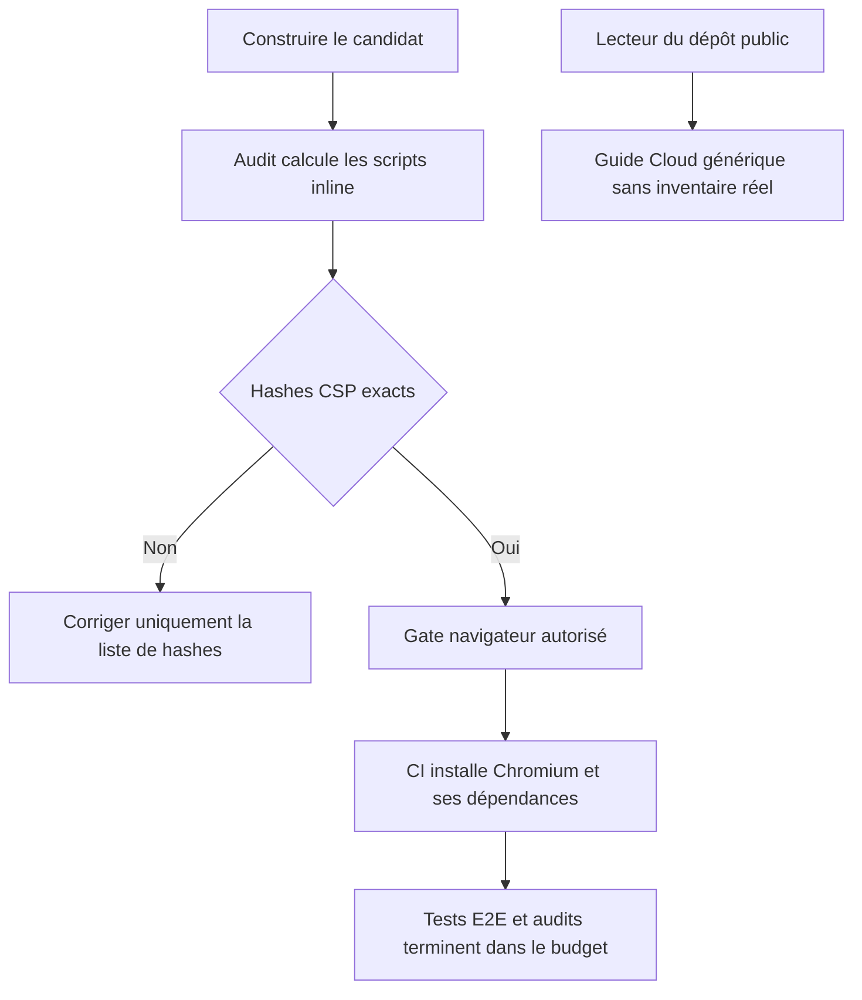
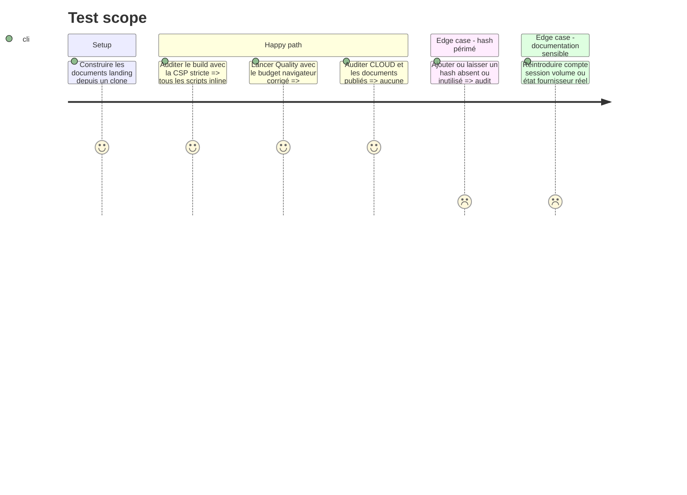

# Instruction: expurger la documentation et stabiliser les gates

## Architecture projection

> Tree of the final files. ✅ create · ✏️ modify · ❌ delete

```txt
.
├── ✏️ CLOUD.md
├── ✏️ vercel.json
└── .github/workflows/
    └── ✏️ quality.yml

❌ Aucun fichier supprimé.
```

## User Journey



## Test Scope



## Tasks to do

### `1)` Réparer le baseline CSP sans l’affaiblir

> Aligner la politique sur les scripts réellement pré-rendus au HEAD courant.

1. Produire un build propre puis relever l’ensemble exact des hashes exigés par `security-headers-audit.mjs`.
2. Remplacer dans `vercel.json` les hashes périmés par cet ensemble; ne modifier aucune autre directive CSP sans preuve distincte.
3. Rejouer l’audit build-only puis le build complet pour prouver absence de hash manquant ou inutilisé.
4. Vérifier que le même correctif ferme le baseline hérité de `main` avant de l’attribuer à la PR.

### `2)` Donner au job E2E un budget réaliste

> Empêcher APT de consommer tout le temps avant même le premier test.

1. Porter `timeout-minutes` du job E2E à 60, conformément à l’exemple CI Playwright officiel.
2. Conserver `playwright install --with-deps chromium`, les versions pinées, l’ordre des gates et le scan des diagnostics.
3. Ne pas ajouter de retry, cache APT, image Docker ou parallélisme tant qu’un nouveau run ne prouve pas leur nécessité.
4. Distinguer dans la preuve finale une panne d’installation, un timeout de job et un véritable échec Playwright.

### `3)` Transformer CLOUD en documentation publique stable

> Expliquer le produit sans publier l’état vivant des fournisseurs ou des utilisateurs.

1. Retirer les nombres d’utilisateurs, sessions, entitlements, projets, assets, settings et abonnements ainsi que les dates d’inventaire.
2. Retirer les affirmations sur l’existence ou l’état courant de comptes, organisations, achats, dérogations et données utilisateur réelles; ne pas les déplacer dans un autre fichier versionné.
3. Garder les rôles génériques de Local, Convex, Resend et Polar, les invariants de sécurité et les procédures sans valeur d’environnement.
4. Corriger la phrase de rate limit pour décrire les limites par destinataire et source réseau, sans prétendre qu’un plafond global subsiste.
5. Passer format, audit de publication, Gitleaks et une recherche explicite des anciens chiffres et états.

## Test acceptance criteria

| Task | Acceptance criteria |
| --- | --- |
| 1 | Le build courant passe l’audit CSP avec chaque script inline couvert et aucun hash inutilisé, sans `unsafe-inline` ni wildcard. |
| 2 | Le job E2E dispose de 60 minutes, conserve l’installation officielle et atteint effectivement les tests et audits sur le prochain run. |
| 3 | `CLOUD.md` ne révèle aucun volume, compte, session, état fournisseur, date d’inventaire ou présence de données utilisateur réelles. |
| 3 | Le guide reste suffisant pour comprendre les responsabilités Local, Convex, Resend et Polar, et décrit fidèlement les limites d’envoi actuelles. |
