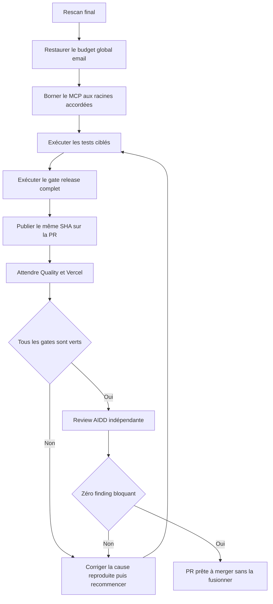
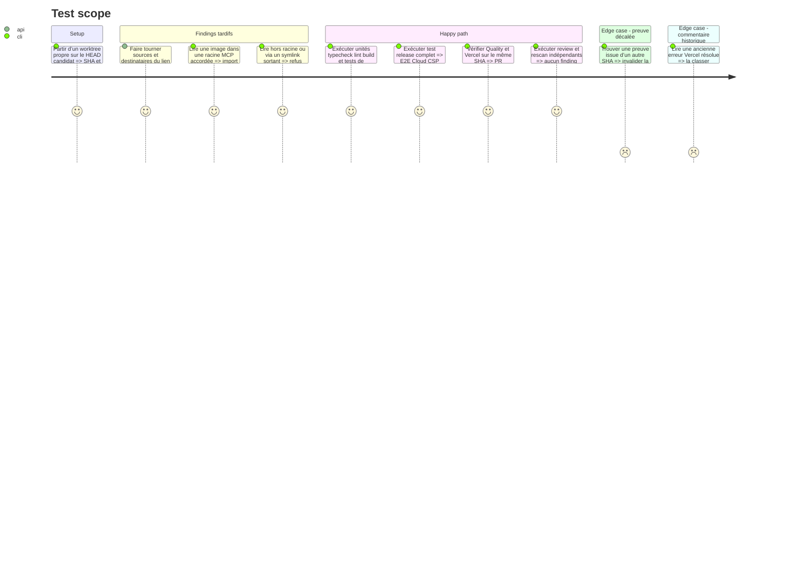

# Instruction: fermer les derniers findings puis prouver un SHA unique

## Architecture projection

> Tree of the final files. ✅ create · ✏️ modify · ❌ delete

```txt
.
├── ✏️ README.md
├── ✏️ CLOUD.md
├── ✏️ scripts/mcp-live-probe.mjs
├── apps/backend/convex/
│   ├── ✏️ auth.ts
│   ├── ✏️ auth.test.ts
│   └── ✏️ limits.ts
├── apps/mcp/
│   ├── ✏️ README.md
│   ├── ✏️ skills/screenforge-mcp/{actions,references}/*.md
│   └── src/
│       ├── ✏️ assets.test.ts
│       ├── ✏️ main.ts
│       ├── ✏️ refresh.test.ts
│       ├── relay/
│       │   ├── ✏️ assets.ts
│       │   └── ✏️ server.ts
│       └── tools/
│           └── ✏️ refresh-screenshots.ts
├── apps/web/src/lib/
│   ├── ✏️ storage.ts
│   └── __tests__/
│       └── ✏️ storage.test.ts
└── aidd_docs/tasks/2026_08/2026_08_20_cloud-prelaunch-merge-fixes/
    └── ✅ verification.md

❌ Aucun fichier supprimé.
```

## User Journey



## Test Scope



## Tasks to do

### `1)` Fermer les deux findings Medium du rescan

> Garder les contrôles ciblés et ajouter seulement les deux frontières manquantes.

1. Restaurer `magicLinkSendGlobal` comme backstop, le consommer avant les compteurs par source et destinataire, et tester une rotation des deux clés jusqu’au refus avant `fetch`.
2. Faire obtenir au serveur MCP les racines `file://` annoncées par le client, complétées uniquement par `SCREENFORGE_MCP_ASSET_ROOTS` lorsqu’elle est configurée explicitement.
3. Dans `AssetVault`, canonicaliser racines et cible avec `realpath`, exiger la contenance avant ouverture et appliquer la même règle au répertoire de rafraîchissement et aux symlinks.
4. Échouer en clair et fermé si aucune racine n’est accordée; documenter la configuration de compatibilité sans élargir le défaut.
5. Corriger la dernière référence README à un inventaire de comptes qui n’existe plus dans `CLOUD.md`.

### `2)` Exécuter les preuves locales dans l’ordre

> Échouer tôt sur les régressions ciblées avant de payer le sweep complet.

1. Lancer les unités web de sync puis les tests backend auth, origins, CORS et preflight.
2. Lancer format, audit publication, Gitleaks sur le diff, typecheck, lint et build.
3. Lancer `pnpm run test:release` depuis la racine et conserver uniquement le résumé expurgé des résultats.
4. En cas d’échec, corriger la cause racine dans la phase propriétaire puis repartir d’un worktree propre; ne pas marquer la phase terminée avec un skip Cloud.

### `3)` Faire porter toutes les preuves par le même commit

> Une ancienne exécution verte ne valide pas le HEAD corrigé.

1. Relever le SHA exact après corrections et vérifier que la branche contient le `main` retenu sans commit manquant.
2. Publier uniquement après autorisation du workflow VCS, puis attendre Quality et Vercel sur ce SHA.
3. Vérifier que le job E2E atteint Playwright, que les scénarios Cloud ne sont pas ignorés et que les diagnostics éventuels sont expurgés avant upload.
4. Mettre à jour la description de PR avec les résultats réellement observés; supprimer les affirmations périmées sur le gate ou le nombre d’E2E.

### `4)` Fermer la review sans fusion automatique

> Le plan prépare la décision de merge; il ne la prend pas à la place de l’utilisateur.

1. Exécuter une review AIDD indépendante du diff final et un rescan sécurité ciblé sur consentement, redirect auth, CORS et secrets.
2. Corriger tout finding reproductible de la review; en particulier, ne basculer de projet qu’après une fenêtre sauvegarde/chargement stable afin qu’une édition concurrente ne soit jamais écrasée.
3. Vérifier les threads, reviews et commentaires GitHub; distinguer l’ancien commentaire Vercel résolu de tout nouveau finding pertinent.
4. Créer `verification.md` avec SHA, commandes, conclusions et liens publics utiles, sans email, identifiant, compteur de données ou valeur fournisseur.
5. Déclarer la PR prête seulement si les gates locaux et distants, Vercel, Gitleaks et la review sont verts sur le même SHA; laisser le merge à une action explicite ultérieure.

## Test acceptance criteria

| Task | Acceptance criteria |
| --- | --- |
| 1 | Une rotation simultanée des sources et destinataires épuise le plafond global et aucun envoi supplémentaire n’atteint Resend. |
| 1 | Le MCP accepte un média sous une racine accordée, refuse hors racine et refuse un symlink sortant avant de copier les octets. |
| 2 | Les tests de consentement prouvent qu’aucun commit ne contourne Pas maintenant et les tests d’origine refusent le domaine collisionnel. |
| 2 | `pnpm run test:release` termine entièrement, y compris E2E Cloud et audit CSP, sans skip de preuve obligatoire. |
| 3 | Quality et Vercel sont verts sur le SHA exact consigné dans `verification.md`; le job E2E a exécuté les tests au lieu d’expirer pendant l’installation. |
| 3 | La description de PR ne revendique aucun résultat provenant d’un ancien commit ou d’un baseline désormais rouge. |
| 4 | La review finale ne contient aucun finding critique, élevé ou moyen non traité et aucun secret ou inventaire opérationnel n’apparaît dans le diff. |
| 4 | Une édition effectuée pendant l’ouverture asynchrone d’un autre projet est durable avant la bascule et n’est pas écrasée par l’autosave du projet cible. |
| 4 | La PR est déclarée prête à merger mais reste ouverte jusqu’à une instruction explicite de fusion. |
