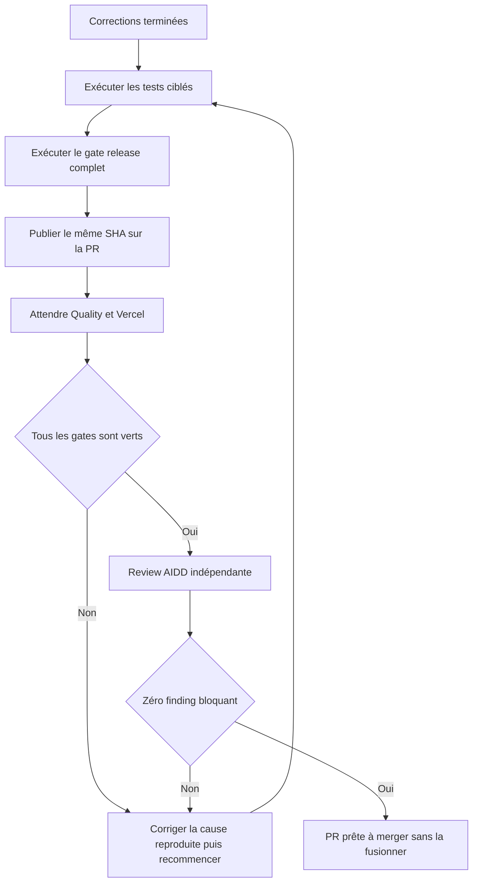
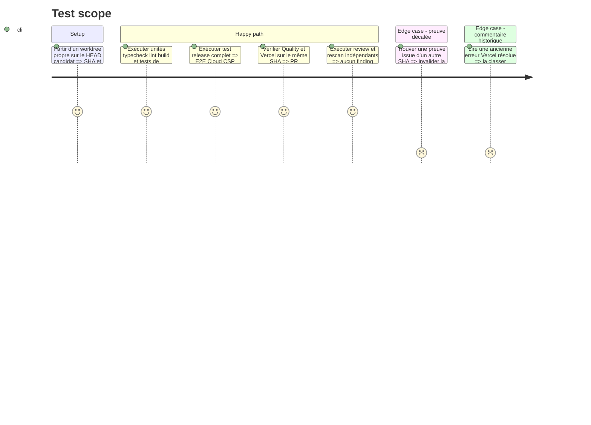

# Instruction: prouver le candidat final sur un SHA unique

## Architecture projection

> Tree of the final files. ✅ create · ✏️ modify · ❌ delete

```txt
.
└── aidd_docs/tasks/2026_08/2026_08_20_cloud-prelaunch-merge-fixes/
    └── ✅ verification.md

❌ Aucun fichier produit n’est modifié dans cette phase; seul le résultat observé est consigné.
```

## User Journey



## Test Scope



## Tasks to do

### `1)` Exécuter les preuves locales dans l’ordre

> Échouer tôt sur les régressions ciblées avant de payer le sweep complet.

1. Lancer les unités web de sync puis les tests backend auth, origins, CORS et preflight.
2. Lancer format, audit publication, Gitleaks sur le diff, typecheck, lint et build.
3. Lancer `pnpm run test:release` depuis la racine et conserver uniquement le résumé expurgé des résultats.
4. En cas d’échec, corriger la cause racine dans la phase propriétaire puis repartir d’un worktree propre; ne pas marquer la phase terminée avec un skip Cloud.

### `2)` Faire porter toutes les preuves par le même commit

> Une ancienne exécution verte ne valide pas le HEAD corrigé.

1. Relever le SHA exact après corrections et vérifier que la branche contient le `main` retenu sans commit manquant.
2. Publier uniquement après autorisation du workflow VCS, puis attendre Quality et Vercel sur ce SHA.
3. Vérifier que le job E2E atteint Playwright, que les scénarios Cloud ne sont pas ignorés et que les diagnostics éventuels sont expurgés avant upload.
4. Mettre à jour la description de PR avec les résultats réellement observés; supprimer les affirmations périmées sur le gate ou le nombre d’E2E.

### `3)` Fermer la review sans fusion automatique

> Le plan prépare la décision de merge; il ne la prend pas à la place de l’utilisateur.

1. Exécuter une review AIDD indépendante du diff final et un rescan sécurité ciblé sur consentement, redirect auth, CORS et secrets.
2. Vérifier les threads, reviews et commentaires GitHub; distinguer l’ancien commentaire Vercel résolu de tout nouveau finding pertinent.
3. Créer `verification.md` avec SHA, commandes, conclusions et liens publics utiles, sans email, identifiant, compteur de données ou valeur fournisseur.
4. Déclarer la PR prête seulement si les gates locaux et distants, Vercel, Gitleaks et la review sont verts sur le même SHA; laisser le merge à une action explicite ultérieure.

## Test acceptance criteria

| Task | Acceptance criteria |
| --- | --- |
| 1 | Les tests de consentement prouvent qu’aucun commit ne contourne Pas maintenant et les tests d’origine refusent le domaine collisionnel. |
| 1 | `pnpm run test:release` termine entièrement, y compris E2E Cloud et audit CSP, sans skip de preuve obligatoire. |
| 2 | Quality et Vercel sont verts sur le SHA exact consigné dans `verification.md`; le job E2E a exécuté les tests au lieu d’expirer pendant l’installation. |
| 2 | La description de PR ne revendique aucun résultat provenant d’un ancien commit ou d’un baseline désormais rouge. |
| 3 | La review finale ne contient aucun finding critique, élevé ou moyen non traité et aucun secret ou inventaire opérationnel n’apparaît dans le diff. |
| 3 | La PR est déclarée prête à merger mais reste ouverte jusqu’à une instruction explicite de fusion. |
