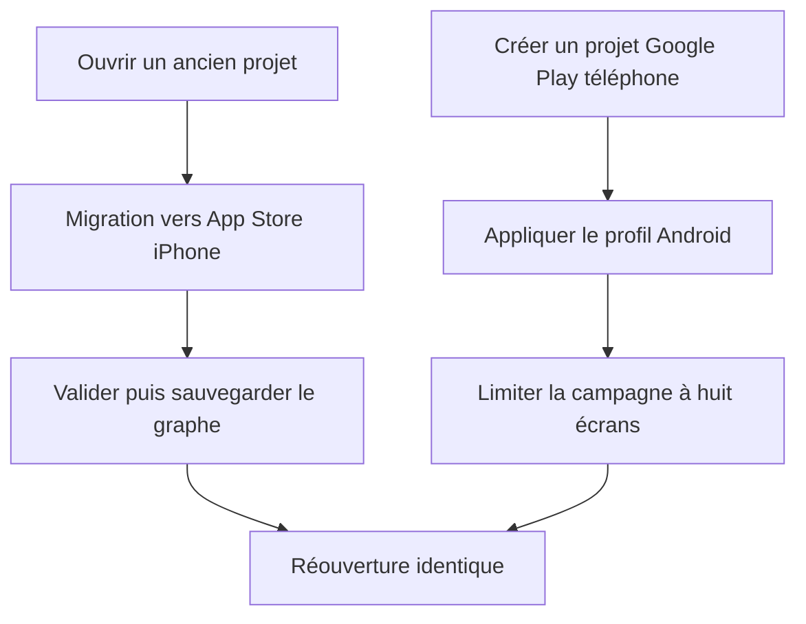
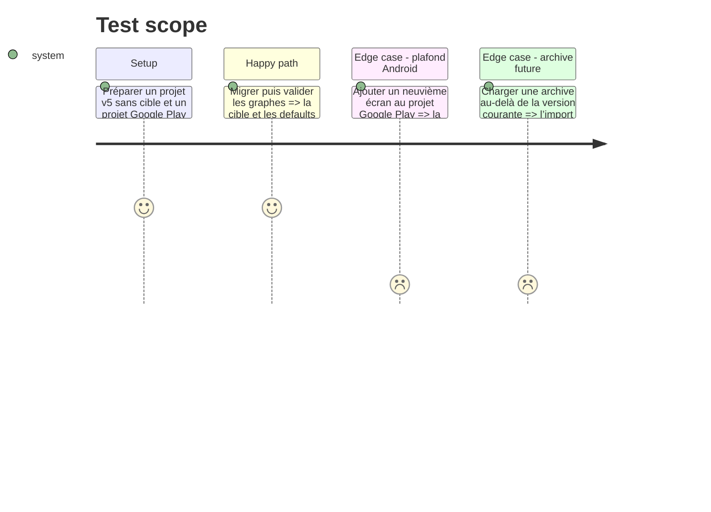

# Instruction: poser le contrat de cible et migrer les projets

## Architecture projection

> Tree of the final files. ✅ create · ✏️ modify · ❌ delete

```txt
packages/project-format/src/
├── catalog-ids.ts                              ✏️ groupe les modèles iPhone et Android dans le catalogue fermé
├── dimensions.ts                               ✏️ définit les deux profils, leurs planches, sorties, dossiers et plafonds
├── project-validation.ts                       ✏️ valide la cible et migre projets et snapshots historiques vers App Store
└── types.ts                                    ✏️ ajoute la cible aux projets, snapshots et gabarits
apps/web/src/
├── lib/
│   ├── project-file.ts                         ✏️ monte la version portable et conserve la lecture des archives antérieures
│   ├── storage.ts                              ✏️ persiste la migration, expose la cible au catalogue et crée un nouveau projet durable
│   └── __tests__/
│       ├── project-validation.test.ts          ✏️ couvre profils, plafonds et migrations
│       └── storage.test.ts                     ✏️ couvre création, catalogue et réouverture par cible
└── stores/
    ├── canvas.store.ts                         ✏️ applique le plafond du profil aux duplications et templates
    ├── project.store.ts                        ✏️ construit les globals et le plafond d’écrans depuis le profil
    └── __tests__/canvas.store.test.ts          ✏️ verrouille le plafond de 10 écrans Apple et 8 écrans Google Play
apps/web/src/components/screens-bar/ScreensBar.tsx ✏️ affiche et applique le plafond du profil
apps/web/e2e/project-file.spec.ts                ✏️ prouve les round-trips v6 et la migration v1-v5
❌ delete: none
```

## User Journey



## Test Scope



## Tasks to do

### `1)` Déclarer les profils de store

> Faire de la destination la source unique des dimensions et limites.

1. Ajouter les identifiants `app-store-iphone` et `google-play-phone` au contrat partagé.
2. Définir pour chacun la taille logique de planche, la sortie portrait, le dossier ZIP, le libellé et le maximum d’écrans.
3. Conserver les alias Apple nécessaires jusqu’à ce que les phases suivantes basculent leurs appelants.

### `2)` Migrer et valider le graphe

> Les données existantes doivent rester Apple sans décision rétroactive.

1. Ajouter la cible au projet et au snapshot de release.
2. Faire de `migrateProject` l’unique endroit qui complète les projets et snapshots historiques.
3. Valider le plafond d’écrans depuis la cible et refuser les identifiants inconnus.

### `3)` Rendre la création et la persistance target-aware

> Un nouveau document arrive complet et un changement de document reste durable.

1. Faire accepter la cible à `createProject` et dériver son appareil par défaut du profil.
2. Ajouter au stockage le chemin qui sauvegarde le projet courant, crée le nouveau, vide sélection et historique, puis l’active.
3. Inclure la cible dans le catalogue léger sans charger les assets.
4. Monter le format portable et tester les archives antérieures et courantes.

## Test acceptance criteria

| Task | Acceptance criteria |
| ---- | ------------------- |
| 1 | Les deux profils sont résolus par identifiant et exposent 440×956 → 1320×2868 pour Apple et 540×960 → 1080×1920 pour Google Play. |
| 2 | Tout projet et toute release antérieurs sans cible se relisent comme `app-store-iphone`; un projet Google Play de plus de huit écrans est invalide. |
| 3 | Créer, sauvegarder, exporter en fichier projet puis réimporter un projet Android conserve sa cible et ses globals, tandis que les archives Apple existantes restent lisibles. |
