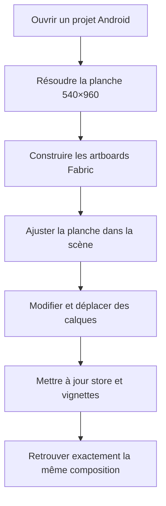
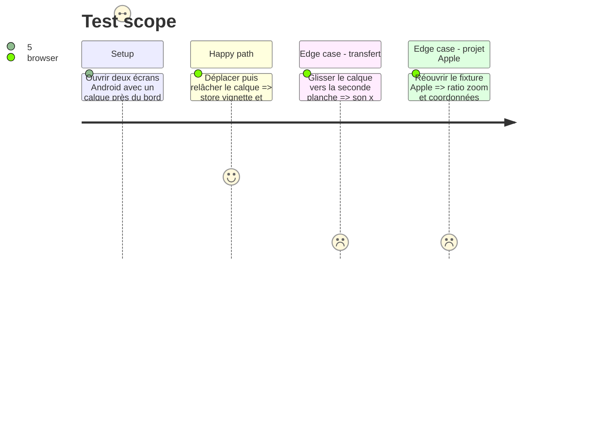

# Instruction: rendre la géométrie de planche dépendante de la cible

## Architecture projection

> Tree of the final files. ✅ create · ✏️ modify · ❌ delete

```txt
apps/web/src/
├── hooks/use-canvas.ts                         ✏️ résout la planche active et la transmet aux installateurs Fabric
├── lib/
│   ├── layer-factories.ts                      ✏️ centre les nouveaux calques dans la planche du projet
│   ├── locale.ts                               ✏️ vérifie les débordements dans les bornes du profil
│   ├── stage.ts                                ✏️ calcule les métriques de pellicule depuis le ratio actif
│   └── canvas/
│       ├── canvas-utils.ts                     ✏️ reçoit la taille de planche pour offsets, clips et bornes
│       ├── canvas-interactions.ts              ✏️ aligne, sélectionne et guide dans les bornes actives
│       ├── canvas-sync.ts                      ✏️ reconstruit les artboards avec la bonne taille
│       ├── install-interactions.ts             ✏️ transmet la géométrie aux gestes
│       ├── install-thumbnails.ts               ✏️ capture des vignettes au ratio actif
│       ├── install-viewport.ts                 ✏️ ajuste fit, zoom et centrage aux dimensions actives
│       └── __tests__/
│           └── project-diff.test.ts            ✏️ conserve le chemin patch lors d’un projet de même cible
├── stores/
│   ├── canvas.store.ts                         ✏️ calcule bornes, transferts et alignements depuis la planche active
│   └── __tests__/canvas.store.test.ts          ✏️ couvre alignement et transfert sur les deux ratios
└── components/
    ├── screens-bar/
    │   ├── ScreenThumbnail.tsx                 ✏️ reçoit la largeur de vignette calculée
    │   └── ScreensBar.tsx                      ✏️ partage les mêmes métriques pour rendu et glisser-déposer
    └── template-picker/TemplatePreview.tsx     ✏️ affiche l’aperçu au ratio de sa cible
apps/web/e2e/
├── canvas-transforms.spec.ts                   ✏️ rejoue le round-trip sans dérive sur Android
├── canvas-viewport.spec.ts                     ✏️ couvre fit et zoom de la planche 9:16
└── screens-bar.spec.ts                         ✏️ couvre ratio et réordonnancement des vignettes Android
❌ delete: none
```

## User Journey



## Test Scope



## Wireframe

```txt
┌──────────────────────────────────────────────────────────────────────┐
│ (1) Barre projet · destination · outils · export                     │
├──────────────────────────────────────────────────────────────────────┤
│                                                                      │
│      (2) Scène                                                       │
│      ┌──────────────────┐   ┌──────────────────┐                     │
│      │                  │   │                  │                     │
│      │  planche 9:16    │   │  planche 9:16    │                     │
│      │                  │   │                  │                     │
│      └──────────────────┘   └──────────────────┘                     │
│                                                                      │
├──────────────────────────────────────────────────────────────────────┤
│ (3) Pellicule : aperçus 9:16 · noms · ordre             (4) Zoom    │
└──────────────────────────────────────────────────────────────────────┘

1. Barre: identité du document, destination visible et outils communs.
2. Scène: artboards utilisant tous le ratio du profil actif.
3. Pellicule: aperçus fidèles au cadrage des artboards.
4. Zoom: contrôle posé hors de la pellicule.
```

## Tasks to do

### `1)` Remplacer les constantes globales par une taille résolue

> Une géométrie explicite traverse tous les calculs qui en dépendent.

1. Garder les helpers purs et leur passer une structure `width` et `height` issue du profil.
2. Mettre à jour offsets, clipping, hit tests, limites, alignements et largeur totale.
3. Faire recréer entièrement la scène uniquement quand la cible change.

### `2)` Propager la taille au cycle Fabric

> Le hook reste l’unique propriétaire de l’instance et distribue le contexte.

1. Résoudre la cible depuis le projet dans `use-canvas`.
2. Transmettre la taille aux installateurs de synchronisation, interactions, viewport et vignettes.
3. Vérifier que les chemins patch et full sync restent déterministes.

### `3)` Adapter la pellicule et les créations

> Tout élément dérivé du ratio montre la vraie planche.

1. Calculer largeur de vignette, pas de drag et borne de pellicule dans une même métrique.
2. Utiliser la taille active dans les fabriques de texte, forme, icône, image et appareil.
3. Utiliser les mêmes bornes pour la revue de locale.

## Test acceptance criteria

| Task | Acceptance criteria |
| ---- | ------------------- |
| 1 | Les artboards Android mesurent 540×960 dans la scène et aucun calcul de clip, sélection, alignement ou transfert ne lit une hauteur Apple implicite. |
| 2 | Zoomer, déplacer puis relâcher un calque Android ne change pas ses coordonnées au round-trip canvas → store → sync; le projet Apple historique garde le même résultat. |
| 3 | Les vignettes Android sont 9:16 sans recadrage et leur indicateur de drop reste sous le pointeur pendant un réordonnancement. |
