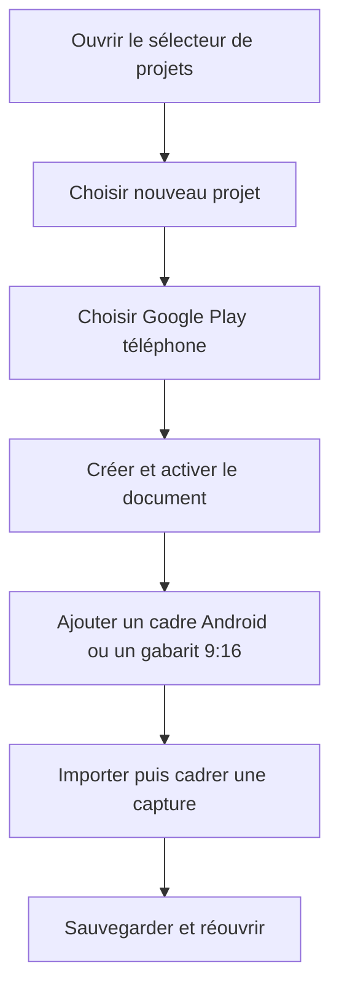
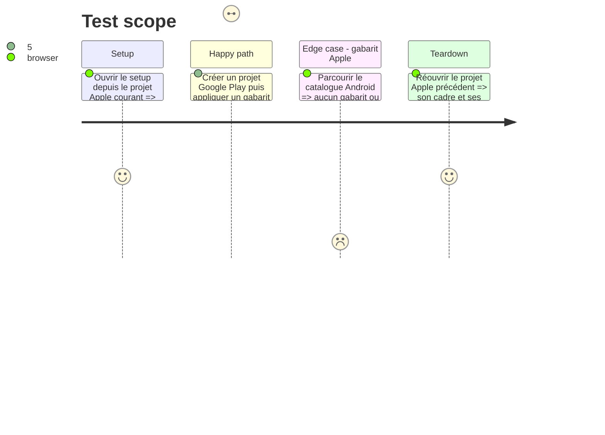

# Instruction: ajouter le setup, les cadres et les gabarits Android

## Architecture projection

> Tree of the final files. ✅ create · ✏️ modify · ❌ delete

```txt
apps/web/src/
├── assets/
│   ├── device-frames/
│   │   ├── index.ts                           ✏️ ajoute un cadre Android générique et un cutout configurable
│   │   └── __tests__/device-frame-svg.test.ts ✏️ vérifie écran, cutout, couleurs et catalogue des deux plateformes
│   └── templates/index.ts                     ✏️ fournit cinq variantes 9:16 avec appareil Android
├── components/
│   ├── device-picker/DevicePicker.tsx         ✏️ filtre modèles et sources selon la cible
│   ├── globals-editor/GlobalsEditor.tsx       ✏️ limite l’appareil par défaut à la plateforme du projet
│   ├── project-switcher/ProjectSwitcher.tsx   ✏️ ajoute le setup d’un projet et les badges de destination
│   ├── refresh-dialog/RefreshDialog.tsx       ✏️ emploie un vocabulaire d’appareil neutre
│   ├── template-picker/TemplatePicker.tsx     ✏️ ne propose que les gabarits compatibles
│   └── toolbar/TopBar.tsx                     ✏️ filtre le menu appareil et masque la publication Apple sur Android
├── lib/
│   ├── commands.ts                            ✏️ rend les commandes appareil, campagne et publication target-aware
│   ├── custom-templates.ts                    ✏️ marque les gabarits enregistrés par cible et relit les anciens comme Apple
│   └── __tests__/custom-templates.test.ts     ✏️ couvre compatibilité et migration des gabarits
└── stores/
    ├── project.store.ts                       ✏️ expose les defaults de cadre du profil au setup
    ├── templates.store.ts                     ✏️ enregistre la cible du projet avec chaque gabarit
    └── __tests__/templates.store.test.ts      ✏️ couvre la cible au figement d’un gabarit
apps/web/e2e/android-project.spec.ts            ✅ couvre création, cadre, template, plafond et réouverture Android
apps/web/e2e/dialogs-a11y.spec.ts               ✏️ couvre focus et clavier du setup projet
scripts/visual-probe.mjs                        ✏️ ajoute les états Android vide et composé au probe visuel
❌ delete: none
```

## User Journey



## Test Scope



## Wireframe

```txt
┌──────────────────────────────────────────────────────┐
│ Nouveau projet                                      │
├──────────────────────────────────────────────────────┤
│ (1) Nom                                             │
│ ┌──────────────────────────────────────────────────┐ │
│ │ Champ                                            │ │
│ └──────────────────────────────────────────────────┘ │
│                                                      │
│ (2) Destination                                     │
│ ┌──────────────────────┐ ┌─────────────────────────┐ │
│ │ App Store · iPhone   │ │ Google Play · téléphone│ │
│ │ profil et plafond    │ │ profil et plafond      │ │
│ └──────────────────────┘ └─────────────────────────┘ │
│                                                      │
│ (3) Résumé du profil                                │
├──────────────────────────────────────────────────────┤
│                         (4) Annuler · Créer          │
└──────────────────────────────────────────────────────┘

1. Nom: identité locale du nouveau document.
2. Destination: les deux profils disponibles, sans tailles personnalisées.
3. Résumé: format, orientation et nombre maximal de captures.
4. Actions: sortie secondaire et création du document.

┌──────────────────────────────────┐
│ Propriétés                       │
├──────────────────────────────────┤
│ (1) Appareil                     │
│ (2) Source · modèle · couleur    │
│ (3) Orientation                  │
│ (4) Capture importée             │
│ (5) Cadrage                      │
│ (6) Ombre                        │
└──────────────────────────────────┘

1. Appareil: section du calque existant.
2. Source: cadre généré ou PNG importé, puis modèle compatible.
3. Orientation: orientation du téléphone dans la composition.
4. Capture: aperçu et remplacement de l’image de l’app.
5. Cadrage: mode, point focal et zoom existants.
6. Ombre: réglages existants pour un cadre généré.
```

## Tasks to do

### `1)` Ajouter un cadre Android au renderer existant

> Un nouvel item de catalogue suffit ; le type de calque ne change pas.

1. Ajouter au catalogue un modèle Android générique, noir et argent, avec ouverture 9:16 et caméra poinçon.
2. Remplacer les booléens iPhone par une configuration minimale de cutout utilisable par les deux plateformes.
3. Réutiliser le cadrage, l’import PNG, l’ombre et la rastérisation existants.

### `2)` Ajouter le setup projet

> La cible est choisie avant la composition et reste ensuite un fait du document.

1. Ajouter « Nouveau projet » au sélecteur existant.
2. Recueillir nom et destination dans le même composant avec les primitives UI existantes.
3. Afficher la destination dans les métadonnées du projet et restaurer le focus après création.

### `3)` Filtrer l’édition par plateforme

> L’interface ne propose jamais un iPhone comme défaut d’un projet Android.

1. Filtrer toolbar, picker, globals et palette de commandes par `platform` du frame.
2. Garder le lien Apple Product Bezel seulement pour la cible Apple ; présenter l’import comme cadre PNG personnalisé sur Android.
3. Masquer l’action « Publier chez Apple » dans un projet Google Play.

### `4)` Livrer des mises en page Android

> Les cinq archétypes actuels gardent leur intention avec des coordonnées 9:16 relues.

1. Ajouter les variantes Android Hero, Feature, Side by Side, Full Bleed et Minimal.
2. Marquer les gabarits intégrés et enregistrés par cible.
3. Filtrer la galerie et traiter tout ancien gabarit sans cible comme Apple.

## Test acceptance criteria

| Task | Acceptance criteria |
| ---- | ------------------- |
| 1 | Le cadre Android se rend net avec sa capture recadrée, sa caméra poinçon et ses deux couleurs, sans nouveau type de layer. |
| 2 | Depuis un projet existant, créer un projet Google Play sauvegarde l’ancien, active le nouveau et l’affiche comme `Google Play · téléphone` après rechargement. |
| 3 | Un projet Android ne propose que les cadres Android dans la toolbar, les globals, les propriétés et ⌘K; la publication Apple n’y est pas affichée. |
| 4 | Chacun des cinq gabarits Android tient dans la planche 540×960 et aucun gabarit Apple ou personnalisé incompatible n’apparaît dans sa galerie. |
