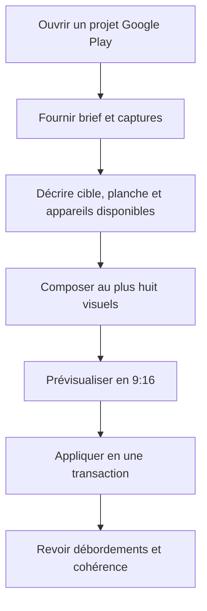
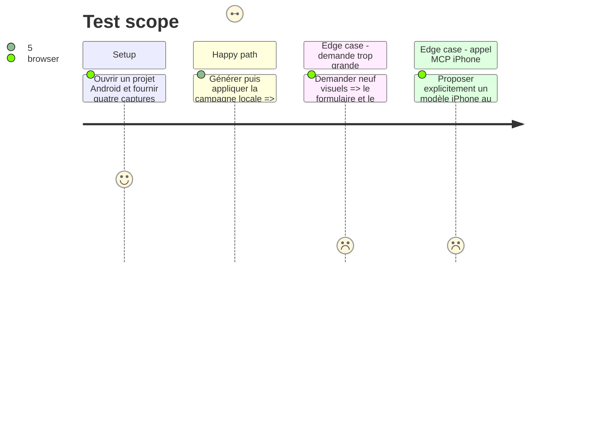

# Instruction: adapter campagnes, localisation et MCP à la cible

## Architecture projection

> Tree of the final files. ✅ create · ✏️ modify · ❌ delete

```txt
packages/project-format/src/ai-tools.ts                 ✏️ neutralise le vocabulaire et expose la cible au contrat agent
apps/web/src/
├── components/
│   ├── campaign-dialog/
│   │   ├── CampaignDialog.tsx                         ✏️ affiche store, plafond et recommandations du projet
│   │   └── PlanPreview.tsx                            ✏️ prévisualise avec la taille de planche du profil
│   └── locale-dialog/LocaleDialog.tsx                 ✏️ remplace les références Apple par la destination active
├── lib/
│   └── ai/
│       ├── archetypes.ts                              ✏️ compose les layouts dans la planche active
│       ├── board-review.ts                            ✏️ contrôle vide, overflow et appareil avec les bornes actives
│       ├── direct-api.ts                              ✏️ fournit au modèle les règles du store ciblé
│       ├── plan.ts                                    ✏️ limite écrans et appareil depuis le profil
│       ├── state.ts                                   ✏️ décrit cible et dimensions à l’agent
│       └── tools.ts                                   ✏️ applique uniquement des modèles d’appareil compatibles
└── lib/__tests__/
    ├── archetypes.test.ts                             ✏️ couvre compositions Android 9:16
    └── board-review.test.ts                           ✏️ couvre les bornes des deux profils
apps/web/e2e/
├── ai-campaign.spec.ts                                ✏️ couvre une campagne Android locale
├── campaign-journey.spec.ts                           ✏️ couvre plafond, preview et copie target-aware
└── mcp-templates.spec.ts                              ✏️ couvre un template Android créé par l’agent
apps/mcp/
├── README.md                                          ✏️ documente les deux destinations
├── skills/screenforge-mcp/
│   ├── SKILL.md                                       ✏️ rend le workflow sensible à la cible ouverte
│   ├── actions/02-compose.md                          ✏️ remplace les suppositions iPhone par le projet courant
│   └── references/
│       ├── tools.md                                   ✏️ décrit un appareil plutôt qu’un iPhone
│       └── workflows.md                               ✏️ ajoute le flux Google Play téléphone
└── src/
    ├── relay/protocol.ts                              ✏️ décrit la plateforme dans l’état rendu
    ├── tools/add-image.ts                             ✏️ remplit le cadre compatible existant
    ├── tools/editor-tools.ts                          ✏️ neutralise permissions et descriptions
    ├── tools/templates.ts                             ✏️ conserve la cible des gabarits
    ├── relay.test.ts                                  ✏️ couvre le catalogue Android
    └── skill-doc.test.ts                              ✏️ garde la documentation alignée aux outils
scripts/mcp-live-probe.mjs                             ✏️ vérifie la cible et le vocabulaire d’appareil du relais réel
❌ delete: none
```

## User Journey



## Test Scope



## Wireframe

```txt
┌────────────────────────────────────────────────────────────────┐
│ Campagne · (1) Destination                                    │
├───────────────────────────────┬────────────────────────────────┤
│ (2) Brief                     │ (4) Aperçu 9:16                │
│ Nom · pitch · contexte        │ ┌────┐ ┌────┐ ┌────┐ ┌────┐   │
│                               │ │    │ │    │ │    │ │    │   │
│ (3) Captures · quantité       │ └────┘ └────┘ └────┘ └────┘   │
│                               │                                │
├───────────────────────────────┴────────────────────────────────┤
│                                           (5) Générer · Appliquer│
└────────────────────────────────────────────────────────────────┘

1. Destination: store et profil hérités du projet.
2. Brief: informations communes à la campagne.
3. Captures: sources et nombre borné par le profil.
4. Aperçu: structure du plan dans le ratio actif.
5. Actions: génération puis application transactionnelle.
```

## Tasks to do

### `1)` Paramétrer le moteur de composition

> Le profil remplace les constantes Apple dans le plan, les archétypes et la revue.

1. Passer taille, plafond et appareil par défaut aux fonctions pures de planification.
2. Adapter chaque archétype aux bornes 540×960 sans branche parallèle.
3. Faire porter la cible par l’état décrit et les plans déclarés.

### `2)` Adapter le parcours de campagne

> L’utilisateur voit la destination qui contraint le résultat.

1. Remplacer titres, aides, limite et preview App Store par les valeurs du profil.
2. Fournir au prompt direct les règles Google Play sur expérience réelle, texte limité et claims interdits.
3. Réutiliser la revue de locale et de planche avec les bornes actives.

### `3)` Aligner le contrat MCP

> L’agent lit la cible ouverte et ne choisit pas un appareil incompatible.

1. Neutraliser les descriptions `iPhone` du schéma, des permissions et de l’import de capture.
2. Valider le modèle demandé contre les modèles de la cible avant application.
3. Mettre à jour le skill MCP et verrouiller sa couverture documentaire.

## Test acceptance criteria

| Task | Acceptance criteria |
| ---- | ------------------- |
| 1 | Le builder local produit des calques entièrement contenus dans 540×960 et utilise le modèle Android du projet; les mêmes fixtures Apple restent identiques. |
| 2 | Le dialogue Android annonce Google Play, borne la quantité à huit et prévisualise le vrai ratio avant l’application. |
| 3 | `get_project_state` expose cible et planche, `add_device` accepte le modèle Android et refuse un modèle iPhone dans ce projet sans mutation partielle. |
