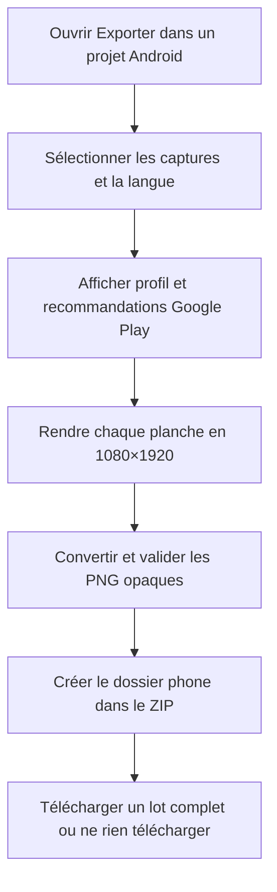
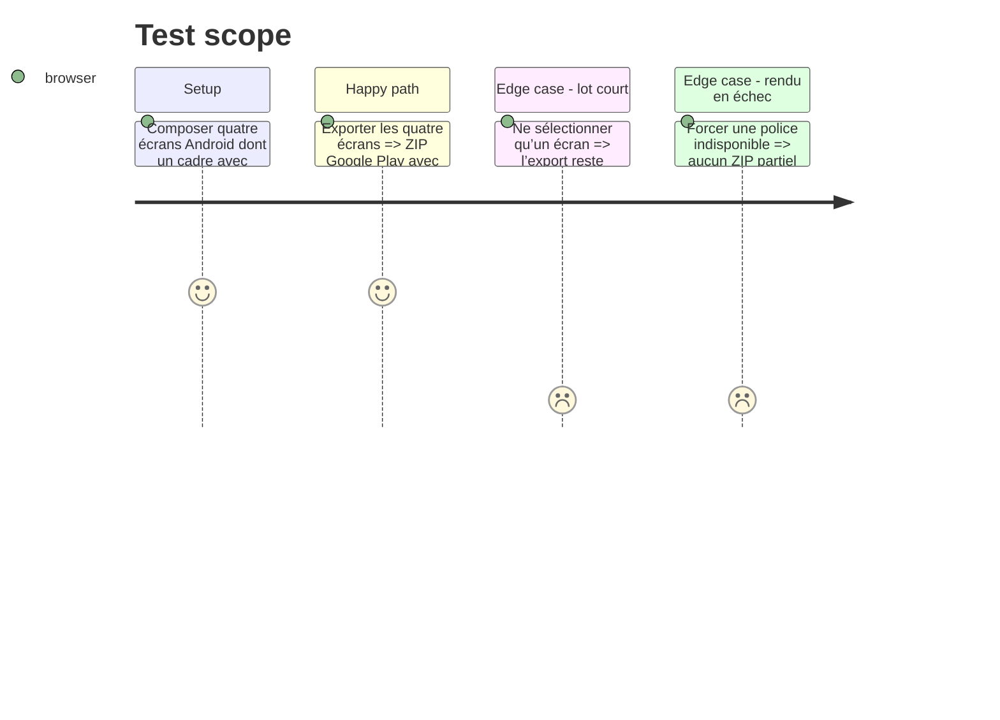

# Instruction: exporter et figer des lots Google Play conformes

## Architecture projection

> Tree of the final files. ✅ create · ✏️ modify · ❌ delete

```txt
apps/web/src/
├── components/
│   ├── export-dialog/ExportDialog.tsx                ✏️ présente le profil Google Play et ses recommandations
│   ├── publish-dialog/PublishDialog.tsx              ✏️ garde un refus défensif hors cible Apple
│   └── release-dialog/ReleaseDialog.tsx              ✏️ rend le vocabulaire de lot indépendant du store
├── hooks/
│   ├── use-export.ts                                 ✏️ construit les jobs depuis la cible du projet
│   └── __tests__/use-export.test.ts                  ✏️ couvre ordre et échec des deux profils
├── lib/
│   ├── export.ts                                     ✏️ rend depuis la taille logique et valide le profil de sortie
│   ├── release.ts                                    ✏️ fige et rejoue avec la cible du snapshot
│   ├── zip.ts                                        ✏️ utilise le dossier de sortie du profil
│   └── __tests__/
│       ├── export.test.ts                            ✏️ couvre 1080×1920 opaque et non-régression Apple
│       └── release.test.ts                           ✏️ couvre chemins et empreintes par cible
apps/web/e2e/
├── asc-publish.spec.ts                               ✏️ prouve que le projet Apple publie toujours et l’Android jamais
├── export.spec.ts                                    ✏️ valide les ZIP Apple et Google Play par l’UI réelle
├── export-tiers.spec.ts                              ✏️ conserve l’export Android local gratuit et complet
└── release.spec.ts                                   ✏️ fige, vérifie et reprend une release Android
scripts/
├── export-probe.mjs                                  ✏️ accepte une cible de probe Apple ou Google Play
└── validate-export.mjs                               ✏️ valide dimensions, format, poids, quantité et arborescence des deux ZIP
❌ delete: none
```

## User Journey



## Test Scope



## Wireframe

```txt
┌──────────────────────────────────────────────────────────────────┐
│ Export · (1) Destination                                        │
├──────────────────────────────────────┬───────────────────────────┤
│ (2) Captures                        │ (3) Profil                │
│ ☑ 01 · aperçu · nom                 │ téléphone · portrait     │
│ ☑ 02 · aperçu · nom                 │ 1080 × 1920 · PNG opaque │
│ ☑ 03 · aperçu · nom                 │                           │
│ ☑ 04 · aperçu · nom                 │ (4) Lot                  │
│                                     │ quantité · recommandations│
│                                     │                           │
│                                     │ (5) Langue               │
├──────────────────────────────────────┴───────────────────────────┤
│ Statut et erreurs                         (6) Annuler · Exporter │
└──────────────────────────────────────────────────────────────────┘

1. Destination: store du projet, non modifiable au dernier moment.
2. Captures: sélection ordonnée des planches du projet.
3. Profil: format exact et contrat du fichier.
4. Lot: quantité choisie, minimum de fiche et recommandation promotionnelle.
5. Langue: variante à rendre.
6. Actions: fermeture et téléchargement atomique.
```

## Tasks to do

### `1)` Généraliser le renderer et son validateur

> Un seul chemin de pixels reçoit planche logique et profil de sortie.

1. Faire accepter au renderer la taille logique du profil au lieu des constantes Apple.
2. Remplacer `assertAppStorePng` par une validation générique des dimensions attendues, du PNG 8 bits RGB opaque et de la cible interne de 5 MB.
3. Conserver `StaticCanvas`, le clipping sans cache et les deux workers actuels.

### `2)` Produire le ZIP Google Play

> Le nom et l’arborescence disent explicitement où va le lot.

1. Résoudre un seul profil depuis le projet dans `useExport`.
2. Écrire les captures Android sous `phone/NN_nom.png` et nommer le téléchargement `nom-google-play.zip`.
3. Afficher 2 captures minimum pour la fiche et 4 recommandées, sans bloquer un export partiel volontaire.

### `3)` Rendre les releases target-aware

> Une release se rejoue toujours avec le profil qu’elle a figé.

1. Inclure la cible dans `snapshotOf`, le rendu, le chemin et la restauration.
2. Adapter les textes de release au store actif.
3. Cacher puis refuser défensivement la publication ASC pour une release Google Play.

### `4)` Étendre les preuves de sortie

> Le validateur CLI et Playwright doivent reconnaître les deux contrats.

1. Faire détecter ou recevoir la cible dans `validate-export.mjs`.
2. Ajouter le profil Google Play au probe réel.
3. Conserver les assertions Apple existantes dans les mêmes suites.

## Test acceptance criteria

| Task | Acceptance criteria |
| ---- | ------------------- |
| 1 | Un écran Android sort exactement en 1080×1920, PNG 24 bits RGB sans alpha, sous 5 MB; un écran Apple sort toujours en 1320×2868 avec les mêmes garanties. |
| 2 | Le ZIP Android est nommé pour Google Play, contient `phone/01_nom.png` à `phone/08_nom.png` au maximum et l’UI distingue minimum 2 et recommandation 4. |
| 3 | Figer puis vérifier une release Android reproduit les mêmes chemins et SHA-256; aucune commande de publication Apple n’est accessible pour ce projet. |
| 4 | `pnpm run validate:export -- fichier.zip` accepte les deux fixtures conformes et refuse ratio, alpha, dimensions, poids, doublon ou neuvième capture Android. |
