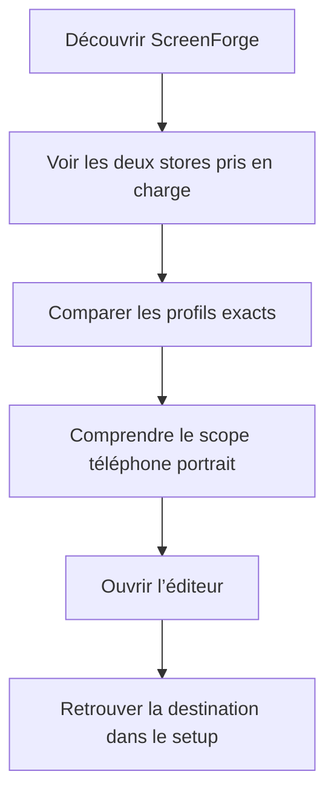
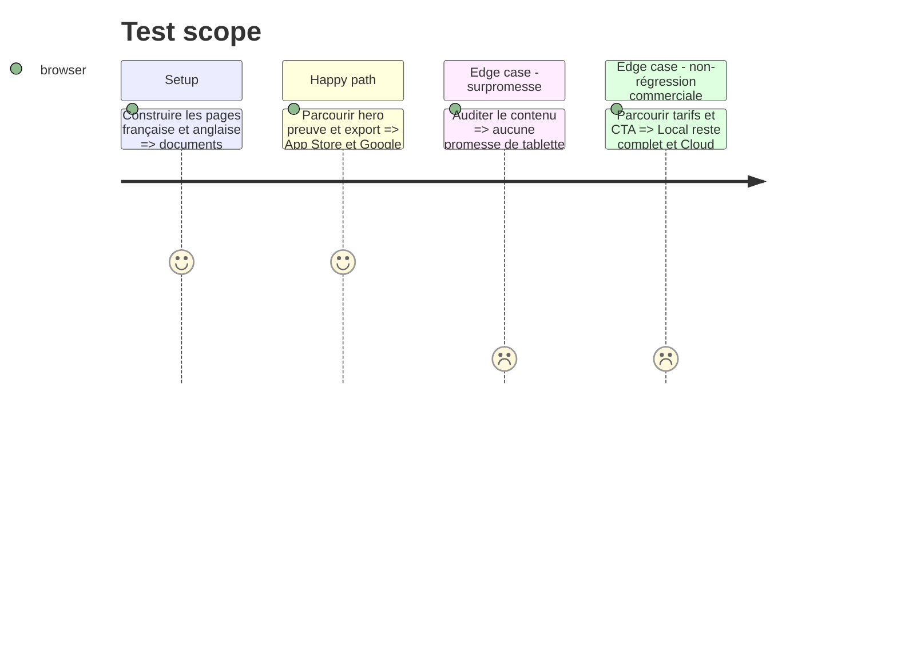

# Instruction: documenter et présenter le support multi-store

## Architecture projection

> Tree of the final files. ✅ create · ✏️ modify · ❌ delete

```txt
AGENTS.md                                             ✏️ remplace les invariants iPhone-only par les deux profils exacts
PRD.md                                                ✏️ ajoute le scope Google Play téléphone et ses limites officielles
aidd_docs/memory/
├── architecture.md                                   ✏️ documente la cible comme source de géométrie et d’export
├── design.md                                         ✏️ documente setup, badge et ratio de pellicule
├── project-brief.md                                  ✏️ élargit le produit à App Store et Google Play téléphone
└── testing.md                                        ✏️ ajoute le contrat Android aux gates d’export
apps/web/
├── landing.html                                      ✏️ met à jour title, meta et JSON-LD multi-store
├── src/landing/
│   ├── copy.ts                                       ✏️ présente clairement Apple et Google Play en français et anglais
│   └── components/ExportSpec.tsx                     ✏️ montre les deux profils et leurs dossiers réels
├── src/lib/__tests__/landing-copy.test.ts            ✏️ verrouille les claims et dimensions multi-store
└── e2e/landing.spec.ts                               ✏️ vérifie contenu, liens et structure de la vitrine
scripts/
├── landing-audit.mjs                                 ✏️ refuse le retour des claims iPhone-only
├── landing-visuals.mjs                               ✏️ capture la preuve d’export multi-store
└── og-card.mjs                                       ✏️ régénère une carte sociale App Store + Google Play
❌ delete: none
```

## User Journey



## Test Scope



## Wireframe

```txt
┌──────────────────────────────────────────────────────────────┐
│ (1) Hero · éditeur de captures pour deux stores · CTA       │
├──────────────────────────────────────────────────────────────┤
│ (2) Preuve : App Store 1320×2868 · Google Play 1080×1920    │
├──────────────────────────────────────────────────────────────┤
│ (3) Démonstration de l’éditeur                              │
├──────────────────────────────┬───────────────────────────────┤
│ (4) ZIP App Store            │ (5) ZIP Google Play          │
│ 6.9/                         │ phone/                       │
├──────────────────────────────┴───────────────────────────────┤
│ (6) Local gratuit · Cloud optionnel · CTA final             │
└──────────────────────────────────────────────────────────────┘

1. Hero: proposition multi-store et accès direct à l’éditeur.
2. Preuve: les deux sorties exactes sans suggérer de profils absents.
3. Démonstration: l’éditeur commun aux deux destinations.
4. ZIP App Store: structure et contrat Apple conservés.
5. ZIP Google Play: structure et contrat téléphone Android.
6. Offre: Local complet, Cloud limité à la synchronisation.
```

## Tasks to do

### `1)` Mettre les contrats du dépôt à jour

> Aucun document actif ne doit encore définir ScreenForge comme iPhone-only.

1. Réviser PRD et AGENTS avec les deux profils, les maxima et les exclusions Android v1.
2. Mettre à jour mémoire architecture, produit, design et tests.
3. Lier les exigences Google Play officielles dans le PRD sans recopier des valeurs hors de la source de code.

### `2)` Mettre la landing en conformité avec le produit

> La promesse publique nomme ce qui existe et rien de plus.

1. Réviser metadata, hero, preuves, fonctionnalités, FAQ et texte agent dans les deux langues.
2. Faire rendre `ExportSpec` depuis deux profils de copie explicites.
3. Garder la démonstration iPhone comme exemple, sans la présenter comme l’unique cible.

### `3)` Verrouiller les claims et visuels

> Les audits doivent échouer si les dimensions ou le scope divergent.

1. Étendre les tests de copie et l’audit landing.
2. Mettre à jour la carte sociale et les captures de vitrine.
3. Exécuter le gate de release complet après les phases précédentes.

## Test acceptance criteria

| Task | Acceptance criteria |
| ---- | ------------------- |
| 1 | PRD, AGENTS et mémoire nomment `app-store-iphone` 1320×2868 et `google-play-phone` 1080×1920, ainsi que les exclusions de ce lot. |
| 2 | Les landings FR et EN présentent les deux destinations, montrent `6.9/` et `phone/`, et ne promettent ni publication Google ni grand écran Android. |
| 3 | Les audits de copie, build/prérendu, captures visuelles et `pnpm run test:release` passent avec les deux contrats d’export. |
