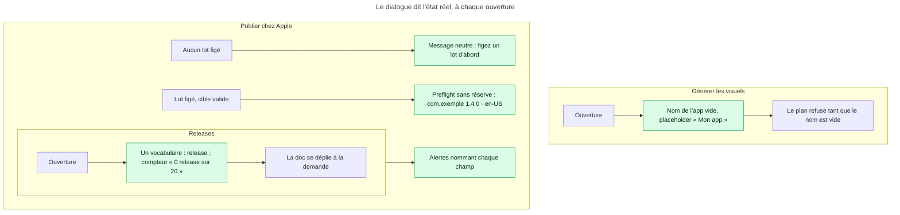
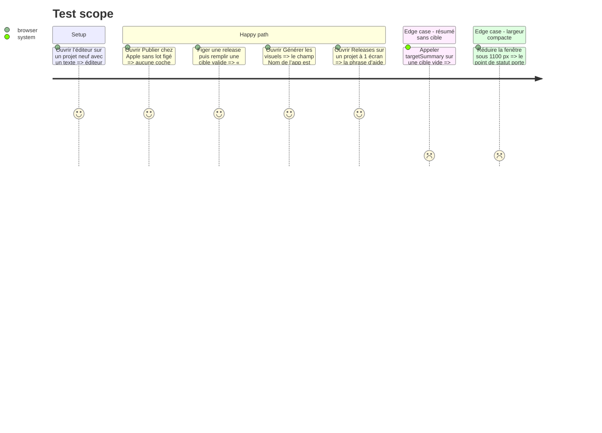

# Instruction: aucun état faux, aucune copie qui ment

## Architecture projection

> Tree of the final files. ✅ create · ✏️ modify · ❌ delete

```txt
apps/web/src/
├── lib/
│   ├── asc.ts                                   ✏️ `targetSummary` ne fabrique plus `<app> <version>` ; renvoie `null` tant que la cible est incomplète
│   └── __tests__/asc.test.ts                    ✏️ verrouille le résumé vide sur cible incomplète
├── components/
│   ├── publish-dialog/PublishDialog.tsx         ✏️ sans lot figé : état neutre « Figez un lot d’abord », jamais la coche verte
│   ├── campaign-dialog/CampaignDialog.tsx       ✏️ `appName` vide par défaut avec placeholder ; labels « Accroche » et « Rédaction » réécrits ; « Appliquer à » sorti du groupe Direction
│   ├── release-dialog/ReleaseDialog.tsx         ✏️ un seul mot (release), pluriel conditionnel, compteur expliqué, doc repliée
│   ├── auth-dialog/AuthDialog.tsx               ✏️ une phrase d’intention en tête : ce que le compte ouvre (Cloud), ce qu’il n’ouvre pas
│   ├── layers-panel/LayersPanel.tsx             ✏️ compteur non zéro-paddé
│   ├── properties-panel/PropertiesPanel.tsx     ✏️ compteur non zéro-paddé
│   └── toolbar/TopBar.tsx                       ✏️ statut de sauvegarde compact : point + `aria-label` + tooltip, jamais couleur seule
└── assets/templates/index.ts                    ✏️ noms de modèles en français
```

## User Journey



## Test Scope



## Tasks to do

### `1)` Preflight : neutre sans lot, vrai avec

> Une coche verte n’apparaît que sur un état que `preflight()` a réellement validé.

1. Dans `lib/asc.ts`, `targetSummary` renvoie `null` si `bundleId`, `appVersion` ou `locale` est vide ; supprimer les fallbacks `<app>`, `<version>`, `<langue>`.
2. Dans `PublishDialog.tsx`, distinguer trois rendus : `!release` → paragraphe neutre (`text-muted-foreground`, icône `Package`) « Figez d’abord une release dans « Releases » : le preflight porte sur un lot rendu » ; `findings.length > 0` → liste actuelle ; sinon → coche verte avec `targetSummary`.
3. Vérifier que `e2e/asc-publish.spec.ts:98` et `e2e/campaign-journey.spec.ts:256` restent verts (ils figent un lot et remplissent la cible avant d’attendre la coche).
4. Ajouter dans `lib/__tests__/asc.test.ts` le cas cible vide → `null`, cible pleine → chaîne sans chevron.

### `2)` Campagne : un nom d’app, pas un nom de projet

> Les accroches générées ne doivent jamais s’appeler « Projet sans titre ».

1. `useState('')` pour `appName` ; placeholder « Ex. : Sleep Tracker » ; `project.name` n’est plus un fallback dans le brief.
2. Désactiver « Proposer N visuels » tant que `appName.trim()` est vide, avec l’aide de champ qui le dit.
3. Renommer le label « Accroche générale vérifiée (3 à 7 mots) » en « Ce que fait l’app, en une phrase » ; « Accroches produit vérifiées (une par ligne) » en « Arguments à reprendre (un par ligne, facultatif) ».
4. Sortir « Appliquer à « Écran 1 » » du bloc Direction : le placer sous son propre intitulé « Repeindre l’écran courant » avec une ligne d’aide, ou dans le pied du dialogue comme action secondaire.
5. Renommer « Rédaction » en « Qui écrit les accroches » (le titre que `CLAUDE.md` documente déjà pour cette rangée) et vérifier que l’option locale se lit comme un choix : « ScreenForge seul — les accroches sont les noms de fichiers, à réécrire ».

### `3)` Releases : un mot, un pluriel, un compteur expliqué

> Le dialogue s’appelle Releases ; tout dedans dit « release ».

1. Label « Nom du lot » → « Nom de la release » ; placeholder inchangé.
2. « Rend les {n} planche et retient leurs empreintes » → pluriel conditionnel : « Rend l’écran et retient son empreinte » / « Rend les {n} écrans et retient leurs empreintes ».
3. Compteur `0/20` → « 0 release sur 20 » avec `aria-label` ; garder `tabular`.
4. Le bloc explicatif de droite devient un `<details>` natif replié « À quoi sert de figer une release » (ouvert par défaut tant qu’aucune release n’existe, replié ensuite).
5. Relire le pied : « Un lot figé ne change plus » → « Une release figée ne change plus ».

### `4)` Connexion : dire ce que le compte ouvre

> Le principe n°1 du produit (« Local est complet ») se lit dans le dialogue qui demande un compte.

1. Sous le titre, une ligne : « Un compte sert uniquement à Cloud : synchroniser vos projets sur plusieurs machines. L’éditeur et l’export n’en ont pas besoin. »
2. Garder la note de pied existante ; ne rien ajouter d’autre.

### `5)` Compteurs, modèles, statut

> Un compte n’est pas un matricule ; une UI française nomme ses modèles en français ; un état ne tient pas à une couleur.

1. `LayersPanel.tsx:217` et `PropertiesPanel.tsx:61` : `String(n)` sans `padStart`. `ExportDialog.tsx:348` garde `01` (rang de fichier dans le ZIP, c’est un nom).
2. `assets/templates/index.ts` : Hero → « Plein cadre », Feature → « Fonctionnalité », Side by Side → « Côte à côte », Full Bleed → « Image pleine », Minimal → « Minimal ». Vérifier `e2e/mcp-templates.spec.ts` et `screenforge_list_templates` (l’`id` ne change pas, seul `name`).
3. `TopBar.tsx` : quand le libellé de statut est masqué (largeur compacte), le point porte `aria-label={label}` et `title`/tooltip ; `role="status"` reste sur le conteneur.

## Test acceptance criteria

| Task | Acceptance criteria                                                                                                                          |
| ---- | -------------------------------------------------------------------------------------------------------------------------------------------- |
| 1    | Sans release figée, le dialogue Publier n’affiche ni coche verte ni chevrons ; avec release et cible valide, il affiche les valeurs saisies.  |
| 1    | `targetSummary` renvoie `null` sur cible incomplète ; les specs `asc-publish` et `campaign-journey` restent vertes.                           |
| 2    | Le champ Nom de l’app s’ouvre vide ; « Proposer » est désactivé tant qu’il l’est ; aucun plan ne contient « Projet sans titre ».             |
| 2    | Les trois labels réécrits sont visibles ; « Appliquer à » n’est plus dans le groupe radio Direction.                                          |
| 3    | Sur un projet à 1 écran la phrase est au singulier, à 3 écrans au pluriel ; le compteur lit « n release(s) sur 20 » ; la doc est un `details`. |
| 4    | Le dialogue Connexion affiche la phrase d’intention sous son titre.                                                                           |
| 5    | Les panneaux affichent « 0 » et « 2 », jamais « 00 » ; les cinq modèles portent un nom français ; sous 1100 px le point de statut est nommé.  |
