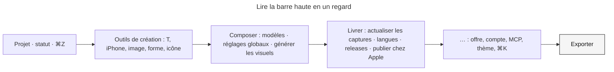

# Instruction: une barre haute qui pèse ses actions

## Architecture projection

> Tree of the final files. ✅ create · ✏️ modify · ❌ delete

```txt
apps/web/src/
├── components/toolbar/TopBar.tsx                ✏️ `useSecondaryActions` rend trois rangs (composer / livrer / utilitaires) ; les utilitaires vivent toujours dans le menu « … »
├── lib/stage.ts                                 ✏️ `TOP_BAR_COMPACT_WIDTH` re-dérivé du nouveau nombre d’icônes visibles
└── e2e/responsive-chrome.spec.ts                ✏️ les seuils et le contenu du menu replié suivent la nouvelle rangée
```

## User Journey



## Test Scope

```mermaid
---
title: Test scope
---
journey
  section Setup
    Ouvrir l’éditeur à 1600 px => barre haute complète: 5: browser
  section Happy path
    Lire la rangée de droite => deux groupes séparés par un filet puis le menu « … » puis Exporter: 5: browser
    Ouvrir le menu « … » => offre, compte, MCP (avec pastille), thème, ⌘K y sont, dans cet ordre: 5: browser
    Réduire sous TOP_BAR_COMPACT_WIDTH => les deux groupes rejoignent le menu, Exporter reste visible: 5: browser
  section Edge case - outils repliés
    Réduire sous TOP_BAR_TOOLS_WIDTH => les outils de création arrivent en tête du menu, avant composer et livrer: 1: browser
  section Edge case - clavier
    Tabuler le long de la barre => chaque bouton visible a un nom ; le menu s’ouvre et se ferme à Échap: 1: browser
```

## Wireframe

```txt
┌────────────────────────────────────────────────────────────────────────────────────────────────┐
│ (1) Projet ▾ · ● Enregistré · ↶ ↷   (2) T ▯ 🖼 ▢ ☆   (3) ▯▯  │ (4) ⌧ ⚙ 📣 │ (5) ⟳ 文 ▣ ☁ │ (6) … │ (7) ⬇ Exporter │
└────────────────────────────────────────────────────────────────────────────────────────────────┘
```

1. Identité du projet, statut de sauvegarde, historique — inchangé.
2. Outils de création — inchangé.
3. Bascules des panneaux — inchangé.
4. Composer : modèles, réglages globaux, générer les visuels. Filet après.
5. Livrer : actualiser les captures, langues, releases, publier chez Apple. Filet après.
6. Menu « … » permanent : offre, compte, Connexion MCP (pastille), thème, palette ⌘K.
7. CTA principal — inchangé, jamais replié.

## Tasks to do

### `1)` Trois rangs au lieu d’une liste

> La hiérarchie se lit dans l’ordre et les filets, pas dans des libellés.

1. Dans `TopBar.tsx`, scinder `useSecondaryActions` en `useComposeActions` (templates, globals, campaign), `useDeliverActions` (refresh, locales, releases, publish) et `useUtilityActions` (plan, account, mcp, theme, palette). Conserver les objets `SecondaryAction` tels quels.
2. `ActionsSegment` rend, hors compact : panneaux · `Divider` · composer · `Divider` · livrer · `Divider` · `SecondaryActionsMenu(utilities)` · Exporter.
3. En compact (`compactActions || compactTools`), le menu unique reçoit `[...tools?, ...compose, ...deliver, ...utilities]` avec un séparateur de menu entre chaque rang (la primitive `Dropdown` en a un ; sinon `role="separator"`).
4. Le menu « … » garde `aria-label="Ouvrir les autres actions"` ; la pastille MCP reste à côté de la prise dans le menu (commentaire existant).
5. Le thème ne s’expose plus en rangée : vérifier qu’aucun test ne cible `button[aria-label="Changer de thème"]` hors menu (`grep -rn "Changer de thème" apps/web/e2e`).

### `2)` Re-dériver les seuils

> `lib/stage.ts` calcule ; personne n’écrit 1280 à la main.

1. Lire le commentaire de `TOP_BAR_COMPACT_WIDTH` (`stage.ts:209`) et recalculer avec 7 icônes visibles + menu au lieu de 10 : la constante baisse d’environ 3 × (32 + 4) px plus deux filets.
2. Mettre à jour `e2e/responsive-chrome.spec.ts` : largeur de bascule, ordre des entrées du menu replié, présence permanente du menu « … ».
3. Rejouer `pnpm run audit:scale` (aucune nouvelle hauteur ni gap) et `e2e/semantics.spec.ts` (curseurs et rôles).

## Test acceptance criteria

| Task | Acceptance criteria                                                                                                                                    |
| ---- | ------------------------------------------------------------------------------------------------------------------------------------------------------ |
| 1    | À 1600 px la rangée de droite montre 3 + 4 icônes séparées par des filets, puis « … », puis Exporter ; thème, MCP, ⌘K, offre et compte sont dans « … ». |
| 1    | Chaque action reste atteignable au clavier et porte le même `aria-label` qu’avant ; les tooltips (`hint`) sont inchangés.                               |
| 2    | `TOP_BAR_COMPACT_WIDTH` est dérivé, commenté, et la spec responsive passe sur les largeurs 1600 / 1100 / 800 / 375.                                     |
| 2    | `audit:scale`, `semantics.spec` et la suite e2e `responsive-chrome` sont verts.                                                                         |
